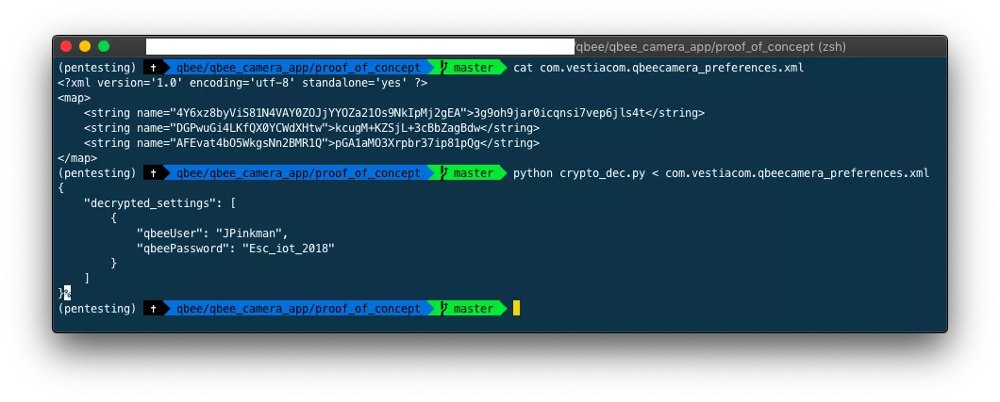

# DFRWS Challenge 2018 - NIWC LANT

This repository is Navy Information Warfare Center Atlantic's submission to the 2018 DFRWS Challenge.  More details about the challenge can be found on the [DFRWS Challenge GitHub page](https://github.com/dfrws/dfrws2018-challenge).

Submission by: Naval Information Warfare Center Atlantic (NIWC LANT)

Team: Kelly Hines, Joshua Lewis, Nicholas Phillpott, Randy Sharo, Shawn Zwach

Submission date: 20 MAR 2019

# Report

## Table of Contents
* [Executive Summary](#executive-summary)
* [Objectives](#objectives)
* [Evidence Review](#evidence-review)
* [Timeline](#timeline)
* [Conclusions](#conclusions)
* [Tool Build and Operating Instructions](#tool-build-and-operating-instructions)
* [Alternative Conclusions](#alternative-conclusions)
* [Acknowledgements](#acknowledgements)

## Executive Summary
From October 2018 through the submission deadline the Navy Information Warfare Center (NIWC LANT) performed a digital forensics examination of the devices listed in the Evidence section below. This report will outline the data extraction, alternative conclusions, and the tools developed to answer the questions presented by the challenge.

## Objectives
The attorney general assigned the following objectives:
* Determine the time the illegal drug lab was raided
* Determine which, if any, of Jessie Pinkman's friends were involved in the raid and document the confidence level in that hypothesis
* Determine how the QBee camera was disabled

## Evidence Review
Evidence items are listed in the order they were presented by the challenge documentation. Each analysis link shows the detailed extraction and analysis of each evidence item. Notably, to share this challenge among teams, evidence items are not original evidence but copies of the previously collected evidence.

| File Description | Filename | Analysis | SHA256 Hash |
| --- | --- | --- | --- |
| Jessie Pinkman’s Samsung phone | Samsung GSM_SM-G925F Galaxy S6 Edge.7z | [Link](Samsung%20GSM_SM-G925F%20Galaxy%20S6%20Edge.7z.md) | ae83b8ec1d4338f6c4e0a312e73d7b410904fab504f7510723362efe6186b757 |
| iSmartAlarm – Diagnostic logs | ismartalarm/diagnostics/2018-05-17T10_54_28/server_stream | [Link](ismartalarm/server_stream.md) | 8033ba6d37ad7f8ba22587ae560c04dba703962ed16ede8c36a55c9553913736 |
| iSmartAlarm – Memory images: 0x0000’0000 (ismart_00.img), 0x8000’0000 | dump/ismart_00.img, dump/ismart_80.img | [Link](./ismart_00.img.md) | b175f98ddb8c79e5a1e7db84eeaa691991939065ae17bad84cdbd915f65d9a10 b175f98ddb8c79e5a1e7db84eeaa691991939065ae17bad84cdbd915f65d9a10  |
| Arlo – Memory image | arlo/dfrws_arlo.img | [Link](./arlo_analysis.md) | 3b957a90a57e5e4485aa78d79c9a04270a2ae93f503165c2a0204de918d7ac70 |
| Arlo – NVRAM settings | arlo/nvram.log | [Link](./arlo_analysis.md) | f5d680d354a261576dc8601047899b5173dbbad374a868a20b97fbd963dca798 |
| Arlo – NAND: TAR archive of the folder /tmp/media/nand | arlo/arlo_nand.tar.gz | [Link](./arlo_analysis.md) | 857455859086cd6face6115e72cb1c63d2befe11db92beec52d1f70618c5e421 |
| WinkHub – Filesystem TAR archive | wink/wink.tar.gz | [Link](./wink_analysis.md) | 083e7428dc1d0ca335bbcfc11c6263720ab8145ffc637954a7733afc7b23e8c6 |
| Amazon Echo – Extraction of cloud data obtained via CIFT | echo/(2018-07-01_13.17.01)_CIFT_RESULT.zip | [Link](./echo_analysis.md) | 7ee2d77a3297bb7ea4030444be6e0e150a272b3302d4f68453e8cfa11ef3241f |
| Network capture | network/dfrws_police.pcap | [Link](./network_analysis.md) | 1837ee390e060079fab1e17cafff88a1837610ef951153ddcb7cd85ad478228e |

### Lab Layout Diagram


### User identities and associations

#### ISmartAlarm ids

| User | Most Likely Identity | Related accounts/identities | Notes |
| - | - | - | - |
| JPinkman | Jessie Pinkman | jpinkman2018@gmail.com | |
| TheBoss | S. Varga | | _associated with Varga by process of elimination_ |
| pandadodu | D. Pandana | | _associated with Pandana due to name similarity_ |
| | | emidnight@gmail.com | _email addr present in com.quirky.android.wink.wink_preferences.xml_ Email also present in the chrome Autofill history /mnt/userdata/data/com.android.chrome/app_chrome/Default/Web Data last used 5/15/2018 at 9:23:56 |
| | | francesco | _user id present in data/com.android.chrome/app_chrome/Default/Web Data_ |

#### fluffy
   * `fluffy@hogwarts` ssh key on Wink device.  Logged in as root from `172.21.94.4`
   * Multiple `Fluffy` sessions captured in `data/com.android.chrome/app_chrome/Default/Sync Data/SyncData.sqlite3`
   * `data/com.android.chrome/app_chrome/Default/Sync Data/LevelDB/000003.log` associates `Fluffy` with `Cthulhuuuu's iPhone` (Chrome IOS-PHONE)


## Steps to Reproduce

Due to the time that we had to invest in this challenge we chose to focus our efforts on two areas that were mentioned by the challenge creators.  Those are:
1.	Device Level Analysis: Developing methods and tools to forensically process digital traces generated by IoT devices, including on mobile devices.
4.	Evaluating and Expressing Conclusions: Assigning the probability of the results given two competing propositions (e.g. The prime suspect committed the offense, versus some unknown person did).

We created plaso parsers to support certain artifacts of interest and have provided them in our public fork of plaso. While we work to get the change merged, the source code is available for review and installation [here](https://github.com/infosecjosh/plaso/tree/dfrws2019).

## Timeline
| Date | Time | Event | Device Source | Notes |
| --- | --- | --- | --- | --- |
| 2018-05-15 | 08:34:32 | First password reset email received | Phone | | 
| 2018-05-15 | 10:52:05 | Last password reset email received | Phone | | 
| 2018-05-15 | 12:38:20 | JPinkman armed alarm | Phone | |
| 2018-05-15 | 12:41:35 | JPinkman disarmed alarm | Phone | |
| 2018-05-15 | 13:03:11 | pandadodu caused alarm "PANIC"| Phone | |
| 2018-05-15 | 13:03:28 | pandadodu caused alarm "PANIC"| Phone | |
| 2018-05-15 | 13:03:36 | pandadodu disarmed alarm | Phone | |
| 2018-05-15 | 13:03:43 | pandadodu caused alarm "PANIC" | Phone | |
| 2018-05-15 | 13:03:47 | pandadodu disarmed alarm | Phone | |
| 2018-05-15 | 13:03:47 | TheBoss caused a sensor to have Action: 2 and Action: 4 | Phone | |
| 2018-05-15 | 13:04:43 | pandadodu set alarm to HOME | Phone | |
| 2018-05-15 | 13:05:43 | JPinkman set alarm to DISARM | Phone | |
| 2018-05-15 | 15:07:34 | Echo time reset to 1970 but Alexa recorded sound of despair "ooooh" | Alexa | Seems odd same time NTP issue was occuring on network that sound of despair was recorded 
| 2018-05-16 | 13:47:14 | TheBoss caused alarm "PANIC" | Phone | | 
| 2018-05-16 | 13:47:15 | TheBoss caused alarm "PANIC" | Phone | | 
| 2018-05-16 | 13:47:18 | TheBoss set alarm to HOME | Phone | | 
| 2018-05-16 | 13:47:33 | TheBoss set alarm to DISARM | Phone | | 
| 2018-05-16 | 13:47:40 | TheBoss set alarm to DISARM | Phone | | 
| 2018-05-16 | 13:53:10 | JPinkman set alarm to HOME | Phone | | 
| 2018-05-16 | 13:53:51 | JPinkman set alarm to ARM | Phone | | 
| 2018-05-16 | 13:55:07 | JPinkman set alarm to DISARM | Phone | | 
| 2018-05-16 | 13:55:11 | JPinkman set alarm to DISARM | Phone | | 
| 2018-05-16 | 13:55:17 | JPinkman set alarm to DISARM | Phone | | 
| 2018-05-16 | 13:55:27 | JPinkman set alarm to ARM | Phone | | 
| 2018-05-17 | 07:45:22 | TheBoss set alarm to DISARM | Phone | | 
| 2018-05-17 | 07:47:50 | JPinkman set alarm to ARM | Phone | | 
| 2018-05-17 | 08:09:57 | TheBoss set alarm to DISARM | Phone | | 
| 2018-05-17 | 08:22:22 | JPinkman set alarm to ARM | Phone | | 
| 2018-05-17 | 08:22:30 | TheBoss set alarm to DISARM | Phone | | 
| 2018-05-17 | 08:34:17 | TheBoss set alarm to HOME | Phone | | 
| 2018-05-17 | 08:34:31 | pandadodu set alarm to DISARM | Phone | | 
| 2018-05-17 | 08:37:52 | pandadodu set alarm to DISARM | Phone | | 
| 2018-05-17 | 10:22:20 | 30 seconds from this time date Alexa triggered iSmartAlarm to set the alarm even though the door was open AND alarm was off | Alexa | Odd owner would set alarm with door open unless owner was wanting to set to home mode |
| 2018-05-17 | 10:22:25 | Just 5 seconds after Jessie set the alarm with the door open the Amazon Echo recorded a voice. On the wav file ((2018-05-17T10_22_24+0200)_TEXT(TRANSCRIPT NOT AVAILABLE).wav) you can hear a voice and then a beep. | Alexa | |
| 2018-05-17 | 10:40:00 | Police alerted an illegal drug lab was invaded and unsuccessfully set on fire | Challenge Details | |
| 2018-05-17 | 10:45:00 | Police and forensic team arrive on scene | Challenge Details | |

## Conclusions
### Time the illegal drug lab was raided
We believe the lab was raided on 05/15 due to all of the odd alarm activity but the smoke alarm detected smoke on 5/17. Although the local Amazon Echo had it's time reset to Jan 1 1970, the cloud added a date/time stamp to a voice of despair which was recorded saying "ooooooh" (in wav file 2018-05-15T15_07_34+0200)_TEXT(TRANSCRIPT NOT AVAILABLE).wav). This suggests the assailants had access to the lab 2 days prior to when the police were called. Also on the phone evidence we noted many password resets on the 15th from 08:34:32 to 10:52:05 which further suggests someone took over the lab on 5/15 and had physical access to Jessie's phone. 2018-05-17 at 10:22:25.439 just 5 seconds after the alarm is set with the door open the Amazon Echo recorded a voice on the wav file ((2018-05-17T10_22_24+0200)_TEXT(TRANSCRIPT NOT AVAILABLE).wav) and you can hear a voice and then a beep which indicates the smoke detector. 


### Involvement of Jessie Pinkman's friends
Without having background information on Jessie's friends that law enforcement gathered and verfied it is difficult to pinpoint which of the friends is one of the particular users. Forensics must take into account physical evidence, testimony (such as alibi) as well as the digital evidence. We found that someone by the alias of fluffy was purposely doing backdoor types of things as indicated in the wink evidence. We know that fluffy was associated with Cthulhuuuu's iPhone (Chrome IOS-PHONE). However, without further investigation information or access to Cthulhuuu's phone we were unable to tie this to the real identity of potentially one of Jessie's friend. 

### How the QBee camera was disabled
In our research of Qbee devices we found a blog that talks about iSmart and QBee vulnerabilities and parsing. This blog had key information on a CVE for the QBee camera and alos included a proof of concept exploit. It is notable this blog belongs to Francesco Servida who is actually mentioned in the challenge acknowledgements which we found was a hidden tip. The links to this information are as follows:
https://blog.francescoservida.ch/2018/09/16/cve-2018-16225-public-disclosure-qbee-camera-vulnerability/
https://blog.francescoservida.ch/wp-content/uploads/2018/09/proof_of_concept_network.zip

We reviewed Jessie Pinkman's Samsung phone and noted use of the QBee Cam application (for example in the data directory we noted the directory com.vestiacom.qbeecamera). Since traffic between the client (in this case the QBee Cam application for Android) and the QBee was unencrypted someone on Jessie's local network could have easily sniffed this unecrypted traffic to capture the required cookie session data to establish a session with the QBee. We believe someone Jessie knew that was in his home was able to reuse this intercepted cookie to authorize requests to camera and disable it which is exactly how the CVE-2018-16225 vulnerability works. 
A further review of the dsim directoy on the Jessie's phone shows a screenshot with the word private over it such that the image is not visible which implies the attacker put the QBee in to privacy mode which locks the camera. These observations together impley the QBee camera was disabled (by enablement of privacy mode) using Fernando's exploit by someone on the Jessie's local network. Lastly, we found the user id francesco
present in data/com.android.chrome/app_chrome/Default/Web Data which furthers our conclusion this exploit was used to disable the QBee camera.

The following image shows the creds disclosed using the above CVE:


## Tool Build and Operating Instructions

Our tools are delivered as python source code, and scripts to build a set of Docker images.  In addition to the tools included in this repo there were two plaso sqlite plugins written for the challenge.  They are available at https://github.com/infosecjosh/plaso/tree/dfrws2019.  These are specifically the ismartalarm_android and android_gmail plugins and formatters.

The general flow of data is as follows:


### Prerequisites
The tools are intended to be run from an Ubuntu 16.04 host with SIFT-CLI installed as described here:
 https://github.com/sans-dfir/sift-cli#installation
The user must have sudo access to install packages and run docker containers.  The build scripts provided will invoke sudo as needed; the user must be prepared to enter their password.  It must also have support for docker and docker-compose.
The host must also have internet or other network access that allows it to download images from Docker Hub and Elastic (https://hub.docker.com and https://www.docker.elastic.co).

### Building the Docker Images
From the top-level of the dfrws2019 repository package, type:
```
cd docker
make images build
```

This will download the required Docker Hub images and apply a patch to the standard log2timeline/plaso image.  The system should now have five docker images installed:

| Docker Image | Description | 
| --- | --- |
| Iot-plaso:latest | Plaso with plugins added |  
| log2timeline/plaso:latest | Base image for iot-plaso |  
| docker.elastic.co/kibana/kibana:5.2.1 | Visualizer for Elasticsearch |  
| docker.elastic.co/elasticsearch/elasticsearch:5.2.1 | Search and analytics engine |


### Launching Tools

#### Elasticsearch and Kibana
Elasticsearch and Kibana are launched using docker-compose.  The file docker/Makefile can automatically launch these tools via the command:
cd docker ; make elastic-start

The provided docker-compose.yml script will bind Elasticsearch to port 9100 and Kibana to port 5601 on the host machine.  Kibana will be reachable by navigating your web browser to http://localhost:5601

The default login and password for Elasticsearch and Kibana will be:

```
Login: elastic
Password: changeme
```

The containers can be shut down and deleted via the commands:
```
make elastic-stop
make clean
```
Ingested data will remain in the docker storage volume esdata1 until you purge it with the command:
```
make realclean
```

#### iot-plaso

The iot-plaso image can perform many different functions, depending on command-line arguments provided.   Typical invocations will be as follows:
Load plaso database into elasticsearch:
sudo docker run --rm -ti -v /cases:/cases iot-plaso:latest psort -o elastic --raw_fields --index_name dfrws2018 --server $(ELASTIC_IP) --elastic_user elastic /cases/dfrws2018/events.plaso

Interactive shell with access to host mount points and /cases directory:
sudo docker run --rm -ti -v /cases:/cases -v /mnt:/mnt --entrypoint /bin/bash iot-plaso:latest

You can also just ingest the plaso database that we've already generated using 

``` 
make plaso import 
```

## Alternative Conclusions
### Time the illegal drug lab was raided
Another alternative is that the drug lab was raided 2018-05-17 at 10:22:25.439 just 5 seconds after Jessie set the alarm with the door open. The Amazon Echo recorded a voice at this time. On the wav file ((2018-05-17T10_22_24+0200)_TEXT(TRANSCRIPT NOT AVAILABLE).wav) you can hear a voice and then a beep. This alludes to the lab being raided after the alarm was last set by Jessie. 


### How the QBee camera was disabled
We also noted NTP packets in the network packet capture indicating the QBee camera kept rebooting and on boot shows time as Jan 1 1970. It appears someone UDP's to a Amazon host, opens a TLS session then NTP time resets causes QBee to reboot. Our secondary hypotheseis is 
someone installed instructions in the Amazon cloud to make the QBee reboot every time it wakes up (in effect disabling the camera function). Without access to the Amazon cloud host or QBee certs we were unable to crack the TLS session.

## Acknowledgements

The authors would like to thank the Digital Forensic Research Workshop and the developers of this years challenge for putting this challenge together. Opportunities like this are critical to advancing the technolgies and methodoligies used by digital forensics examiners and researchers. Thank you. 