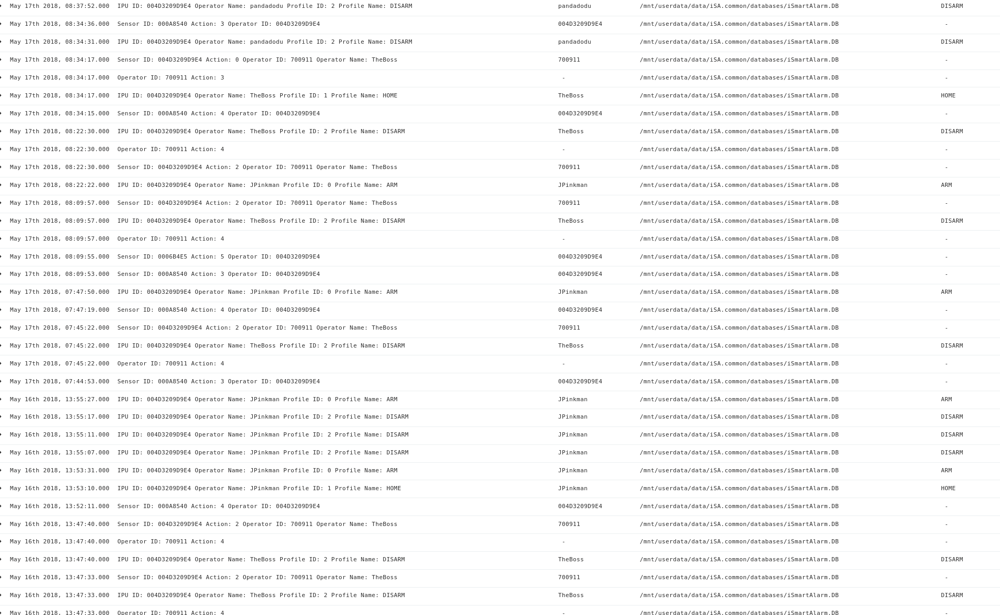

# Analysis of Jessie Pinkman’s Samsung phone
  
  File/Folder: Samsung GSM_SM-G925F Galaxy S6 Edge.7z
  
  SHA256: ae83b8ec1d4338f6c4e0a312e73d7b410904fab504f7510723362efe6186b757

--------------------

Outline

* [Initial Processing and Data Extraction](#Initial-Processing-and-Data-Extraction)
* [Interesting Activity](#Interesting-Activity)


## Initial Processing and Data Extraction
  
### Download and verify the integrity of downloaded artifact

First we downloaded and verified the integrity of the downloaded artifact to the SHA256 hash provided by the challenge.
```
# sha256sum Samsung\ GSM_SM-G925F\ Galaxy\ S6\ Edge.7z 
ae83b8ec1d4338f6c4e0a312e73d7b410904fab504f7510723362efe6186b757  Samsung GSM_SM-G925F Galaxy S6 Edge.7z
```

### Extract the 7zip file contents for analysis

During the next step we extracted the compressed 7zip file and began looking at its contents.

```
# mkdir samsung_galaxy_s6
# 7z x Samsung\ GSM_SM-G925F\ Galaxy\ S6\ Edge.7z -osamsung_s6/

7-Zip [64] 9.20  Copyright (c) 1999-2010 Igor Pavlov  2010-11-18
p7zip Version 9.20 (locale=en_US.UTF-8,Utf16=on,HugeFiles=on,2 CPUs)

Processing archive: Samsung GSM_SM-G925F Galaxy S6 Edge.7z


Extracting  blk0_sda.bin
Extracting  blk16_sdb.bin
Extracting  blk32_sdc.bin
Extracting  procdata.zip

Everything is Ok

Files: 4
Size:       31999719108
Compressed: 7109827923

```
Then we listed the extracted files.

```
# ls samsung_s6
blk0_sda.bin  blk16_sdb.bin  blk32_sdc.bin  procdata.zip
```

Then we ran file against the contents to attempt to determine the filetypes.

```
# file *
blk0_sda.bin:  DOS/MBR boot sector; partition 1 : ID=0xee, start-CHS (0x0,0,0), end-CHS (0x0,0,0), startsector 1, 7810047 sectors, extended partition table (last)
blk16_sdb.bin: data
blk32_sdc.bin: data
procdata.zip:  Zip archive data, at least v2.0 to extract
```


Then for each of the blk* files we ran the mmls command to display the partition layout of a volume system.  

```
$ mmls blk0_sda.bin
GUID Partition Table (EFI)
Offset Sector: 0
Units are in 4096-byte sectors

      Slot      Start        End          Length       Description
000:  Meta      0000000000   0000000000   0000000001   Safety Table
001:  -------   0000000000   0000001023   0000001024   Unallocated
002:  Meta      0000000001   0000000001   0000000001   GPT Header
003:  Meta      0000000002   0000000005   0000000004   Partition Table
004:  000       0000001024   0000002047   0000001024   BOTA0
005:  001       0000002048   0000003071   0000001024   BOTA1
006:  002       0000003072   0000008191   0000005120   EFS
007:  003       0000008192   0000010239   0000002048   PARAM
008:  004       0000010240   0000017407   0000007168   BOOT
009:  005       0000017408   0000026111   0000008704   RECOVERY
010:  006       0000026112   0000028159   0000002048   OTA
011:  007       0000028160   0000038911   0000010752   RADIO
012:  008       0000038912   0000039167   0000000256   TOMBSTONES
013:  009       0000039168   0000039423   0000000256   DNT
014:  010       0000039424   0000039615   0000000192   PERSISTENT
015:  011       0000039616   0000039679   0000000064   STEADY
016:  012       0000039680   0000041983   0000002304   PERSDATA
017:  013       0000041984   0000045823   0000003840   SBFS
018:  014       0000045824   0000993023   0000947200   SYSTEM
019:  015       0000993024   0001044223   0000051200   CACHE
020:  016       0001044224   0001057023   0000012800   HIDDEN
021:  017       0001057024   0007808255   0006751232   USERDATA
022:  -------   0007808256   0007810047   0000001792   Unallocated
```

```
$ mmls blk16_sdb.bin
Cannot determine partition type
```
```
$ mmls blk32_sdc.bin
Cannot determine partition type
```

```
# 7z x Samsung\ GSM_SM-G925F\ Galaxy\ S6\ Edge.7z -osamsung_s6/

7-Zip [64] 9.20  Copyright (c) 1999-2010 Igor Pavlov  2010-11-18
p7zip Version 9.20 (locale=en_US.UTF-8,Utf16=on,HugeFiles=on,2 CPUs)

Processing archive: Samsung GSM_SM-G925F Galaxy S6 Edge.7z


Extracting  blk0_sda.bin
Extracting  blk16_sdb.bin
Extracting  blk32_sdc.bin
Extracting  procdata.zip

Everything is Ok

Files: 4
Size:       31999719108
Compressed: 7109827923
```

```
# unzip procdata.zip -d procdata
Archive:  procdata.zip
 extracting: procdata/partitions
 extracting: procdata/mounts
 extracting: procdata/cpuinfo
 extracting: procdata/diskstats
 extracting: procdata/filesystems
 extracting: procdata/system
 extracting: procdata/radio
 extracting: procdata/events

```
```
# cat cpuinfo
Processor       : AArch64 Processor rev 0 (aarch64)
processor       : 0
processor       : 1
processor       : 2
processor       : 3
processor       : 4
processor       : 5
processor       : 6
processor       : 7
Features        : fp asimd aes pmull sha1 sha2 crc32
CPU implementer : 0x41
CPU architecture: AArch64
CPU variant     : 0x1
CPU part        : 0xd07
CPU revision    : 0

Hardware        : SAMSUNG Exynos7420
```

```
# cat mounts
rootfs / rootfs ro,seclabel 0 0
tmpfs /dev tmpfs rw,seclabel,nosuid,relatime,size=1371712k,nr_inodes=342928,mode=755 0 0
devpts /dev/pts devpts rw,seclabel,relatime,mode=600 0 0
proc /proc proc rw,relatime 0 0
sysfs /sys sysfs rw,seclabel,relatime 0 0
selinuxfs /sys/fs/selinux selinuxfs rw,relatime 0 0
/sys/kernel/debug /sys/kernel/debug debugfs rw,relatime 0 0
none /acct cgroup rw,relatime,cpuacct 0 0
none /sys/fs/cgroup tmpfs rw,seclabel,relatime,size=1371712k,nr_inodes=342928,mode=750,gid=1000 0 0
tmpfs /mnt tmpfs rw,seclabel,relatime,size=1371712k,nr_inodes=342928,mode=755,gid=1000 0 0
none /dev/cpuctl cgroup rw,relatime,cpu 0 0
/dev/block/platform/15570000.ufs/by-name/SYSTEM /system ext4 ro,seclabel,noatime,norecovery 0 0
/dev/block/platform/15570000.ufs/by-name/EFS /efs ext4 rw,seclabel,nosuid,nodev,noatime,discard,journal_checksum,journal_async_commit,noauto_da_alloc,data=ordered 0 0
/dev/block/platform/15570000.ufs/by-name/CACHE /cache ext4 rw,seclabel,nosuid,nodev,noatime,discard,journal_checksum,journal_async_commit,noauto_da_alloc,errors=panic,data=ordered 0 0
/dev/block/platform/15570000.ufs/by-name/USERDATA /data ext4 rw,seclabel,nosuid,nodev,noatime,discard,journal_checksum,journal_async_commit,noauto_da_alloc,data=ordered 0 0
/dev/block/platform/15570000.ufs/by-name/PERSDATA /persdata/absolute ext4 rw,seclabel,nosuid,nodev,relatime,data=ordered 0 0
/dev/block/platform/15570000.ufs/by-name/SBFS /sbfs ext4 rw,seclabel,nosuid,nodev,relatime,data=ordered 0 0
tmpfs /storage tmpfs rw,seclabel,relatime,size=1371712k,nr_inodes=342928,mode=755,gid=1000 0 0
/dev/block/platform/15570000.ufs/by-name/HIDDEN /preload ext4 ro,seclabel,nosuid,nodev,relatime,data=ordered 0 0
/data/knox/tmp_sdcard /mnt/knox sdcardfs rw,seclabel,nosuid,nodev,relatime,mask=0077 0 0
/data/knox/sdcard /mnt/knox/default/knox-emulated sdcardfs rw,seclabel,nosuid,nodev,relatime,low_uid=1000,low_gid=1000,gid=1015,multi_user,mask=0006 0 0
/data/knox/sdcard /mnt/knox/read/knox-emulated sdcardfs rw,seclabel,nosuid,nodev,relatime,low_uid=1000,low_gid=1000,gid=9997,multi_user,mask=0027 0 0
/data/knox/sdcard /mnt/knox/write/knox-emulated sdcardfs rw,seclabel,nosuid,nodev,relatime,low_uid=1000,low_gid=1000,gid=9997,multi_user,mask=0007 0 0
/data/knox/secure_fs/enc_media /mnt/shell/enc_media sdcardfs rw,seclabel,nosuid,nodev,relatime,low_uid=1000,low_gid=1000,gid=9997,multi_user,reserved=20MB 0 0
/data/media /mnt/runtime/default/emulated sdcardfs rw,seclabel,nosuid,nodev,noexec,relatime,low_uid=1023,low_gid=1023,gid=1015,multi_user,mask=0006,reserved=20MB 0 0
/data/media /storage/emulated sdcardfs rw,seclabel,nosuid,nodev,noexec,relatime,low_uid=1023,low_gid=1023,gid=1015,multi_user,mask=0006,reserved=20MB 0 0
/data/media /mnt/runtime/read/emulated sdcardfs rw,seclabel,nosuid,nodev,noexec,relatime,low_uid=1023,low_gid=1023,gid=9997,multi_user,mask=0027,reserved=20MB 0 0
/data/media /mnt/runtime/write/emulated sdcardfs rw,seclabel,nosuid,nodev,noexec,relatime,low_uid=1023,low_gid=1023,gid=9997,multi_user,mask=0007,reserved=20MB 0 0
```

```
$ cat diskstats
   1       0 ram0 0 0 0 0 0 0 0 0 0 0 0
   1       1 ram1 0 0 0 0 0 0 0 0 0 0 0
   1       2 ram2 0 0 0 0 0 0 0 0 0 0 0
   1       3 ram3 0 0 0 0 0 0 0 0 0 0 0
   1       4 ram4 0 0 0 0 0 0 0 0 0 0 0
   1       5 ram5 0 0 0 0 0 0 0 0 0 0 0
   1       6 ram6 0 0 0 0 0 0 0 0 0 0 0
   1       7 ram7 0 0 0 0 0 0 0 0 0 0 0
   1       8 ram8 0 0 0 0 0 0 0 0 0 0 0
   1       9 ram9 0 0 0 0 0 0 0 0 0 0 0
   1      10 ram10 0 0 0 0 0 0 0 0 0 0 0
   1      11 ram11 0 0 0 0 0 0 0 0 0 0 0
   1      12 ram12 0 0 0 0 0 0 0 0 0 0 0
   1      13 ram13 0 0 0 0 0 0 0 0 0 0 0
   1      14 ram14 0 0 0 0 0 0 0 0 0 0 0
   1      15 ram15 0 0 0 0 0 0 0 0 0 0 0
   7       0 loop0 0 0 0 0 0 0 0 0 0 0 0
   7       1 loop1 0 0 0 0 0 0 0 0 0 0 0
   7       2 loop2 0 0 0 0 0 0 0 0 0 0 0
   7       3 loop3 0 0 0 0 0 0 0 0 0 0 0
   7       4 loop4 0 0 0 0 0 0 0 0 0 0 0
   7       5 loop5 0 0 0 0 0 0 0 0 0 0 0
   7       6 loop6 0 0 0 0 0 0 0 0 0 0 0
   7       7 loop7 0 0 0 0 0 0 0 0 0 0 0
   8       0 sda 46956 28888 7962432 32330 5523 10172 197000 7900 1 17960 40120
   8       1 sda1 0 0 0 0 0 0 0 0 0 0 0
   8       2 sda2 0 0 0 0 0 0 0 0 0 0 0
   8       3 sda3 61 193 4016 50 18 29 376 0 0 50 50
   8       4 sda4 1 0 8 0 3 0 24 0 0 0 0
   8       5 sda5 108 6868 55808 160 0 0 0 0 0 120 160
   8       6 sda6 111 7057 57344 20 0 0 0 0 0 10 20
   8       7 sda7 0 0 0 0 0 0 0 0 0 0 0
   8       8 sda8 160 9898 80464 30 0 0 0 0 0 30 30
   8       9 sda9 0 0 0 0 0 0 0 0 0 0 0
   8      10 sda10 0 0 0 0 0 0 0 0 0 0 0
   8      11 sda11 0 0 0 0 0 0 0 0 0 0 0
   8      12 sda12 2 3 40 0 0 0 0 0 0 0 0
   8      13 sda13 12 25 296 20 15 6 168 70 0 60 90
   8      14 sda14 4 25 232 0 6 1 56 0 0 0 0
   8      15 sda15 21534 1206 2841128 14560 0 0 0 0 0 6800 14490
 259       0 sda16 14 10 192 10 7 3 80 0 0 10 10
 259       1 sda17 19 17 288 0 0 0 0 0 0 0 0
 259       2 sda18 24919 3586 4922528 17480 4161 10133 196296 6580 1 11700 24020
   8      16 sdb 1 0 8 0 0 0 0 0 0 0 0
   8      32 sdc 1 0 8 0 0 0 0 0 0 0 0
 253       0 vnswap0 0 0 0 0 0 0 0 0 0 0 0
```

We wrote a script called [mountem.sh](./utils/mountem.sh) to mount the USERDATA partition.  You will need to clone the dfrws2019 repo and then run the command below.
```
./utils/mountem.sh
```

We also wrote a script that would generate a timeline using plaso if you have plaso installed on your local machine with the parser plugins and formatters that we wrote for this challenge.

```
./utils/timelinegen.sh
```

We ran the command below to list all files with the .db extension that were not created or modified in 2015.  This was helpful to focus only on files that were modified or created during particular periods while we were doing analysis.  This can also be viewed in Kibana from the log2timeline data.  This led us to look further at /mnt/userdata/data/com.google.android.gm/databases/mailstore.jpinkman2018@gmail.com.db file.  We also noticed that a large number of the files were modified and accessed 05-15-2018.  This is largely due to the way that a lot of the apps on the phone ran in the background and updated regularly.  This output could also be easily tailored down to see specific dates/times of interest with the cut command.
```
find . -name *.db | xargs stat ./com.android.settings/databases/search_index.db -c "%n "Access:" %x "Modify:" %y "Change:" %z "Size:" %s" | grep -v "Create: 2015*Modify: 2015" | sort -nk 15 > ~/samsung.txt

./com.android.providers.settings/databases/settings.db Access: 2018-05-17 09:32:38.270000115 +0000 Modify: 2018-05-17 09:32:38.270000115 +0000 Change: 2018-05-17 09:32:38.270000115 +0000 Size: 0
./com.microsoft.office.excel/files/aria/offlineKVP.db Access: 2018-05-15 12:23:22.748004476 +0000 Modify: 2018-05-15 12:23:22.758004477 +0000 Change: 2018-05-15 12:23:22.758004477 +0000 Size: 201
./com.microsoft.office.powerpoint/files/aria/offlineKVP.db Access: 2018-05-15 12:01:41.578003856 +0000 Modify: 2018-05-15 12:01:41.588003856 +0000 Change: 2018-05-15 12:01:41.588003856 +0000 Size: 201
./com.microsoft.office.word/files/aria/offlineKVP.db Access: 2018-05-15 12:14:14.868004215 +0000 Modify: 2018-05-15 12:14:14.888004215 +0000 Change: 2018-05-15 12:14:14.888004215 +0000 Size: 201
./com.android.providers.contacts/databases/contacts2.db Access: 2015-12-31 23:06:54.710000184 +0000 Modify: 2015-12-31 23:06:54.720000184 +0000 Change: 2018-05-17 17:58:06.160000006 +0000 Size: 4096
./com.android.providers.contacts/databases/profile.db Access: 2015-12-31 23:06:55.030000184 +0000 Modify: 2015-12-31 23:06:55.040000184 +0000 Change: 2018-05-17 17:58:06.270000007 +0000 Size: 4096
./com.android.providers.telephony/databases/mmssms.db Access: 2015-12-31 23:07:17.570000195 +0000 Modify: 2015-12-31 23:07:17.590000195 +0000 Change: 2018-05-17 17:58:06.490000007 +0000 Size: 4096
./com.android.settings/databases/mysettings.db Access: 2015-12-31 23:07:47.250000209 +0000 Modify: 2015-12-31 23:07:47.270000209 +0000 Change: 2018-05-17 17:59:45.690000054 +0000 Size: 4096
./com.google.android.gm/databases/metadata.-958634096.db Access: 2018-05-16 00:38:01.541387204 +0000 Modify: 2018-05-16 00:38:01.561387204 +0000 Change: 2018-05-16 00:38:01.591387204 +0000 Size: 4096
./com.google.android.gms/databases/icing_mmssms.db Access: 2018-05-15 11:01:55.128002146 +0000 Modify: 2018-05-15 11:01:55.138002146 +0000 Change: 2018-05-17 17:58:35.510000020 +0000 Size: 4096
./com.google.android.gms/databases/ipa_mmssms.db Access: 2018-05-15 11:01:53.318002145 +0000 Modify: 2018-05-15 11:01:53.338002145 +0000 Change: 2018-05-15 11:01:53.368002145 +0000 Size: 4096
./com.google.android.gms/files/nearby-discovery/nearby_discovery_item_cache.db Access: 2018-05-15 11:01:55.528002146 +0000 Modify: 2018-05-17 17:58:36.700000021 +0000 Change: 2018-05-17 17:58:36.700000021 +0000 Size: 4096
./com.google.android.gms/files/nearby-discovery/nearby_discovery_scan_result_cache.db Access: 2018-05-15 11:01:55.578002146 +0000 Modify: 2018-05-17 17:58:39.730000022 +0000 Change: 2018-05-17 17:58:39.730000022 +0000 Size: 4096
./com.google.android.gsf/databases/googlesettings.db Access: 2015-12-31 23:07:01.600000187 +0000 Modify: 2015-12-31 23:07:01.610000187 +0000 Change: 2018-05-17 17:58:07.050000007 +0000 Size: 4096
./com.google.android.syncadapters.calendar/databases/timelydata.db Access: 2018-05-15 10:52:43.738001883 +0000 Modify: 2018-05-15 10:52:43.758001883 +0000 Change: 2018-05-17 17:29:44.009006730 +0000 Size: 4096
./com.microsoft.skydrive/files/QTMetadata.db Access: 2018-05-15 12:33:50.708004776 +0000 Modify: 2018-05-15 12:33:50.728004776 +0000 Change: 2018-05-15 12:33:50.728004776 +0000 Size: 4096
./com.samsung.android.fmm/databases/profile.db Access: 2015-12-31 23:07:56.220000213 +0000 Modify: 2015-12-31 23:07:56.220000213 +0000 Change: 2018-05-17 17:58:26.960000016 +0000 Size: 4096
./com.samsung.svoice.sync/databases/svoicelocal.db Access: 2015-12-31 23:07:57.420000214 +0000 Modify: 2015-12-31 23:07:57.430000214 +0000 Change: 2018-05-17 17:58:45.240000025 +0000 Size: 4096
./com.sec.imsservice/databases/profile.db Access: 2015-12-31 23:07:01.740000187 +0000 Modify: 2015-12-31 23:07:01.760000187 +0000 Change: 2018-05-17 17:58:06.830000007 +0000 Size: 4096
./com.sec.imsservice/databases/rcs_settings.db Access: 2015-12-31 23:07:03.750000188 +0000 Modify: 2015-12-31 23:07:03.760000188 +0000 Change: 2018-05-17 17:58:07.360000007 +0000 Size: 4096
./com.whatsapp/databases/location.db Access: 2018-05-15 22:00:51.711350791 +0000 Modify: 2018-05-15 22:00:51.721350791 +0000 Change: 2018-05-15 22:00:51.751350791 +0000 Size: 4096
./com.whatsapp/databases/wa.db Access: 2018-05-15 22:00:50.811350791 +0000 Modify: 2018-05-15 22:00:50.831350791 +0000 Change: 2018-05-15 22:00:50.861350791 +0000 Size: 4096
./com.amazon.dee.app/app_webview/databases/Databases.db Access: 2018-05-15 11:38:46.168003200 +0000 Modify: 2018-05-15 11:38:46.178003200 +0000 Change: 2018-05-15 11:38:46.178003200 +0000 Size: 8192
./com.android.chrome/app_chrome/Default/databases/Databases.db Access: 2018-05-15 11:15:49.638002544 +0000 Modify: 2018-05-15 11:15:49.648002544 +0000 Change: 2018-05-15 11:15:49.648002544 +0000 Size: 8192
./com.sec.android.app.sbrowser/app_sbrowser/Default/databases/Databases.db Access: 2018-05-16 13:23:21.940000039 +0000 Modify: 2018-05-16 13:23:21.950000039 +0000 Change: 2018-05-16 13:23:21.950000039 +0000 Size: 8192
./com.android.providers.partnerbookmarks/databases/partnerBookmarks.db Access: 2015-12-31 23:07:43.120000207 +0000 Modify: 2018-05-15 11:15:22.268002531 +0000 Change: 2018-05-15 11:15:22.278002531 +0000 Size: 16384
./com.android.providers.telephony/opname.db Access: 2018-05-16 13:22:01.640000001 +0000 Modify: 2018-05-16 13:22:01.650000001 +0000 Change: 2018-05-16 13:22:01.650000001 +0000 Size: 16384
./com.android.providers.userdictionary/databases/user_dict.db Access: 2015-12-31 23:08:00.300000215 +0000 Modify: 2018-05-16 13:22:41.240000020 +0000 Change: 2018-05-17 17:58:43.400000024 +0000 Size: 16384
./com.dropbox.android/databases/evernote_jobs.db Access: 2018-05-15 12:05:41.838003971 +0000 Modify: 2018-05-15 12:05:41.878003971 +0000 Change: 2018-05-17 17:58:28.620000017 +0000 Size: 16384
./com.google.android.gms/databases/dgp.db Access: 2018-05-15 11:01:50.638002144 +0000 Modify: 2018-05-17 13:35:13.299000020 +0000 Change: 2018-05-17 17:58:33.810000020 +0000 Size: 16384
./com.google.android.gms/databases/icing-proxy-calendar.db Access: 2018-05-15 11:14:55.008002518 +0000 Modify: 2018-05-15 11:14:55.058002518 +0000 Change: 2018-05-17 17:59:45.780000054 +0000 Size: 16384
./com.google.android.gms/databases/NetworkUsage.db Access: 2018-05-16 14:28:26.951353051 +0000 Modify: 2018-05-17 16:20:35.449004751 +0000 Change: 2018-05-17 16:20:35.449004751 +0000 Size: 16384
./com.osp.app.signin/databases/samsungaccount.db Access: 2015-12-31 23:07:56.830000213 +0000 Modify: 2018-05-15 10:52:05.438001865 +0000 Change: 2018-05-17 17:58:29.420000018 +0000 Size: 16384
./com.policydm/databases/policy.db Access: 2018-05-15 11:00:29.728002105 +0000 Modify: 2018-05-15 11:00:30.548002106 +0000 Change: 2018-05-15 11:00:30.548002106 +0000 Size: 16384
./com.quirky.android.wink.wink/databases/google_app_measurement_local.db Access: 2018-05-15 11:36:28.158003134 +0000 Modify: 2018-05-17 17:35:05.199006883 +0000 Change: 2018-05-17 17:59:35.120000049 +0000 Size: 16384
./com.samsung.android.app.taskedge/databases/taskedge.db Access: 2015-12-31 23:08:07.710000218 +0000 Modify: 2015-12-31 23:39:11.820001107 +0000 Change: 2018-05-17 17:59:36.460000050 +0000 Size: 16384
./com.samsung.android.intelligenceservice2/databases/Place.db Access: 2015-12-31 23:07:53.230000212 +0000 Modify: 2015-12-31 23:07:53.270000212 +0000 Change: 2015-12-31 23:07:53.270000212 +0000 Size: 16384
./com.samsung.android.intelligenceservice/databases/Place.db Access: 2015-12-31 23:07:52.010000211 +0000 Modify: 2015-12-31 23:07:52.890000211 +0000 Change: 2015-12-31 23:07:52.890000211 +0000 Size: 16384
./com.samsung.android.video/databases/video_remote_file.db Access: 2015-12-31 23:07:13.280000193 +0000 Modify: 2018-05-15 10:52:11.598001868 +0000 Change: 2018-05-17 17:58:13.440000010 +0000 Size: 16384
./com.sec.android.app.samsungapps/databases/evernote_jobs.db Access: 2018-05-15 09:46:07.758000044 +0000 Modify: 2018-05-15 09:46:07.798000044 +0000 Change: 2018-05-17 17:58:31.980000019 +0000 Size: 16384
./com.sec.android.app.samsungapps/databases/info2.db Access: 2018-05-15 09:45:11.728000017 +0000 Modify: 2018-05-15 09:45:12.778000018 +0000 Change: 2018-05-17 17:58:28.180000017 +0000 Size: 16384
./com.sec.android.app.sbrowser/app_sbrowser/Default/previews_opt_out.db Access: 2018-05-15 13:11:14.408005846 +0000 Modify: 2018-05-15 13:11:14.418005846 +0000 Change: 2018-05-15 13:11:14.418005846 +0000 Size: 16384
./com.sec.android.soagent/databases/soagent.db Access: 2015-12-31 23:07:55.820000213 +0000 Modify: 2018-05-15 09:45:07.528000015 +0000 Change: 2018-05-17 17:58:33.950000020 +0000 Size: 16384
./com.vestiacom.qbeecamera/databases/google_app_measurement_local.db Access: 2018-05-15 11:36:35.878003138 +0000 Modify: 2018-05-17 17:36:03.089006910 +0000 Change: 2018-05-17 17:36:03.089006910 +0000 Size: 16384
./com.wssyncmldm/databases/fota.db Access: 2018-05-15 11:00:29.998002105 +0000 Modify: 2018-05-15 11:00:30.328002105 +0000 Change: 2018-05-17 08:39:28.971349258 +0000 Size: 16384
./tv.peel.app/databases/google_app_measurement_local.db Access: 2018-05-15 12:43:04.948005040 +0000 Modify: 2018-05-15 12:49:02.528005211 +0000 Change: 2018-05-17 17:58:27.600000017 +0000 Size: 16384
./com.android.bluetooth/databases/bthfp.db Access: 2018-05-15 11:35:28.838003106 +0000 Modify: 2018-05-17 17:32:44.389006816 +0000 Change: 2018-05-17 17:32:44.389006816 +0000 Size: 20480
./com.android.bluetooth/databases/btopp.db Access: 2015-12-31 23:07:56.840000213 +0000 Modify: 2018-05-16 13:22:16.890000008 +0000 Change: 2018-05-17 17:31:38.959006784 +0000 Size: 20480
./com.android.chrome/app_chrome/Default/previews_opt_out.db Access: 2018-05-16 13:24:17.780000066 +0000 Modify: 2018-05-16 13:24:17.870000066 +0000 Change: 2018-05-16 13:24:17.870000066 +0000 Size: 20480
./com.android.incallui/databases/quickreply.db Access: 2015-12-31 23:08:36.420000232 +0000 Modify: 2018-05-15 10:52:45.908001884 +0000 Change: 2018-05-17 17:59:11.600000038 +0000 Size: 20480
./com.android.keychain/databases/grants.db Access: 2018-05-15 09:44:54.438000009 +0000 Modify: 2018-05-15 09:44:54.468000009 +0000 Change: 2018-05-17 17:29:54.019006734 +0000 Size: 20480
./com.android.phone/databases/autoreject.db Access: 2015-12-31 23:07:54.740000212 +0000 Modify: 2018-05-16 13:22:28.330000014 +0000 Change: 2018-05-17 17:58:25.150000016 +0000 Size: 20480
./com.android.settings/databases/personalvibration.db Access: 2015-12-31 23:07:47.100000209 +0000 Modify: 2018-05-15 09:44:52.948000008 +0000 Change: 2018-05-17 17:59:45.620000054 +0000 Size: 20480
./com.android.vending/databases/suggestions.db Access: 2018-05-15 11:08:20.148002329 +0000 Modify: 2018-05-15 11:11:10.818002411 +0000 Change: 2018-05-15 11:11:10.818002411 +0000 Size: 20480
./com.google.android.apps.maps/databases/ugc_photos_location_data.db Access: 2018-05-15 12:03:16.978003902 +0000 Modify: 2018-05-15 12:03:17.008003902 +0000 Change: 2018-05-15 12:03:17.008003902 +0000 Size: 20480
./com.google.android.gm/databases/internal.jpinkman2018@gmail.com.db Access: 2018-05-15 09:45:36.478000029 +0000 Modify: 2018-05-17 07:36:29.949000027 +0000 Change: 2018-05-17 17:29:39.249006727 +0000 Size: 20480
./com.google.android.gms/databases/gms.notifications.db Access: 2018-05-15 11:01:55.858002146 +0000 Modify: 2018-05-15 11:01:55.878002146 +0000 Change: 2018-05-17 17:58:37.830000022 +0000 Size: 20480
./com.google.android.gms/databases/upload_queue.db Access: 2018-05-16 13:22:37.380000018 +0000 Modify: 2018-05-16 13:22:37.410000018 +0000 Change: 2018-05-17 17:58:38.430000022 +0000 Size: 20480
./com.google.android.music/databases/WearableDataSync.db Access: 2018-05-16 00:59:42.321386013 +0000 Modify: 2018-05-16 00:59:42.371386013 +0000 Change: 2018-05-16 13:33:06.889000013 +0000 Size: 20480
./com.google.android.youtube/databases/google_conversion_tracking.db Access: 2015-12-31 23:07:20.440000196 +0000 Modify: 2018-05-17 17:58:37.430000021 +0000 Change: 2018-05-17 17:58:37.430000021 +0000 Size: 20480
./com.quirky.android.wink.wink/databases/google_conversion_tracking.db Access: 2018-05-15 11:36:27.108003134 +0000 Modify: 2018-05-17 17:33:39.079006842 +0000 Change: 2018-05-17 17:33:39.079006842 +0000 Size: 20480
./com.samsung.android.app.withtv/databases/alarmTable.db Access: 2015-12-31 23:08:04.060000217 +0000 Modify: 2015-12-31 23:39:21.980001112 +0000 Change: 2018-05-15 10:52:41.168001882 +0000 Size: 20480
./com.samsung.android.email.provider/databases/EmailCache.db Access: 2018-05-15 09:45:46.928000034 +0000 Modify: 2018-05-17 17:29:40.919006728 +0000 Change: 2018-05-17 17:29:40.919006728 +0000 Size: 20480
./com.samsung.android.providers.context/databases/PrivacyLog.db Access: 2015-12-31 23:07:05.280000189 +0000 Modify: 2018-05-16 13:22:15.280000008 +0000 Change: 2018-05-17 17:58:09.610000008 +0000 Size: 20480
./com.samsung.android.slinkcloud/databases/asp_cache.db Access: 2018-05-15 09:45:39.448000030 +0000 Modify: 2018-05-15 09:45:39.508000031 +0000 Change: 2018-05-17 17:29:39.939006728 +0000 Size: 20480
./com.samsung.ipservice/databases/ipservice.db Access: 2015-12-31 23:38:27.020001086 +0000 Modify: 2015-12-31 23:40:10.390001135 +0000 Change: 2015-12-31 23:40:10.390001135 +0000 Size: 20480
./com.samsung.voiceserviceplatform/databases/SVoiceLogsDatabase.db Access: 2015-12-31 23:08:15.350000222 +0000 Modify: 2018-05-15 09:44:56.068000010 +0000 Change: 2018-05-17 17:29:57.999006736 +0000 Size: 20480
./com.sec.android.app.clockpackage/databases/alarm.db Access: 2015-12-31 23:07:41.960000206 +0000 Modify: 2015-12-31 23:39:11.690001107 +0000 Change: 2018-05-17 17:58:27.040000016 +0000 Size: 20480
./com.sec.android.app.clockpackage/databases/worldclock.db Access: 2015-12-31 23:07:41.870000206 +0000 Modify: 2015-12-31 23:39:11.670001107 +0000 Change: 2018-05-17 17:58:26.930000016 +0000 Size: 20480
./com.sec.android.app.music/databases/setting.db Access: 2018-05-15 12:04:09.598003927 +0000 Modify: 2018-05-15 12:04:09.638003927 +0000 Change: 2018-05-17 17:58:53.900000029 +0000 Size: 20480
./com.sec.android.app.sbrowser/databases/webpushnoti_database.db Access: 2015-12-31 23:07:34.740000203 +0000 Modify: 2018-05-15 09:44:55.268000009 +0000 Change: 2018-05-15 12:10:45.918004116 +0000 Size: 20480
./com.sec.android.app.shealth/databases/WearableDeviceStatus.db Access: 2018-05-15 12:21:03.888004410 +0000 Modify: 2018-05-15 12:21:03.928004410 +0000 Change: 2018-05-17 17:29:59.849006737 +0000 Size: 20480
./com.sec.android.app.sysscope/databases/SysScope.db Access: 2018-05-17 17:58:27.620000017 +0000 Modify: 2018-05-17 17:58:27.700000017 +0000 Change: 2018-05-17 17:58:27.700000017 +0000 Size: 20480
./com.sec.android.app.voicenote/databases/label.db Access: 2018-05-15 11:56:17.898003702 +0000 Modify: 2018-05-15 11:56:17.928003702 +0000 Change: 2018-05-15 11:56:17.928003702 +0000 Size: 20480
./com.sec.imsservice/databases/blockContact.db Access: 2015-12-31 23:07:01.670000187 +0000 Modify: 2018-05-16 13:22:12.690000006 +0000 Change: 2018-05-17 17:58:06.820000007 +0000 Size: 20480
./com.sec.knox.foldercontainer/databases/KnoxFolderContainer.db Access: 2015-12-31 23:07:56.390000213 +0000 Modify: 2018-05-16 13:22:34.950000017 +0000 Change: 2018-05-17 17:58:36.970000021 +0000 Size: 20480
./com.sec.spp.push/databases/checker.db Access: 2018-05-16 13:22:31.790000015 +0000 Modify: 2018-05-17 17:58:29.900000018 +0000 Change: 2018-05-17 17:58:29.900000018 +0000 Size: 20480
./tv.peel.app/databases/reminder.db Access: 2015-12-31 23:07:58.650000214 +0000 Modify: 2018-05-15 12:06:53.618004005 +0000 Change: 2018-05-17 17:58:26.790000016 +0000 Size: 20480
./com.amazon.dee.app/databases/arn:aws:remote-config:us-west-2:412793207129:appConfig:ayuw5hfh_ConfigurationCache.db Access: 2018-05-15 11:38:32.188003194 +0000 Modify: 2018-05-17 17:30:05.269006740 +0000 Change: 2018-05-17 17:58:48.340000027 +0000 Size: 24576
./com.android.providers.downloads/databases/downloads.db Access: 2015-12-31 23:07:02.540000187 +0000 Modify: 2018-05-17 17:29:49.039006732 +0000 Change: 2018-05-17 17:58:12.730000010 +0000 Size: 24576
./com.android.vending/databases/frosting.db Access: 2018-05-16 00:39:01.201387232 +0000 Modify: 2018-05-17 17:59:38.490000051 +0000 Change: 2018-05-17 17:59:38.490000051 +0000 Size: 24576
./com.android.vending/databases/xternal_referrer_status.db Access: 2018-05-15 11:16:56.588002576 +0000 Modify: 2018-05-15 11:16:56.608002576 +0000 Change: 2018-05-15 11:16:56.608002576 +0000 Size: 24576
./com.facebook.appmanager/databases/downloads.db Access: 2018-05-15 10:05:50.928000542 +0000 Modify: 2018-05-15 10:05:50.988000542 +0000 Change: 2018-05-17 17:58:46.350000026 +0000 Size: 24576
./com.google.android.apps.maps/databases/ue3.db Access: 2015-12-31 23:07:10.400000191 +0000 Modify: 2018-05-15 09:45:49.948000035 +0000 Change: 2018-05-17 13:35:17.729000022 +0000 Size: 24576
./com.google.android.gms/databases/auto_complete_suggestions.db Access: 2018-05-15 09:44:53.458000009 +0000 Modify: 2018-05-15 09:44:53.468000009 +0000 Change: 2018-05-17 17:29:54.679006735 +0000 Size: 24576
./com.google.android.gms/databases/device_connections.db Access: 2015-12-31 23:07:25.000000198 +0000 Modify: 2018-05-15 11:01:50.688002144 +0000 Change: 2018-05-17 17:59:27.070000045 +0000 Size: 24576
./com.google.android.gms/databases/downloads.db Access: 2015-12-31 23:07:17.970000195 +0000 Modify: 2018-05-16 13:52:42.909000574 +0000 Change: 2018-05-17 13:37:25.909000083 +0000 Size: 24576
./com.google.android.gms/databases/icing-indexapi-errors.db Access: 2018-05-15 11:55:08.808003669 +0000 Modify: 2018-05-15 11:55:08.888003669 +0000 Change: 2018-05-17 11:18:02.240000096 +0000 Size: 24576
./com.google.android.gms/databases/keys.db Access: 2018-05-15 09:45:47.388000034 +0000 Modify: 2018-05-15 09:45:48.678000035 +0000 Change: 2018-05-15 11:06:06.108002266 +0000 Size: 24576
./com.google.android.gms/databases/rmq.db Access: 2015-12-31 23:07:29.580000200 +0000 Modify: 2018-05-17 17:29:33.309006725 +0000 Change: 2018-05-17 17:58:16.710000012 +0000 Size: 24576
./com.google.android.gms/databases/snet_safe_browsing.db Access: 2018-05-15 11:15:41.368002540 +0000 Modify: 2018-05-17 17:29:46.639006731 +0000 Change: 2018-05-17 17:59:28.710000046 +0000 Size: 24576
./com.mobeam.barcodeService/databases/mobeam.db Access: 2015-12-31 23:09:56.480000270 +0000 Modify: 2018-05-15 09:44:34.918000000 +0000 Change: 2018-05-15 09:44:34.928000000 +0000 Size: 24576
./com.osp.app.signin/databases/openData.db Access: 2015-12-31 23:07:56.860000213 +0000 Modify: 2018-05-15 17:19:13.741352861 +0000 Change: 2018-05-17 17:58:29.460000018 +0000 Size: 24576
./com.samsung.android.app.FileShareServer/databases/inbound_transfer.db Access: 2015-12-31 23:07:56.550000213 +0000 Modify: 2018-05-17 17:58:33.890000020 +0000 Change: 2018-05-17 17:58:33.890000020 +0000 Size: 24576
./com.samsung.android.email.provider/databases/EmailProviderBody.db Access: 2015-12-31 23:06:57.450000185 +0000 Modify: 2015-12-31 23:39:15.100001109 +0000 Change: 2018-05-17 17:59:00.530000032 +0000 Size: 24576
./com.samsung.android.fmm/databases/value.db Access: 2015-12-31 23:07:50.070000210 +0000 Modify: 2018-05-15 10:52:16.938001870 +0000 Change: 2018-05-17 18:28:30.920000877 +0000 Size: 24576
./com.samsung.android.intelligenceservice2/databases/predictor.db Access: 2015-12-31 23:07:07.030000190 +0000 Modify: 2018-05-15 09:44:53.338000008 +0000 Change: 2018-05-17 17:58:33.440000019 +0000 Size: 24576
./com.samsung.crane/databases/callcomposer.db Access: 2015-12-31 23:07:49.010000210 +0000 Modify: 2018-05-16 13:22:29.380000014 +0000 Change: 2018-05-17 17:58:25.900000016 +0000 Size: 24576
./com.sec.android.app.sbrowser/databases/pintab.db Access: 2018-05-16 13:23:21.790000039 +0000 Modify: 2018-05-16 13:23:21.810000039 +0000 Change: 2018-05-16 13:23:21.810000039 +0000 Size: 24576
./com.sec.android.app.sns3/databases/snsDB.db Access: 2015-12-31 23:07:55.190000212 +0000 Modify: 2018-05-17 17:59:24.630000044 +0000 Change: 2018-05-17 17:59:24.630000044 +0000 Size: 24576
./com.sec.android.provider.badge/databases/badge.db Access: 2015-12-31 23:06:57.680000185 +0000 Modify: 2018-05-17 17:59:48.630000055 +0000 Change: 2018-05-17 17:59:48.630000055 +0000 Size: 24576
./com.whatsapp/databases/hsmpacks.db Access: 2018-05-15 22:00:52.621350792 +0000 Modify: 2018-05-15 22:00:52.671350792 +0000 Change: 2018-05-15 22:00:52.671350792 +0000 Size: 24576
./com.wssnps/databases/wssnpsdb.db Access: 2015-12-31 23:07:53.620000212 +0000 Modify: 2018-05-16 13:22:27.520000013 +0000 Change: 2018-05-17 17:58:23.900000015 +0000 Size: 24576
./com.amazon.dee.app/databases/DataStore.db Access: 2018-05-15 11:25:23.118002817 +0000 Modify: 2018-05-17 17:37:36.789006955 +0000 Change: 2018-05-17 17:58:48.130000027 +0000 Size: 28672
./com.android.mms/databases/message_glance.db Access: 2015-12-31 23:07:42.440000206 +0000 Modify: 2018-05-15 10:52:44.508001883 +0000 Change: 2018-05-17 17:58:14.990000011 +0000 Size: 28672
./com.android.vending/databases/fetch_suggestions.db Access: 2018-05-15 10:54:28.518001933 +0000 Modify: 2018-05-17 18:47:18.330001414 +0000 Change: 2018-05-17 18:47:18.330001414 +0000 Size: 28672
./com.android.vending/databases/scheduler_logging_store.db Access: 2018-05-15 11:19:37.808002653 +0000 Modify: 2018-05-17 18:47:19.150001415 +0000 Change: 2018-05-17 18:47:19.150001415 +0000 Size: 28672
./com.google.android.apps.books/databases/google_analytics_v4.db Access: 2018-05-15 12:16:39.258004284 +0000 Modify: 2018-05-15 12:33:49.858004776 +0000 Change: 2018-05-17 17:29:39.509006727 +0000 Size: 28672
./com.google.android.apps.docs/databases/google_analytics_v4.db Access: 2015-12-31 23:08:17.160000223 +0000 Modify: 2018-05-15 09:44:53.738000009 +0000 Change: 2018-05-17 17:30:06.159006740 +0000 Size: 28672
./com.google.android.apps.magazines/databases/google_analytics_v4.db Access: 2015-12-31 23:08:00.700000215 +0000 Modify: 2015-12-31 23:39:20.270001111 +0000 Change: 2018-05-17 17:58:34.890000020 +0000 Size: 28672
./com.google.android.gms/databases/app_state.db Access: 2018-05-15 10:53:08.448001895 +0000 Modify: 2018-05-15 10:53:08.498001895 +0000 Change: 2018-05-17 13:35:04.659000016 +0000 Size: 28672
./com.google.android.gms/databases/cryptauthkeys.db Access: 2018-05-15 11:01:46.398002142 +0000 Modify: 2018-05-15 11:06:08.028002266 +0000 Change: 2018-05-15 11:06:08.028002266 +0000 Size: 28672
./com.google.android.gms/databases/gcm_registrar.db Access: 2015-12-31 23:07:27.850000199 +0000 Modify: 2018-05-15 12:24:59.498004523 +0000 Change: 2018-05-17 17:58:16.430000011 +0000 Size: 28672
./com.google.android.gms/databases/google_account_history.db Access: 2018-05-15 09:45:36.038000029 +0000 Modify: 2018-05-15 09:45:36.098000029 +0000 Change: 2018-05-17 13:34:43.269000006 +0000 Size: 28672
./com.google.android.gms/databases/google_analytics2_v4.db Access: 2015-12-31 23:07:26.670000199 +0000 Modify: 2015-12-31 23:07:56.230000213 +0000 Change: 2015-12-31 23:07:56.230000213 +0000 Size: 28672
./com.google.android.gms/databases/google_analytics_v4.db Access: 2015-12-31 23:07:05.520000189 +0000 Modify: 2018-05-17 17:33:46.669006845 +0000 Change: 2018-05-17 17:58:42.430000024 +0000 Size: 28672
./com.google.android.gms/databases/peoplelog.db Access: 2015-12-31 23:07:26.780000199 +0000 Modify: 2018-05-17 17:29:39.739006728 +0000 Change: 2018-05-17 17:29:39.739006728 +0000 Size: 28672
./com.google.android.googlequicksearchbox/databases/icing-mdh.db Access: 2018-05-17 09:32:43.260000118 +0000 Modify: 2018-05-17 09:32:43.290000118 +0000 Change: 2018-05-17 09:32:43.290000118 +0000 Size: 28672
./com.google.android.talk/databases/concurrent_service_task_store.db Access: 2018-05-15 12:10:05.918004097 +0000 Modify: 2018-05-17 17:58:29.260000018 +0000 Change: 2018-05-17 17:58:29.260000018 +0000 Size: 28672
./com.google.android.youtube/databases/identity.db Access: 2018-05-15 09:45:45.848000034 +0000 Modify: 2018-05-15 12:33:47.988004775 +0000 Change: 2018-05-17 17:29:38.589006727 +0000 Size: 28672
./com.microsoft.office.onenote/databases/AriaStorage.db Access: 2018-05-15 12:00:14.318003814 +0000 Modify: 2018-05-15 12:00:16.688003816 +0000 Change: 2018-05-17 17:58:38.050000022 +0000 Size: 28672
./com.nest.android/databases/google_analytics_v4.db Access: 2018-05-15 11:16:56.968002576 +0000 Modify: 2018-05-17 17:32:42.339006815 +0000 Change: 2018-05-17 17:58:46.960000026 +0000 Size: 28672
./com.netgear.android/databases/google_analytics_v4.db Access: 2018-05-15 11:35:51.638003117 +0000 Modify: 2018-05-17 17:33:31.399006838 +0000 Change: 2018-05-17 17:33:31.399006838 +0000 Size: 28672
./com.netgear.android/databases/swrve.db Access: 2018-05-15 11:35:51.328003117 +0000 Modify: 2018-05-17 17:33:36.379006840 +0000 Change: 2018-05-17 17:33:36.379006840 +0000 Size: 28672
./com.osp.app.signin/databases/osp.db Access: 2015-12-31 23:07:57.120000213 +0000 Modify: 2018-05-17 13:34:32.619000001 +0000 Change: 2018-05-17 17:58:30.000000018 +0000 Size: 28672
./com.samsung.android.app.watchmanager/databases/uhm.db Access: 2015-12-31 23:08:38.070000233 +0000 Modify: 2018-05-15 17:20:00.721352883 +0000 Change: 2018-05-17 17:58:21.560000014 +0000 Size: 28672
./com.samsung.android.intelligenceservice2/databases/dump.db Access: 2015-12-31 23:07:07.160000190 +0000 Modify: 2018-05-17 17:58:33.520000020 +0000 Change: 2018-05-17 17:58:33.520000020 +0000 Size: 28672
./com.samsung.klmsagent/databases/klms.db Access: 2015-12-31 23:07:53.590000212 +0000 Modify: 2018-05-15 09:44:36.298000000 +0000 Change: 2018-05-17 17:59:03.200000034 +0000 Size: 28672
./com.sec.android.app.music/databases/DiskCacheJournal.db Access: 2018-05-15 12:04:09.888003927 +0000 Modify: 2018-05-15 12:04:09.928003927 +0000 Change: 2018-05-17 17:58:54.180000029 +0000 Size: 28672
./com.sec.android.app.music/databases/DiskCacheRemoteAlbumsJournal.db Access: 2018-05-15 12:04:09.798003927 +0000 Modify: 2018-05-15 12:04:09.868003927 +0000 Change: 2018-05-15 12:04:09.868003927 +0000 Size: 28672
./com.sec.android.app.shealth/databases/Permission.db Access: 2015-12-31 23:07:54.860000212 +0000 Modify: 2015-12-31 23:07:54.880000212 +0000 Change: 2015-12-31 23:07:54.880000212 +0000 Size: 28672
./com.sec.android.app.shealth/databases/tile.db Access: 2015-12-31 23:07:48.910000210 +0000 Modify: 2018-05-15 12:20:24.908004392 +0000 Change: 2018-05-17 17:59:07.210000036 +0000 Size: 28672
./com.sec.spp.push/databases/logcollector.db Access: 2018-05-15 09:47:11.488000008 +0000 Modify: 2018-05-16 13:38:31.379000167 +0000 Change: 2018-05-17 17:34:59.769006880 +0000 Size: 28672
./com.skype.raider/databases/aria.db Access: 2018-05-15 12:13:10.558004185 +0000 Modify: 2018-05-16 13:22:33.140000016 +0000 Change: 2018-05-16 13:22:33.140000016 +0000 Size: 28672
./com.skype.raider/databases/AriaStorage.db Access: 2018-05-16 13:22:31.360000015 +0000 Modify: 2018-05-16 13:22:31.470000015 +0000 Change: 2018-05-16 13:22:31.470000015 +0000 Size: 28672
./flipboard.boxer.app/databases/users-v6.db Access: 2018-05-16 13:22:28.240000014 +0000 Modify: 2018-05-16 13:22:28.300000014 +0000 Change: 2018-05-17 17:58:25.010000015 +0000 Size: 28672
./com.android.providers.telephony/databases/nwk_info.db Access: 2015-12-31 23:07:39.710000205 +0000 Modify: 2018-05-16 13:22:20.210000010 +0000 Change: 2018-05-17 17:58:14.930000011 +0000 Size: 32768
./com.dropbox.android/databases/prefs.db Access: 2015-12-31 23:07:47.240000209 +0000 Modify: 2018-05-17 17:58:30.700000018 +0000 Change: 2018-05-17 17:58:30.700000018 +0000 Size: 32768
./com.dropbox.android/databases/prefs-shared.db Access: 2015-12-31 23:07:48.590000209 +0000 Modify: 2018-05-15 12:05:42.038003971 +0000 Change: 2018-05-17 17:58:25.580000016 +0000 Size: 32768
./com.google.android.gm/databases/EmailProviderBody.db Access: 2015-12-31 23:06:57.100000185 +0000 Modify: 2018-05-15 12:16:01.378004266 +0000 Change: 2018-05-17 17:59:28.470000046 +0000 Size: 32768
./com.google.android.gms/databases/constellation.db Access: 2018-05-15 11:01:44.668002141 +0000 Modify: 2018-05-15 11:01:44.698002141 +0000 Change: 2018-05-15 11:01:50.498002144 +0000 Size: 32768
./com.google.android.gms/databases/datalayer.db Access: 2018-05-15 11:02:50.018002172 +0000 Modify: 2018-05-17 09:29:24.600000023 +0000 Change: 2018-05-17 18:00:29.040000075 +0000 Size: 32768
./com.google.android.gms/databases/plus.db Access: 2015-12-31 23:07:01.950000187 +0000 Modify: 2018-05-15 11:01:57.908002147 +0000 Change: 2018-05-17 13:34:57.859000013 +0000 Size: 32768
./com.samsung.android.app.appsedge/databases/appsedge.db Access: 2015-12-31 23:08:07.420000218 +0000 Modify: 2015-12-31 23:39:11.940001107 +0000 Change: 2018-05-17 17:58:20.480000013 +0000 Size: 32768
./com.samsung.android.app.simplesharing/databases/easysignup.db Access: 2018-05-15 12:06:03.358003981 +0000 Modify: 2018-05-15 12:06:03.418003981 +0000 Change: 2018-05-17 17:59:12.980000038 +0000 Size: 32768
./com.samsung.android.service.peoplestripe/databases/easysignup.db Access: 2015-12-31 23:07:37.860000204 +0000 Modify: 2018-05-15 17:19:49.011352878 +0000 Change: 2018-05-17 17:58:20.230000013 +0000 Size: 32768
./com.sec.android.app.sbrowser/databases/ContentClip.db Access: 2018-05-16 13:23:21.830000039 +0000 Modify: 2018-05-16 13:23:21.840000039 +0000 Change: 2018-05-16 13:23:21.840000039 +0000 Size: 32768
./com.sec.android.app.shealth/databases/easysignup.db Access: 2018-05-15 12:20:25.018004392 +0000 Modify: 2018-05-15 12:20:25.028004392 +0000 Change: 2018-05-17 17:59:07.290000036 +0000 Size: 32768
./com.google.android.gsf/databases/subscribedfeeds.db Access: 2015-12-31 23:06:57.220000185 +0000 Modify: 2018-05-16 00:38:01.111387203 +0000 Change: 2018-05-17 17:58:06.100000006 +0000 Size: 36864
./com.google.android.partnersetup/databases/rlz_data.db Access: 2015-12-31 23:07:50.960000210 +0000 Modify: 2018-05-16 13:22:30.290000015 +0000 Change: 2018-05-17 17:58:28.920000017 +0000 Size: 36864
./com.microsoft.skydrive/databases/AriaStorage.db Access: 2018-05-15 12:33:50.148004776 +0000 Modify: 2018-05-17 17:58:22.350000014 +0000 Change: 2018-05-17 17:58:22.350000014 +0000 Size: 36864
./com.samsung.android.asksmanager/databases/asks_manager.db Access: 2015-12-31 23:07:55.120000212 +0000 Modify: 2018-05-16 13:22:28.460000014 +0000 Change: 2018-05-17 17:58:25.430000016 +0000 Size: 36864
./com.samsung.android.coreapps/databases/easysignup.db Access: 2015-12-31 23:07:18.350000195 +0000 Modify: 2018-05-15 09:47:07.958000006 +0000 Change: 2018-05-17 17:59:13.320000039 +0000 Size: 36864
./com.samsung.android.provider.filterprovider/databases/filter.db Access: 2015-12-31 23:07:58.750000214 +0000 Modify: 2015-12-31 23:39:18.360001110 +0000 Change: 2015-12-31 23:39:18.360001110 +0000 Size: 36864
./com.samsung.android.provider.shootingmodeprovider/databases/shootingmodemanager.db Access: 2015-12-31 23:07:49.740000210 +0000 Modify: 2015-12-31 23:39:15.820001109 +0000 Change: 2018-05-17 17:58:26.010000016 +0000 Size: 36864
./com.samsung.android.service.peoplestripe/databases/contactagent.db Access: 2018-05-15 17:19:48.881352877 +0000 Modify: 2018-05-15 17:19:48.931352878 +0000 Change: 2018-05-17 17:59:03.250000034 +0000 Size: 36864
./com.sec.android.app.myfiles/databases/myfiles.db Access: 2015-12-31 23:07:14.230000193 +0000 Modify: 2018-05-17 17:58:13.730000010 +0000 Change: 2018-05-17 17:58:13.730000010 +0000 Size: 36864
./com.android.vending/databases/library.db Access: 2018-05-15 09:45:35.008000028 +0000 Modify: 2018-05-15 12:33:48.118004775 +0000 Change: 2018-05-17 17:59:08.960000036 +0000 Size: 40960
./com.google.android.gms/databases/gass.db Access: 2015-12-31 23:08:16.330000223 +0000 Modify: 2018-05-17 17:29:59.199006737 +0000 Change: 2018-05-17 17:58:35.780000021 +0000 Size: 40960
./com.samsung.android.providers.context/databases/status_monitor_v1.db Access: 2015-12-31 23:07:06.610000189 +0000 Modify: 2018-05-17 17:58:10.700000009 +0000 Change: 2018-05-17 17:58:10.700000009 +0000 Size: 40960
./com.samsung.android.service.peoplestripe/databases/circle.db Access: 2015-12-31 23:07:40.030000205 +0000 Modify: 2018-05-15 17:19:50.811352878 +0000 Change: 2018-05-17 17:58:20.290000013 +0000 Size: 40960
./com.sec.android.app.sbrowser/databases/extension.db Access: 2018-05-15 12:12:00.508004151 +0000 Modify: 2018-05-15 12:12:00.538004151 +0000 Change: 2018-05-17 17:29:55.239006735 +0000 Size: 40960
./com.sec.android.provider.emergencymode/databases/emergency.db Access: 2015-12-31 23:06:58.870000186 +0000 Modify: 2018-05-16 13:22:11.770000006 +0000 Change: 2018-05-17 17:58:05.870000006 +0000 Size: 40960
./com.sec.android.providers.mapcon/databases/mapcon.db Access: 2015-12-31 23:06:59.360000186 +0000 Modify: 2018-05-16 13:22:11.810000006 +0000 Change: 2018-05-17 17:58:05.820000006 +0000 Size: 40960
./com.facebook.katana/databases/savedvideos.db Access: 2018-05-15 12:43:21.428005048 +0000 Modify: 2018-05-17 13:38:10.959000105 +0000 Change: 2018-05-17 17:38:32.999006982 +0000 Size: 45056
./com.google.android.apps.maps/databases/gmm_sync.db Access: 2018-05-15 12:03:16.948003902 +0000 Modify: 2018-05-15 12:03:16.998003902 +0000 Change: 2018-05-17 17:59:10.060000037 +0000 Size: 45056
./com.google.android.googlequicksearchbox/app_si/accl_conv_client_content_store/content_store.db Access: 2018-05-16 13:23:20.190000038 +0000 Modify: 2018-05-17 11:15:25.070000021 +0000 Change: 2018-05-17 11:15:25.070000021 +0000 Size: 45056
./com.google.android.googlequicksearchbox/app_si/homescreen_shortcut_content_store/content_store.db Access: 2018-05-16 13:23:20.200000038 +0000 Modify: 2018-05-17 11:15:25.080000021 +0000 Change: 2018-05-17 11:15:25.080000021 +0000 Size: 45056
./com.google.android.googlequicksearchbox/app_si/now_content_store/content_store.db Access: 2018-05-15 12:09:10.978004070 +0000 Modify: 2018-05-17 13:34:31.669000000 +0000 Change: 2018-05-17 13:34:31.669000000 +0000 Size: 45056
./com.google.android.googlequicksearchbox/app_si/opa_content_store/content_store.db Access: 2018-05-16 13:23:20.190000038 +0000 Modify: 2018-05-17 11:15:25.070000021 +0000 Change: 2018-05-17 11:15:25.070000021 +0000 Size: 45056
./com.google.android.googlequicksearchbox/app_si/proactive_key_value_content_store/content_store.db Access: 2018-05-16 13:23:20.190000038 +0000 Modify: 2018-05-17 11:15:25.060000021 +0000 Change: 2018-05-17 11:15:25.060000021 +0000 Size: 45056
./com.google.android.googlequicksearchbox/app_si/shortcuts_content_store/content_store.db Access: 2018-05-16 13:23:20.200000038 +0000 Modify: 2018-05-17 11:15:25.070000021 +0000 Change: 2018-05-17 11:15:25.070000021 +0000 Size: 45056
./com.google.android.googlequicksearchbox/app_si/srp_content_store/content_store.db Access: 2018-05-16 13:23:20.190000038 +0000 Modify: 2018-05-17 11:15:25.070000021 +0000 Change: 2018-05-17 11:15:25.070000021 +0000 Size: 45056
./com.google.android.googlequicksearchbox/app_si/state_dump_event_content_store/content_store.db Access: 2018-05-15 12:21:54.008004434 +0000 Modify: 2018-05-17 11:15:25.040000021 +0000 Change: 2018-05-17 11:15:25.040000021 +0000 Size: 45056
./com.google.android.googlequicksearchbox/files/velour/feature_data/ipa/ipa_content_store/content_store.db Access: 2018-05-17 09:32:41.490000117 +0000 Modify: 2018-05-17 17:58:55.850000030 +0000 Change: 2018-05-17 17:58:55.850000030 +0000 Size: 45056
./com.samsung.android.app.simplesharing/databases/simplesharing.db Access: 2018-05-16 13:22:28.320000014 +0000 Modify: 2018-05-16 13:22:28.590000014 +0000 Change: 2018-05-17 17:58:26.230000016 +0000 Size: 45056
./com.samsung.android.email.provider/databases/Notification.db Access: 2015-12-31 23:07:48.350000209 +0000 Modify: 2015-12-31 23:39:14.940001109 +0000 Change: 2018-05-17 17:58:39.750000023 +0000 Size: 45056
./com.sec.android.app.sbrowser/databases/SBrowser.db Access: 2015-12-31 23:07:34.840000203 +0000 Modify: 2018-05-15 10:52:12.928001868 +0000 Change: 2018-05-15 10:52:12.928001868 +0000 Size: 45056
./com.samsung.android.bbc.bbcagent/databases/BBCAgent.db Access: 2015-12-31 23:07:56.900000213 +0000 Modify: 2018-05-17 17:58:34.520000020 +0000 Change: 2018-05-17 17:58:34.520000020 +0000 Size: 49152
./com.google.android.gms/databases/context_jpinkman2018_gmail.com.db Access: 2018-05-15 09:47:10.808000008 +0000 Modify: 2018-05-17 09:15:37.170000014 +0000 Change: 2018-05-17 17:58:17.330000012 +0000 Size: 53248
./com.google.android.music/databases/config.db Access: 2015-12-31 23:07:15.210000193 +0000 Modify: 2018-05-17 17:29:44.399006730 +0000 Change: 2018-05-17 17:29:44.399006730 +0000 Size: 53248
./com.android.providers.telephony/databases/HbpcdLookup.db Access: 2015-12-31 23:06:59.710000186 +0000 Modify: 2018-05-16 13:22:12.080000006 +0000 Change: 2018-05-17 17:58:06.130000006 +0000 Size: 57344
./com.google.android.gms/databases/context_feature_default.db Access: 2018-05-15 09:44:44.518000004 +0000 Modify: 2018-05-17 18:00:28.580000074 +0000 Change: 2018-05-17 18:00:28.580000074 +0000 Size: 57344
./com.sec.android.app.sns3/databases/snsGooglePlusDB.db Access: 2018-05-15 09:44:40.388000002 +0000 Modify: 2018-05-15 09:44:40.408000002 +0000 Change: 2018-05-16 00:38:10.261387208 +0000 Size: 57344
./com.sec.android.diagmonagent/databases/diagmondm.db Access: 2015-12-31 23:07:44.310000207 +0000 Modify: 2015-12-31 23:39:12.500001108 +0000 Change: 2018-05-17 17:59:17.600000041 +0000 Size: 57344
./com.google.android.gms/databases/cast.db Access: 2018-05-15 11:01:40.968002139 +0000 Modify: 2018-05-17 17:59:34.260000048 +0000 Change: 2018-05-17 17:59:34.260000048 +0000 Size: 61440
./com.samsung.android.coreapps/databases/rshare.db Access: 2015-12-31 23:07:19.030000195 +0000 Modify: 2018-05-17 07:35:32.370000006 +0000 Change: 2018-05-17 17:59:13.450000039 +0000 Size: 61440
./com.sec.android.app.sns3/databases/snsTwitterDB.db Access: 2018-05-15 09:44:40.418000002 +0000 Modify: 2018-05-15 09:44:40.438000002 +0000 Change: 2018-05-16 00:38:10.281387208 +0000 Size: 61440
./com.samsung.android.sm.policy/databases/scpm.db Access: 2015-12-31 23:07:06.790000189 +0000 Modify: 2018-05-15 09:44:38.858000002 +0000 Change: 2018-05-17 17:58:35.340000020 +0000 Size: 65536
./com.sec.android.app.samsungapps/databases/ppmt.db Access: 2018-05-15 09:46:04.718000043 +0000 Modify: 2018-05-15 09:46:04.758000043 +0000 Change: 2018-05-17 17:58:28.720000017 +0000 Size: 65536
./com.sec.android.widgetapp.locationwidget/databases/LBHWidget.db Access: 2015-12-31 23:07:53.090000211 +0000 Modify: 2018-05-15 10:52:42.488001882 +0000 Change: 2018-05-17 17:55:42.240000017 +0000 Size: 65536
./com.amazon.dee.app/databases/map_data_storage_v2.db Access: 2018-05-15 11:25:22.958002817 +0000 Modify: 2018-05-17 17:36:05.939006912 +0000 Change: 2018-05-17 17:58:48.000000026 +0000 Size: 69632
./com.google.android.gms/databases/config.db Access: 2018-05-15 09:44:36.078000000 +0000 Modify: 2018-05-17 17:29:37.969006727 +0000 Change: 2018-05-17 17:59:28.340000046 +0000 Size: 69632
./com.wssyncmldm/databases/wssdmdatabase.db Access: 2015-12-31 23:07:54.210000212 +0000 Modify: 2018-05-15 11:00:32.828002107 +0000 Change: 2018-05-17 17:59:18.900000041 +0000 Size: 69632
./com.google.android.gms/databases/icing-indexapi.db Access: 2018-05-15 11:01:55.038002146 +0000 Modify: 2018-05-17 17:58:44.930000025 +0000 Change: 2018-05-17 17:58:44.930000025 +0000 Size: 73728
./com.policydm/databases/policydmdb.db Access: 2015-12-31 23:07:45.460000208 +0000 Modify: 2018-05-15 11:00:32.908002107 +0000 Change: 2018-05-17 17:59:18.420000041 +0000 Size: 73728
./com.android.vending/databases/package_verification.db Access: 2018-05-15 09:44:43.688000004 +0000 Modify: 2018-05-17 13:35:38.589000032 +0000 Change: 2018-05-17 13:35:38.589000032 +0000 Size: 77824
./com.google.android.apps.plus/databases/iu.upload.db Access: 2018-05-15 09:45:18.468000020 +0000 Modify: 2018-05-15 09:45:18.538000021 +0000 Change: 2018-05-17 17:29:55.459006735 +0000 Size: 77824
./com.samsung.android.app.simplesharing/databases/rshare.db Access: 2018-05-15 12:06:03.458003981 +0000 Modify: 2018-05-17 07:35:48.159000007 +0000 Change: 2018-05-17 17:59:13.020000038 +0000 Size: 77824
./com.samsung.android.fmm/databases/fmmdm.db Access: 2018-05-15 10:52:16.878001870 +0000 Modify: 2018-05-17 17:29:44.739006730 +0000 Change: 2018-05-17 18:28:31.310000877 +0000 Size: 77824
./com.samsung.android.sm.devicesecurity/databases/device_security.db Access: 2015-12-31 23:07:50.720000210 +0000 Modify: 2018-05-17 17:58:23.620000015 +0000 Change: 2018-05-17 17:58:23.620000015 +0000 Size: 77824
./com.sec.android.app.shealth/databases/rshare.db Access: 2018-05-15 12:20:25.048004392 +0000 Modify: 2018-05-15 12:20:25.088004392 +0000 Change: 2018-05-17 17:59:07.350000036 +0000 Size: 77824
./com.sec.android.app.sns3/databases/snsFourSquareDB.db Access: 2018-05-15 09:44:40.438000002 +0000 Modify: 2018-05-15 09:44:40.468000002 +0000 Change: 2018-05-16 00:38:10.281387208 +0000 Size: 81920
./com.sec.android.app.sns3/databases/snsInstagramDB.db Access: 2018-05-15 09:44:40.478000002 +0000 Modify: 2018-05-15 09:44:40.488000002 +0000 Change: 2018-05-16 00:38:10.291387208 +0000 Size: 81920
./com.google.android.gms/databases/icing_contacts.db Access: 2015-12-31 23:07:25.600000198 +0000 Modify: 2018-05-17 17:59:33.030000048 +0000 Change: 2018-05-17 17:59:33.030000048 +0000 Size: 86016
./com.google.android.gms/databases/ns.db Access: 2015-12-31 23:07:27.730000199 +0000 Modify: 2018-05-17 18:00:28.580000074 +0000 Change: 2018-05-17 18:00:28.580000074 +0000 Size: 86016
./com.samsung.android.service.peoplestripe/databases/rshare.db Access: 2015-12-31 23:07:38.110000204 +0000 Modify: 2018-05-17 17:58:19.970000013 +0000 Change: 2018-05-17 17:58:19.970000013 +0000 Size: 86016
./com.samsung.android.MtpApplication/databases/mtpMedia.db Access: 2018-05-16 13:22:26.350000013 +0000 Modify: 2018-05-17 17:58:45.940000025 +0000 Change: 2018-05-17 17:58:45.940000025 +0000 Size: 90112
./com.quirky.android.wink.wink/databases/google_app_measurement.db Access: 2018-05-15 11:36:28.058003134 +0000 Modify: 2018-05-15 11:36:28.148003134 +0000 Change: 2018-05-15 11:36:28.148003134 +0000 Size: 94208
./com.samsung.android.app.galaxyfinder/databases/Application.db Access: 2015-12-31 23:07:51.730000211 +0000 Modify: 2015-12-31 23:39:17.860001110 +0000 Change: 2015-12-31 23:39:17.860001110 +0000 Size: 98304
./com.samsung.android.sm.provider/databases/sm.db Access: 2015-12-31 23:07:05.400000189 +0000 Modify: 2018-05-17 17:58:25.820000016 +0000 Change: 2018-05-17 17:58:25.820000016 +0000 Size: 98304
./com.google.android.apps.plus/files/accounts/0/StreamDatabase0.db Access: 2018-05-15 12:20:59.688004408 +0000 Modify: 2018-05-17 12:01:37.090000101 +0000 Change: 2018-05-17 12:01:37.090000101 +0000 Size: 102400
./com.google.android.gms/databases/reminders.db Access: 2015-12-31 23:07:01.860000187 +0000 Modify: 2018-05-17 17:29:39.879006728 +0000 Change: 2018-05-17 17:58:37.850000022 +0000 Size: 102400
./com.sec.android.gallery3d/databases/local.db Access: 2015-12-31 23:07:17.630000195 +0000 Modify: 2015-12-31 23:07:17.670000195 +0000 Change: 2015-12-31 23:07:17.670000195 +0000 Size: 102400
./com.google.android.gms/databases/google_app_measurement.db Access: 2018-05-15 11:01:55.118002146 +0000 Modify: 2018-05-17 17:36:03.139006910 +0000 Change: 2018-05-17 17:58:15.890000011 +0000 Size: 110592
./com.samsung.hs20provider/databases/hotspot.db Access: 2015-12-31 23:07:45.700000208 +0000 Modify: 2018-05-15 12:43:36.278005055 +0000 Change: 2018-05-17 17:29:27.619006722 +0000 Size: 110592
./com.android.vending/databases/localappstate.db Access: 2015-12-31 23:07:00.790000187 +0000 Modify: 2018-05-17 17:29:58.899006737 +0000 Change: 2018-05-17 17:59:09.010000036 +0000 Size: 122880
./com.whatsapp/databases/axolotl.db Access: 2018-05-15 22:00:52.631350792 +0000 Modify: 2018-05-15 22:00:54.641350793 +0000 Change: 2018-05-15 22:00:54.641350793 +0000 Size: 126976
./com.google.android.gms/databases/iu.upload.db Access: 2015-12-31 23:08:07.330000218 +0000 Modify: 2018-05-17 09:31:56.410000095 +0000 Change: 2018-05-17 13:22:05.480000452 +0000 Size: 135168
./com.samsung.android.app.memo/databases/memo.db Access: 2015-12-31 23:07:40.900000206 +0000 Modify: 2018-05-15 10:52:12.468001868 +0000 Change: 2018-05-15 10:52:12.468001868 +0000 Size: 135168
./com.samsung.android.providers.context/databases/SurveyLog.db Access: 2015-12-31 23:07:06.580000189 +0000 Modify: 2018-05-17 18:36:46.400001113 +0000 Change: 2018-05-17 18:36:46.400001113 +0000 Size: 139264
./com.sec.android.app.sns3/databases/snsLinkedInDB.db Access: 2018-05-15 09:44:40.308000002 +0000 Modify: 2018-05-15 09:44:40.338000002 +0000 Change: 2018-05-16 00:38:10.231387208 +0000 Size: 159744
./com.google.android.gms/databases/matchstickv9.db Access: 2018-05-15 11:01:54.268002145 +0000 Modify: 2018-05-15 11:01:54.318002146 +0000 Change: 2018-05-17 17:58:37.190000021 +0000 Size: 167936
./com.google.android.videos/databases/purchase_store.db Access: 2015-12-31 23:08:01.520000216 +0000 Modify: 2018-05-15 09:45:45.428000033 +0000 Change: 2018-05-17 17:58:32.270000019 +0000 Size: 184320
./com.android.providers.calendar/databases/calendar.db Access: 2015-12-31 23:07:56.960000213 +0000 Modify: 2018-05-17 17:59:45.760000054 +0000 Change: 2018-05-17 17:59:45.760000054 +0000 Size: 188416
./com.google.android.gms/databases/dg.db Access: 2018-05-15 09:44:37.978000001 +0000 Modify: 2018-05-17 13:35:23.339000025 +0000 Change: 2018-05-17 17:58:40.900000023 +0000 Size: 192512
./com.samsung.android.slinkcloud/databases/asp.db Access: 2018-05-15 09:45:34.218000028 +0000 Modify: 2018-05-15 09:45:34.638000028 +0000 Change: 2018-05-17 17:29:35.229006725 +0000 Size: 192512
./com.android.vending/databases/phenotype.db Access: 2018-05-15 10:54:31.648001934 +0000 Modify: 2018-05-17 17:59:18.910000041 +0000 Change: 2018-05-17 17:59:18.910000041 +0000 Size: 204800
./com.google.android.apps.books/databases/books.db Access: 2018-05-15 09:45:41.058000031 +0000 Modify: 2018-05-15 12:33:49.928004776 +0000 Change: 2018-05-17 17:29:39.639006728 +0000 Size: 208896
./com.samsung.android.providers.context/databases/SecureContextLog.db Access: 2015-12-31 23:07:06.490000189 +0000 Modify: 2018-05-17 17:38:21.679006976 +0000 Change: 2018-05-17 17:38:21.679006976 +0000 Size: 208896
./com.google.android.gms/databases/pluscontacts.db Access: 2015-12-31 23:07:27.210000199 +0000 Modify: 2018-05-17 17:29:36.669006726 +0000 Change: 2018-05-17 17:29:36.669006726 +0000 Size: 217088
./com.google.android.gms/databases/playlog.db Access: 2015-12-31 23:07:27.440000199 +0000 Modify: 2018-05-17 18:12:43.240000425 +0000 Change: 2018-05-17 18:12:43.240000425 +0000 Size: 225280
./com.android.providers.media/databases/internal.db Access: 2015-12-31 23:07:38.790000205 +0000 Modify: 2015-12-31 23:39:21.490001112 +0000 Change: 2018-05-17 17:58:20.510000013 +0000 Size: 229376
./com.sec.android.app.music/databases/smusic.db Access: 2018-05-15 12:04:09.428003927 +0000 Modify: 2018-05-15 12:04:10.248003927 +0000 Change: 2018-05-17 17:58:53.790000029 +0000 Size: 229376
./com.google.android.gsf/databases/gservices.db Access: 2015-12-31 23:06:57.130000185 +0000 Modify: 2018-05-17 13:35:24.329000025 +0000 Change: 2018-05-17 17:58:05.940000006 +0000 Size: 258048
./com.google.android.talk/databases/apn.db Access: 2015-12-31 23:07:55.740000213 +0000 Modify: 2015-12-31 23:39:19.740001111 +0000 Change: 2018-05-17 17:58:28.860000017 +0000 Size: 274432
./com.samsung.android.email.provider/databases/EmailProvider.db Access: 2015-12-31 23:06:57.340000185 +0000 Modify: 2015-12-31 23:39:15.080001109 +0000 Change: 2018-05-17 17:59:00.520000032 +0000 Size: 274432
./com.sec.android.app.sns3/databases/snsFacebookDB.db Access: 2018-05-15 09:44:40.348000002 +0000 Modify: 2018-05-15 09:44:40.378000002 +0000 Change: 2018-05-16 00:38:10.261387208 +0000 Size: 274432
./com.android.vending/databases/verify_apps.db Access: 2018-05-15 10:54:38.708001938 +0000 Modify: 2018-05-17 13:35:38.609000032 +0000 Change: 2018-05-17 17:59:19.270000041 +0000 Size: 290816
./com.google.android.gms/databases/games_c6dc6790.db Access: 2018-05-15 09:45:38.778000030 +0000 Modify: 2018-05-15 12:18:43.698004343 +0000 Change: 2018-05-17 17:58:31.360000019 +0000 Size: 290816
./com.samsung.android.providers.context/databases/SurveyUploaderDB.db Access: 2018-05-16 13:23:18.670000038 +0000 Modify: 2018-05-17 10:03:27.450000124 +0000 Change: 2018-05-17 10:03:27.450000124 +0000 Size: 290816
./com.google.android.gm/databases/EmailProvider.db Access: 2015-12-31 23:06:56.990000185 +0000 Modify: 2018-05-15 12:16:01.338004266 +0000 Change: 2018-05-17 17:59:28.460000046 +0000 Size: 307200
./com.android.settings/databases/search_index.db Access: 2015-12-31 23:07:48.010000209 +0000 Modify: 2018-05-17 17:58:46.100000026 +0000 Change: 2018-05-17 17:58:46.100000026 +0000 Size: 319488
./com.android.settings/databases/search_index.db Access: 2015-12-31 23:07:48.010000209 +0000 Modify: 2018-05-17 17:58:46.100000026 +0000 Change: 2018-05-17 17:58:46.100000026 +0000 Size: 319488
./com.google.android.talk/databases/babel1.db Access: 2018-05-15 09:45:44.668000033 +0000 Modify: 2018-05-15 12:10:17.248004102 +0000 Change: 2018-05-17 17:58:29.310000018 +0000 Size: 372736
./com.google.android.gms/databases/DocList.db Access: 2018-05-15 09:45:38.398000030 +0000 Modify: 2018-05-17 13:34:32.949000001 +0000 Change: 2018-05-17 13:34:32.949000001 +0000 Size: 376832
./com.android.providers.media/databases/external.db Access: 2015-12-31 23:07:01.580000187 +0000 Modify: 2018-05-15 12:09:28.428004079 +0000 Change: 2018-05-17 17:58:12.580000010 +0000 Size: 380928
./com.google.android.music/databases/music.db Access: 2018-05-15 09:45:40.348000031 +0000 Modify: 2018-05-17 17:30:15.089006744 +0000 Change: 2018-05-17 17:30:15.089006744 +0000 Size: 442368
./com.sec.imsservice/databases/ims_config_data.db Access: 2015-12-31 23:06:59.380000186 +0000 Modify: 2018-05-17 17:58:12.190000009 +0000 Change: 2018-05-17 17:58:12.190000009 +0000 Size: 479232
./com.google.android.apps.docs/databases/DocList.db Access: 2015-12-31 23:08:17.190000223 +0000 Modify: 2018-05-17 17:30:06.229006740 +0000 Change: 2018-05-17 17:30:06.229006740 +0000 Size: 483328
./com.samsung.cmh/databases/cmh.db Access: 2015-12-31 23:07:07.680000190 +0000 Modify: 2018-05-17 17:58:52.900000029 +0000 Change: 2018-05-17 17:58:52.900000029 +0000 Size: 499712
./com.sec.android.app.launcher/databases/launcher.db Access: 2018-05-15 10:52:40.468001881 +0000 Modify: 2018-05-17 17:58:25.710000016 +0000 Change: 2018-05-17 17:58:25.710000016 +0000 Size: 524288
./com.google.android.apps.plus/databases/es0.db Access: 2018-05-15 11:55:08.288003669 +0000 Modify: 2018-05-17 17:29:38.219006727 +0000 Change: 2018-05-17 17:29:38.219006727 +0000 Size: 716800
./com.android.providers.telephony/databases/telephony.db Access: 2015-12-31 23:06:59.920000186 +0000 Modify: 2018-05-17 17:58:11.630000009 +0000 Change: 2018-05-17 17:58:11.630000009 +0000 Size: 724992
./com.google.android.gm/databases/mailstore.jpinkman2018@gmail.com.db Access: 2018-05-15 09:45:36.568000029 +0000 Modify: 2018-05-15 12:32:44.828004745 +0000 Change: 2018-05-17 17:29:39.259006727 +0000 Size: 761856
./com.sec.android.app.shealth/databases/HealthFramework.db Access: 2018-05-15 12:20:26.568004392 +0000 Modify: 2018-05-15 12:20:33.138004396 +0000 Change: 2018-05-15 12:20:33.138004396 +0000 Size: 925696
./com.sec.android.app.shealth/databases/SecureHealthData.db Access: 2015-12-31 23:07:53.610000212 +0000 Modify: 2018-05-15 12:20:33.128004396 +0000 Change: 2018-05-15 12:20:33.128004396 +0000 Size: 1376256
./com.google.android.gms/databases/phenotype.db Access: 2015-12-31 23:07:33.150000202 +0000 Modify: 2018-05-17 17:58:06.730000007 +0000 Change: 2018-05-17 17:58:06.730000007 +0000 Size: 2818048
```

We ran this command to look for pictures within the userdata volume. Then we began analysing based on areas of interests.
```
find /mnt/userdata -xtype f -print0 | xargs -0 file | grep "image data" | cut -f1 -d:|xargs ls -ltr --full-time
-r-xr-xr-x. 1 sift  1023   96837 2015-12-31 23:08:12.460000221 +0000 /mnt/userdata/media/0/Android/data/com.android.providers.media/albumthumbs/1451603292402
-r-xr-xr-x. 1 sift  1023  225016 2016-12-13 16:18:44.351415380 +0000 /mnt/userdata/media/0/WhatsApp/Media/WhatsApp Images/IMG-20161213-WA0000.jpg
-r-xr-xr-x. 1 sift  1023  970125 2016-12-13 16:39:40.221420279 +0000 /mnt/userdata/media/0/WhatsApp/Media/WhatsApp Images/IMG-20161213-WA0001.jpeg
-r-xr-xr-x. 1 sift  1023  253373 2016-12-13 16:39:43.321420281 +0000 /mnt/userdata/media/0/WhatsApp/Media/WhatsApp Images/Sent/IMG-20161213-WA0002.jpg
-r-xr-xr-x. 1 sift  1023   86247 2016-12-13 17:25:53.951443806 +0000 /mnt/userdata/media/0/WhatsApp/Media/WhatsApp Images/Sent/IMG-20161213-WA0004.jpg
-r-xr-xr-x. 1 sift  1023  621169 2016-12-13 17:28:34.941439657 +0000 /mnt/userdata/media/0/WhatsApp/Media/WhatsApp Images/IMG-20161213-WA0007.jpeg
-r-xr-xr-x. 1 sift  1023  122375 2016-12-13 17:28:38.801439659 +0000 /mnt/userdata/media/0/WhatsApp/Media/WhatsApp Images/Sent/IMG-20161213-WA0008.jpg
-r-xr-xr-x. 1 sift  1023  263450 2016-12-14 07:08:51.321417377 +0000 /mnt/userdata/media/0/WhatsApp/Media/WhatsApp Images/IMG-20161214-WA0000.jpg
-r-xr-xr-x. 1 sift  1023  168386 2016-12-14 07:08:53.601417378 +0000 /mnt/userdata/media/0/WhatsApp/Media/WhatsApp Images/IMG-20161214-WA0001.jpg
-r-xr-xr-x. 1 sift  1023   84270 2017-04-14 20:41:56.722729102 +0000 /mnt/userdata/media/0/WhatsApp/Media/.Statuses/9db71d367ff965eb8c153a2acf4baee3.jpg
-r-xr-xr-x. 1 sift  1023  116435 2017-04-14 20:41:59.112729104 +0000 /mnt/userdata/media/0/WhatsApp/Media/.Statuses/93881d2dbd683a794ac07777aa37d277.jpg
-r-xr-xr-x. 1 sift  1023   72973 2017-04-14 20:42:01.292729105 +0000 /mnt/userdata/media/0/WhatsApp/Media/.Statuses/4afb6c7f0de9582007e7df478582d4b5.jpg
-r-xr-xr-x. 1 sift  1023   97786 2017-04-14 20:42:03.342729106 +0000 /mnt/userdata/media/0/WhatsApp/Media/.Statuses/b343f6ddee40022dc09f2bba4d1b5240.jpg
-r-xr-xr-x. 1 sift  1023  243478 2017-04-14 20:42:07.732729108 +0000 /mnt/userdata/media/0/WhatsApp/Media/.Statuses/fd8bd9c8cfac78541af8dd0e8a29929f.jpg
-r-xr-xr-x. 1 sift  1023   12479 2017-04-19 08:34:55.746000031 +0000 /mnt/userdata/media/0/Android/data/ch.couponplus.dealch/cache/uil-images/-368147343.0
-r-xr-xr-x. 1 sift  1023   18181 2017-04-19 08:34:55.786000031 +0000 /mnt/userdata/media/0/Android/data/ch.couponplus.dealch/cache/uil-images/-1917958881.0
-r-xr-xr-x. 1 sift  1023   17543 2017-04-19 08:34:55.786000031 +0000 /mnt/userdata/media/0/Android/data/ch.couponplus.dealch/cache/uil-images/-1793950378.0
-r-xr-xr-x. 1 sift  1023   35310 2017-04-19 08:34:55.816000031 +0000 /mnt/userdata/media/0/Android/data/ch.couponplus.dealch/cache/uil-images/-1973963022.0
-r-xr-xr-x. 1 sift  1023    8472 2017-04-19 08:35:06.866000036 +0000 /mnt/userdata/media/0/Android/data/ch.couponplus.dealch/cache/uil-images/1771254649.0
-r-xr-xr-x. 1 sift  1023    5978 2017-04-19 08:35:06.866000036 +0000 /mnt/userdata/media/0/Android/data/ch.couponplus.dealch/cache/uil-images/-1680613786.0
-r-xr-xr-x. 1 sift  1023    8463 2017-04-19 08:35:06.876000036 +0000 /mnt/userdata/media/0/Android/data/ch.couponplus.dealch/cache/uil-images/1348151104.0
-r-xr-xr-x. 1 sift  1023   20844 2017-04-19 08:35:06.916000036 +0000 /mnt/userdata/media/0/Android/data/ch.couponplus.dealch/cache/uil-images/314623538.0
-r-xr-xr-x. 1 sift  1023    9846 2017-04-19 08:35:28.746000047 +0000 /mnt/userdata/media/0/Android/data/ch.couponplus.dealch/cache/uil-images/1868789934.0
-r-xr-xr-x. 1 sift  1023   36881 2017-04-19 08:36:13.886000068 +0000 /mnt/userdata/media/0/Android/data/ch.couponplus.dealch/cache/uil-images/-1880579711.0
-r-xr-xr-x. 1 sift  1023   33533 2017-04-19 08:36:13.896000068 +0000 /mnt/userdata/media/0/Android/data/ch.couponplus.dealch/cache/uil-images/-1399463973.0
-r-xr-xr-x. 1 sift  1023     159 2017-04-24 13:24:26.621000021 +0000 /mnt/userdata/media/0/Android/data/com.google.android.gms/files/gmsnet2.jpg
-r-xr-xr-x. 1 sift  1023  105677 2017-04-25 20:10:53.451433029 +0000 /mnt/userdata/media/0/Pictures/Facebook/IMG_1493151053452.jpg
-r-xr-xr-x. 1 sift  1023 2864636 2017-04-25 20:13:05.141433092 +0000 /mnt/userdata/media/0/Pictures/signal-2017-04-24-153300.jpg
-r-xr-xr-x. 1 sift  1023    1477 2017-04-25 20:15:59.731406085 +0000 /mnt/userdata/media/0/Android/data/org.telegram.messenger/cache/431710316_31699.jpg
-r-xr-xr-x. 1 sift  1023  108091 2017-04-25 20:16:00.161406085 +0000 /mnt/userdata/media/0/Telegram/Telegram Images/431710316_31698.jpg
-r-xr-xr-x. 1 sift  1023    6073 2017-04-25 20:16:06.321406088 +0000 /mnt/userdata/media/0/Android/data/org.telegram.messenger/cache/q_431710316_31699.jpg
-r-xr-xr-x. 1 sift  1023  108091 2017-04-25 20:16:12.171406091 +0000 /mnt/userdata/media/0/Pictures/Telegram/IMG_20170425_221612.jpg
-r-xr-xr-x. 1 sift  1023    1347 2017-04-25 20:18:43.541402502 +0000 /mnt/userdata/media/0/Android/data/org.telegram.messenger/cache/430408348_59852.jpg
-r-xr-xr-x. 1 sift  1023    1774 2017-04-25 20:18:43.541402502 +0000 /mnt/userdata/media/0/Android/data/org.telegram.messenger/cache/429640075_237500.jpg
-r-xr-xr-x. 1 sift  1023  202181 2017-04-25 20:18:44.201402502 +0000 /mnt/userdata/media/0/Telegram/Telegram Images/429640075_237499.jpg
-r-xr-xr-x. 1 sift  1023  463041 2017-04-25 20:18:44.391402502 +0000 /mnt/userdata/media/0/Telegram/Telegram Images/430408348_59854.jpg
-r-xr-xr-x. 1 sift  1023    7986 2017-04-25 20:18:53.861402507 +0000 /mnt/userdata/media/0/Android/data/org.telegram.messenger/cache/q_429640075_237500.jpg
-r-xr-xr-x. 1 sift  1023   10063 2017-04-25 20:18:53.911402507 +0000 /mnt/userdata/media/0/Android/data/org.telegram.messenger/cache/q_430408348_59852.jpg
-r-xr-xr-x. 1 sift  1023    2209 2017-04-27 07:19:07.751464309 +0000 /mnt/userdata/media/0/Android/data/org.telegram.messenger/cache/429938033_165642.jpg
-r-xr-xr-x. 1 sift  1023    1757 2017-04-27 07:19:07.781464309 +0000 /mnt/userdata/media/0/Android/data/org.telegram.messenger/cache/425809185_25514.jpg
-r-xr-xr-x. 1 sift  1023    2210 2017-04-27 07:19:07.911464309 +0000 /mnt/userdata/media/0/Android/data/org.telegram.messenger/cache/421940754_98983.jpg
-r-xr-xr-x. 1 sift  1023    2845 2017-04-27 07:19:08.301464310 +0000 /mnt/userdata/media/0/Android/data/org.telegram.messenger/cache/431834951_9530.jpg
-r-xr-xr-x. 1 sift  1023    1626 2017-04-27 07:19:08.411464310 +0000 /mnt/userdata/media/0/Android/data/org.telegram.messenger/cache/431834793_20200.jpg
-r-xr-xr-x. 1 sift  1023    2916 2017-04-27 07:19:25.371464318 +0000 /mnt/userdata/media/0/Android/data/org.telegram.messenger/cache/421940704_92499.jpg
-r-xr-xr-x. 1 sift  1023    2274 2017-04-27 07:19:25.381464318 +0000 /mnt/userdata/media/0/Android/data/org.telegram.messenger/cache/812339285_80480.jpg
-r-xr-xr-x. 1 sift  1023     393 2017-04-27 07:19:25.461464318 +0000 /mnt/userdata/media/0/Android/data/org.telegram.messenger/cache/425808200_121472.jpg
-r-xr-xr-x. 1 sift  1023    2047 2017-04-27 07:19:25.511464318 +0000 /mnt/userdata/media/0/Android/data/org.telegram.messenger/cache/425809293_184882.jpg
-r-xr-xr-x. 1 sift  1023    1278 2017-04-27 07:19:25.551464318 +0000 /mnt/userdata/media/0/Android/data/org.telegram.messenger/cache/425809127_124671.jpg
-r-xr-xr-x. 1 sift  1023    2297 2017-04-27 07:19:26.501464318 +0000 /mnt/userdata/media/0/Android/data/org.telegram.messenger/cache/425810941_8091.jpg
-r-xr-xr-x. 1 sift  1023    2928 2017-04-27 07:19:26.591464318 +0000 /mnt/userdata/media/0/Android/data/org.telegram.messenger/cache/421939284_85614.jpg
-r-xr-xr-x. 1 sift  1023    2299 2017-04-27 07:19:26.651464318 +0000 /mnt/userdata/media/0/Android/data/org.telegram.messenger/cache/421937108_87412.jpg
-r-xr-xr-x. 1 sift  1023    2898 2017-04-27 07:19:26.771464318 +0000 /mnt/userdata/media/0/Android/data/org.telegram.messenger/cache/429940104_108825.jpg
-r-xr-xr-x. 1 sift  1023    2612 2017-04-27 07:19:26.811464318 +0000 /mnt/userdata/media/0/Android/data/org.telegram.messenger/cache/421940883_89421.jpg
-r-xr-xr-x. 1 sift  1023    1913 2017-04-27 07:19:29.001464319 +0000 /mnt/userdata/media/0/Android/data/org.telegram.messenger/cache/429939461_134648.jpg
-r-xr-xr-x. 1 sift  1023    3003 2017-04-27 07:19:35.421464322 +0000 /mnt/userdata/media/0/Android/data/org.telegram.messenger/cache/812337246_104207.jpg
-r-xr-xr-x. 1 sift  1023    1975 2017-04-27 07:19:35.501464323 +0000 /mnt/userdata/media/0/Android/data/org.telegram.messenger/cache/421938613_47576.jpg
-r-xr-xr-x. 1 sift  1023    1663 2017-04-27 07:19:35.591464323 +0000 /mnt/userdata/media/0/Android/data/org.telegram.messenger/cache/429939328_30017.jpg
-r-xr-xr-x. 1 sift  1023    1854 2017-04-27 07:19:35.741464323 +0000 /mnt/userdata/media/0/Android/data/org.telegram.messenger/cache/812340661_79394.jpg
-r-xr-xr-x. 1 sift  1023    1705 2017-04-27 07:19:35.861464323 +0000 /mnt/userdata/media/0/Android/data/org.telegram.messenger/cache/421938008_46133.jpg
-r-xr-xr-x. 1 sift  1023    2544 2017-04-27 07:19:40.901464325 +0000 /mnt/userdata/media/0/Android/data/org.telegram.messenger/cache/429937355_95858.jpg
-r-xr-xr-x. 1 sift  1023    2161 2017-04-27 07:19:41.051464325 +0000 /mnt/userdata/media/0/Android/data/org.telegram.messenger/cache/421937703_118767.jpg
-r-xr-xr-x. 1 sift  1023    2761 2017-04-27 07:19:41.111464325 +0000 /mnt/userdata/media/0/Android/data/org.telegram.messenger/cache/812339614_77685.jpg
-r-xr-xr-x. 1 sift  1023    2960 2017-04-27 07:19:41.321464325 +0000 /mnt/userdata/media/0/Android/data/org.telegram.messenger/cache/429940204_95898.jpg
-r-xr-xr-x. 1 sift  1023    2801 2017-04-27 07:19:43.151464326 +0000 /mnt/userdata/media/0/Android/data/org.telegram.messenger/cache/429939794_69437.jpg
-r-xr-xr-x. 1 sift  1023    1291 2017-04-27 07:19:43.221464326 +0000 /mnt/userdata/media/0/Android/data/org.telegram.messenger/cache/425810985_195530.jpg
-r-xr-xr-x. 1 sift  1023   12504 2017-04-27 07:19:43.481464326 +0000 /mnt/userdata/media/0/Android/data/org.telegram.messenger/cache/081a6c4585e2b195c66994e7e7dd2c9c.gif
-r-xr-xr-x. 1 sift  1023    7452 2017-04-27 07:19:43.731464326 +0000 /mnt/userdata/media/0/Android/data/org.telegram.messenger/cache/8d98d80a71e9d661a695faddc6ab2797.gif
-r-xr-xr-x. 1 sift  1023    1417 2017-04-27 07:19:58.441464333 +0000 /mnt/userdata/media/0/Android/data/org.telegram.messenger/cache/431834008_20157.jpg
-r-xr-xr-x. 1 sift  1023    1882 2017-04-27 07:19:58.511464334 +0000 /mnt/userdata/media/0/Android/data/org.telegram.messenger/cache/429937626_164747.jpg
-r-xr-xr-x. 1 sift  1023    1653 2017-04-27 07:20:14.471464341 +0000 /mnt/userdata/media/0/Android/data/org.telegram.messenger/cache/812339412_80180.jpg
-r-xr-xr-x. 1 sift  1023    3157 2017-04-27 07:20:14.561464341 +0000 /mnt/userdata/media/0/Android/data/org.telegram.messenger/cache/425811211_6940.jpg
-r-xr-xr-x. 1 sift  1023    2180 2017-04-27 07:20:14.661464341 +0000 /mnt/userdata/media/0/Android/data/org.telegram.messenger/cache/431834580_19808.jpg
-r-xr-xr-x. 1 sift  1023    2691 2017-04-27 07:20:14.871464341 +0000 /mnt/userdata/media/0/Android/data/org.telegram.messenger/cache/431834945_20326.jpg
-r-xr-xr-x. 1 sift  1023    1883 2017-04-27 07:20:15.031464341 +0000 /mnt/userdata/media/0/Android/data/org.telegram.messenger/cache/429938455_110170.jpg
-r-xr-xr-x. 1 sift  1023    2196 2017-04-27 07:20:15.081464341 +0000 /mnt/userdata/media/0/Android/data/org.telegram.messenger/cache/429937924_165287.jpg
-r-xr-xr-x. 1 sift  1023    2533 2017-04-27 07:20:17.731464343 +0000 /mnt/userdata/media/0/Android/data/org.telegram.messenger/cache/429938841_166032.jpg
-r-xr-xr-x. 1 sift  1023    1079 2017-04-27 07:20:17.831464343 +0000 /mnt/userdata/media/0/Android/data/org.telegram.messenger/cache/429938078_166023.jpg
-r-xr-xr-x. 1 sift  1023    1699 2017-05-11 07:54:14.281412422 +0000 /mnt/userdata/media/0/Android/data/org.telegram.messenger/cache/431834222_94064.jpg
-r-xr-xr-x. 1 sift  1023  261911 2017-05-11 07:54:14.831412422 +0000 /mnt/userdata/media/0/Android/data/org.telegram.messenger/cache/431834222_94063.jpg
-r-xr-xr-x. 1 sift  1023    1612 2017-07-15 18:15:15.841409033 +0000 /mnt/userdata/media/0/Android/data/org.telegram.messenger/cache/431834688_95593.jpg
-r-xr-xr-x. 1 sift  1023    1607 2017-07-15 18:15:15.841409033 +0000 /mnt/userdata/media/0/Android/data/org.telegram.messenger/cache/431804161_168529.jpg
-r-xr-xr-x. 1 sift  1023    6009 2017-07-15 18:15:16.531409033 +0000 /mnt/userdata/media/0/Android/data/org.telegram.messenger/cache/702229962_26779.jpg
-r-xr-xr-x. 1 sift  1023  134168 2017-07-15 18:15:17.071409034 +0000 /mnt/userdata/media/0/Android/data/org.telegram.messenger/cache/431834688_95596.jpg
-r-xr-xr-x. 1 sift  1023  151668 2017-07-15 18:15:17.971409034 +0000 /mnt/userdata/media/0/Android/data/org.telegram.messenger/cache/431804161_168530.jpg
-r-xr-xr-x. 1 sift  1023   45338 2017-07-19 17:23:30.872358811 +0000 /mnt/userdata/media/0/com.facebook.katana/fb_temp/.facebook_1500485010875.jpg
-r-xr-xr-x. 1 sift  1023   94874 2017-11-14 10:07:58.721424921 +0000 /mnt/userdata/media/0/Android/data/com.android.systemui/cache/lockscreen_capture_land.png
-r-xr-xr-x. 1 sift  1023 4158141 2018-02-09 10:17:04.011357213 +0000 /mnt/userdata/media/0/DCIM/Camera/20180209_111703.jpg
-r-xr-xr-x. 1 sift  1023 4291473 2018-02-09 10:19:04.571381384 +0000 /mnt/userdata/media/0/DCIM/Camera/20180209_111904.jpg
-r-xr-xr-x. 1 sift  1023 4811666 2018-02-09 10:25:56.781336948 +0000 /mnt/userdata/media/0/DCIM/Camera/20180209_112556.jpg
-r-xr-xr-x. 1 sift  1023 2898705 2018-02-09 10:27:26.231355641 +0000 /mnt/userdata/media/0/DCIM/Camera/20180127_151027.jpg
-r-xr-xr-x. 1 sift  1023 2975990 2018-02-09 10:27:26.231355641 +0000 /mnt/userdata/media/0/DCIM/Camera/20180127_151013.jpg
-r-xr-xr-x. 1 sift  1023 4352257 2018-02-09 10:27:26.241355641 +0000 /mnt/userdata/media/0/DCIM/Camera/20180127_151117.jpg
-r-xr-xr-x. 1 sift  1023 5517964 2018-02-09 10:27:26.251355641 +0000 /mnt/userdata/media/0/DCIM/Camera/20180127_153141.jpg
-r-xr-xr-x. 1 sift  1023 4005644 2018-02-09 10:27:26.251355641 +0000 /mnt/userdata/media/0/DCIM/Camera/20180127_151524.jpg
-r-xr-xr-x. 1 sift  1023 4208089 2018-02-09 10:27:26.261355641 +0000 /mnt/userdata/media/0/DCIM/Camera/20180127_153550.jpg
-r-xr-xr-x. 1 sift  1023 3630902 2018-02-09 10:27:26.261355641 +0000 /mnt/userdata/media/0/DCIM/Camera/20180127_153330.jpg
-r-xr-xr-x. 1 sift  1023 2034020 2018-02-09 10:27:26.271355641 +0000 /mnt/userdata/media/0/DCIM/Camera/20180127_155416.jpg
-r-xr-xr-x. 1 sift  1023 3603192 2018-02-09 10:27:26.271355641 +0000 /mnt/userdata/media/0/DCIM/Camera/20180127_153753.jpg
-r-xr-xr-x. 1 sift  1023 2224370 2018-02-09 10:27:26.281355641 +0000 /mnt/userdata/media/0/DCIM/Camera/20180127_155428.jpg
-r-xr-xr-x. 1 sift  1023 2432868 2018-02-09 10:27:26.291355641 +0000 /mnt/userdata/media/0/DCIM/Camera/20180127_155445.jpg
-r-xr-xr-x. 1 sift  1023 2287999 2018-02-09 10:27:26.291355641 +0000 /mnt/userdata/media/0/DCIM/Camera/20180127_155436.jpg
-r-xr-xr-x. 1 sift  1023 2339215 2018-02-09 10:27:26.301355641 +0000 /mnt/userdata/media/0/DCIM/Camera/20180127_155506.jpg
-r-xr-xr-x. 1 sift  1023 2002339 2018-02-09 10:27:26.301355641 +0000 /mnt/userdata/media/0/DCIM/Camera/20180127_155452.jpg
-r-xr-xr-x. 1 sift  1023 2696136 2018-02-09 10:27:26.311355641 +0000 /mnt/userdata/media/0/DCIM/Camera/20180127_155517.jpg
-r-xr-xr-x. 1 sift  1023 4271661 2018-02-09 10:27:26.321355641 +0000 /mnt/userdata/media/0/DCIM/Camera/20180127_155646.jpg
-r-xr-xr-x. 1 sift  1023 3268168 2018-02-09 10:27:26.321355641 +0000 /mnt/userdata/media/0/DCIM/Camera/20180127_155635.jpg
-r-xr-xr-x. 1 sift  1023 2522985 2018-02-09 10:27:26.321355641 +0000 /mnt/userdata/media/0/DCIM/Camera/20180127_155525.jpg
-r-xr-xr-x. 1 sift  1023 4074160 2018-02-09 10:27:26.331355641 +0000 /mnt/userdata/media/0/DCIM/Camera/20180127_155707.jpg
-r-xr-xr-x. 1 sift  1023 4392151 2018-02-09 10:27:26.331355641 +0000 /mnt/userdata/media/0/DCIM/Camera/20180127_155650.jpg
-r-xr-xr-x. 1 sift  1023 3854159 2018-02-09 10:27:26.341355641 +0000 /mnt/userdata/media/0/DCIM/Camera/20180127_155724.jpg
-r-xr-xr-x. 1 sift  1023 3702085 2018-02-09 10:27:26.341355641 +0000 /mnt/userdata/media/0/DCIM/Camera/20180127_155718.jpg
-r-xr-xr-x. 1 sift  1023 3641848 2018-02-09 10:27:26.351355641 +0000 /mnt/userdata/media/0/DCIM/Camera/20180127_155808.jpg
-r-xr-xr-x. 1 sift  1023 3413710 2018-02-09 10:27:26.351355641 +0000 /mnt/userdata/media/0/DCIM/Camera/20180127_155742.jpg
-r-xr-xr-x. 1 sift  1023 3783444 2018-02-09 10:27:26.351355641 +0000 /mnt/userdata/media/0/DCIM/Camera/20180127_155733.jpg
-r-xr-xr-x. 1 sift  1023 5485439 2018-02-09 10:27:26.361355641 +0000 /mnt/userdata/media/0/DCIM/Camera/20180127_155859.jpg
-r-xr-xr-x. 1 sift  1023 3578568 2018-02-09 10:27:26.361355641 +0000 /mnt/userdata/media/0/DCIM/Camera/20180127_155812.jpg
-r-xr-xr-x. 1 sift  1023 5163890 2018-02-09 10:37:44.001349650 +0000 /mnt/userdata/media/0/DCIM/Camera/20180209_113743.jpg
-r-xr-xr-x. 1 sift  1023   84270 2018-02-09 21:15:05.065000137 +0000 /mnt/userdata/media/0/WhatsApp/Media/.Statuses/98123261f8c5ab42ef9bd09e46e5c981.jpg
-r-xr-xr-x. 1 sift  1023  116435 2018-02-09 21:15:06.545000138 +0000 /mnt/userdata/media/0/WhatsApp/Media/.Statuses/e686801b7c3ad3f53d8414f454c4d2c1.jpg
-r-xr-xr-x. 1 sift  1023   72973 2018-02-09 21:15:08.375000139 +0000 /mnt/userdata/media/0/WhatsApp/Media/.Statuses/74693979f25a08990ff6ca5389d353cd.jpg
-r-xr-xr-x. 1 sift  1023   97786 2018-02-09 21:15:10.145000140 +0000 /mnt/userdata/media/0/WhatsApp/Media/.Statuses/b502707c2d5722b041da5f0d67b06b8e.jpg
-r-xr-xr-x. 1 sift  1023   33535 2018-03-01 08:40:38.225000362 +0000 /mnt/userdata/media/0/Android/data/com.garzotto.smma/files/bgdi/ch.swisstopo.pixelkarte-farbe/1000000/548000/221999.jpg
-r-xr-xr-x. 1 sift  1023   37037 2018-03-01 08:40:38.235000362 +0000 /mnt/userdata/media/0/Android/data/com.garzotto.smma/files/bgdi/ch.swisstopo.pixelkarte-farbe/1000000/650400/221999.jpg
-r-xr-xr-x. 1 sift  1023   28324 2018-03-01 08:40:38.265000362 +0000 /mnt/userdata/media/0/Android/data/com.garzotto.smma/files/bgdi/ch.swisstopo.pixelkarte-farbe/1000000/624800/221999.jpg
-r-xr-xr-x. 1 sift  1023   35466 2018-03-01 08:40:38.265000362 +0000 /mnt/userdata/media/0/Android/data/com.garzotto.smma/files/bgdi/ch.swisstopo.pixelkarte-farbe/1000000/599200/221999.jpg
-r-xr-xr-x. 1 sift  1023   39830 2018-03-01 08:40:38.275000362 +0000 /mnt/userdata/media/0/Android/data/com.garzotto.smma/files/bgdi/ch.swisstopo.pixelkarte-farbe/1000000/573600/221999.jpg
-r-xr-xr-x. 1 sift  1023   30290 2018-03-01 08:40:38.275000362 +0000 /mnt/userdata/media/0/Android/data/com.garzotto.smma/files/bgdi/ch.swisstopo.pixelkarte-farbe/1000000/496800/196399.jpg
-r-xr-xr-x. 1 sift  1023   23462 2018-03-01 08:40:38.305000362 +0000 /mnt/userdata/media/0/Android/data/com.garzotto.smma/files/bgdi/ch.swisstopo.pixelkarte-farbe/1000000/496800/221999.jpg
-r-xr-xr-x. 1 sift  1023   35276 2018-03-01 08:40:38.315000362 +0000 /mnt/userdata/media/0/Android/data/com.garzotto.smma/files/bgdi/ch.swisstopo.pixelkarte-farbe/1000000/548000/196399.jpg
-r-xr-xr-x. 1 sift  1023   27840 2018-03-01 08:40:38.315000362 +0000 /mnt/userdata/media/0/Android/data/com.garzotto.smma/files/bgdi/ch.swisstopo.pixelkarte-farbe/1000000/522400/221999.jpg
-r-xr-xr-x. 1 sift  1023   33086 2018-03-01 08:40:38.315000362 +0000 /mnt/userdata/media/0/Android/data/com.garzotto.smma/files/bgdi/ch.swisstopo.pixelkarte-farbe/1000000/522400/196399.jpg
-r-xr-xr-x. 1 sift  1023   36825 2018-03-01 08:40:38.325000362 +0000 /mnt/userdata/media/0/Android/data/com.garzotto.smma/files/bgdi/ch.swisstopo.pixelkarte-farbe/1000000/650400/247599.jpg
-r-xr-xr-x. 1 sift  1023   28824 2018-03-01 08:40:38.345000362 +0000 /mnt/userdata/media/0/Android/data/com.garzotto.smma/files/bgdi/ch.swisstopo.pixelkarte-farbe/1000000/624800/196399.jpg
-r-xr-xr-x. 1 sift  1023   36082 2018-03-01 08:40:38.345000362 +0000 /mnt/userdata/media/0/Android/data/com.garzotto.smma/files/bgdi/ch.swisstopo.pixelkarte-farbe/1000000/599200/247599.jpg
-r-xr-xr-x. 1 sift  1023   28911 2018-03-01 08:40:38.355000362 +0000 /mnt/userdata/media/0/Android/data/com.garzotto.smma/files/bgdi/ch.swisstopo.pixelkarte-farbe/1000000/650400/196399.jpg
-r-xr-xr-x. 1 sift  1023   35817 2018-03-01 08:40:38.355000362 +0000 /mnt/userdata/media/0/Android/data/com.garzotto.smma/files/bgdi/ch.swisstopo.pixelkarte-farbe/1000000/573600/247599.jpg
-r-xr-xr-x. 1 sift  1023   32211 2018-03-01 08:40:38.365000362 +0000 /mnt/userdata/media/0/Android/data/com.garzotto.smma/files/bgdi/ch.swisstopo.pixelkarte-farbe/1000000/548000/247599.jpg
-r-xr-xr-x. 1 sift  1023   39491 2018-03-01 08:40:38.385000362 +0000 /mnt/userdata/media/0/Android/data/com.garzotto.smma/files/bgdi/ch.swisstopo.pixelkarte-farbe/1000000/650400/273199.jpg
-r-xr-xr-x. 1 sift  1023   27603 2018-03-01 08:40:38.385000362 +0000 /mnt/userdata/media/0/Android/data/com.garzotto.smma/files/bgdi/ch.swisstopo.pixelkarte-farbe/1000000/573600/170799.jpg
-r-xr-xr-x. 1 sift  1023   25415 2018-03-01 08:40:38.395000362 +0000 /mnt/userdata/media/0/Android/data/com.garzotto.smma/files/bgdi/ch.swisstopo.pixelkarte-farbe/1000000/624800/170799.jpg
-r-xr-xr-x. 1 sift  1023   39520 2018-03-01 08:40:38.415000362 +0000 /mnt/userdata/media/0/Android/data/com.garzotto.smma/files/bgdi/ch.swisstopo.pixelkarte-farbe/1000000/599200/273199.jpg
-r-xr-xr-x. 1 sift  1023   29879 2018-03-01 08:40:38.415000362 +0000 /mnt/userdata/media/0/Android/data/com.garzotto.smma/files/bgdi/ch.swisstopo.pixelkarte-farbe/1000000/522400/273199.jpg
-r-xr-xr-x. 1 sift  1023   28787 2018-03-01 08:40:38.425000362 +0000 /mnt/userdata/media/0/Android/data/com.garzotto.smma/files/bgdi/ch.swisstopo.pixelkarte-farbe/1000000/650400/170799.jpg
-r-xr-xr-x. 1 sift  1023   30184 2018-03-01 08:40:38.445000362 +0000 /mnt/userdata/media/0/Android/data/com.garzotto.smma/files/bgdi/ch.swisstopo.pixelkarte-farbe/1000000/650400/298799.jpg
-r-xr-xr-x. 1 sift  1023   28388 2018-03-01 08:40:38.465000362 +0000 /mnt/userdata/media/0/Android/data/com.garzotto.smma/files/bgdi/ch.swisstopo.pixelkarte-farbe/1000000/624800/298799.jpg
-r-xr-xr-x. 1 sift  1023   35122 2018-03-01 08:40:38.465000362 +0000 /mnt/userdata/media/0/Android/data/com.garzotto.smma/files/bgdi/ch.swisstopo.pixelkarte-farbe/1000000/599200/298799.jpg
-r-xr-xr-x. 1 sift  1023   27467 2018-03-01 08:40:38.465000362 +0000 /mnt/userdata/media/0/Android/data/com.garzotto.smma/files/bgdi/ch.swisstopo.pixelkarte-farbe/1000000/599200/145199.jpg
-r-xr-xr-x. 1 sift  1023   32699 2018-03-01 08:40:38.485000362 +0000 /mnt/userdata/media/0/Android/data/com.garzotto.smma/files/bgdi/ch.swisstopo.pixelkarte-farbe/1000000/548000/298799.jpg
-r-xr-xr-x. 1 sift  1023   30944 2018-03-01 08:40:38.505000362 +0000 /mnt/userdata/media/0/Android/data/com.garzotto.smma/files/bgdi/ch.swisstopo.pixelkarte-farbe/1000000/548000/119599.jpg
-r-xr-xr-x. 1 sift  1023   29063 2018-03-01 08:40:38.505000362 +0000 /mnt/userdata/media/0/Android/data/com.garzotto.smma/files/bgdi/ch.swisstopo.pixelkarte-farbe/1000000/522400/298799.jpg
-r-xr-xr-x. 1 sift  1023   26000 2018-03-01 08:40:38.515000362 +0000 /mnt/userdata/media/0/Android/data/com.garzotto.smma/files/bgdi/ch.swisstopo.pixelkarte-farbe/1000000/496800/298799.jpg
-r-xr-xr-x. 1 sift  1023   29964 2018-03-01 08:40:38.525000362 +0000 /mnt/userdata/media/0/Android/data/com.garzotto.smma/files/bgdi/ch.swisstopo.pixelkarte-farbe/1000000/573600/273199.jpg
-r-xr-xr-x. 1 sift  1023   34877 2018-03-01 08:40:38.545000362 +0000 /mnt/userdata/media/0/Android/data/com.garzotto.smma/files/bgdi/ch.swisstopo.pixelkarte-farbe/1000000/624800/324399.jpg
-r-xr-xr-x. 1 sift  1023   25871 2018-03-01 08:40:38.545000362 +0000 /mnt/userdata/media/0/Android/data/com.garzotto.smma/files/bgdi/ch.swisstopo.pixelkarte-farbe/1000000/624800/119599.jpg
-r-xr-xr-x. 1 sift  1023   33290 2018-03-01 08:40:38.555000362 +0000 /mnt/userdata/media/0/Android/data/com.garzotto.smma/files/bgdi/ch.swisstopo.pixelkarte-farbe/1000000/599200/324399.jpg
-r-xr-xr-x. 1 sift  1023   30759 2018-03-01 08:40:38.555000362 +0000 /mnt/userdata/media/0/Android/data/com.garzotto.smma/files/bgdi/ch.swisstopo.pixelkarte-farbe/1000000/573600/324399.jpg
-r-xr-xr-x. 1 sift  1023   30355 2018-03-01 08:40:38.565000362 +0000 /mnt/userdata/media/0/Android/data/com.garzotto.smma/files/bgdi/ch.swisstopo.pixelkarte-farbe/1000000/522400/324399.jpg
-r-xr-xr-x. 1 sift  1023   24556 2018-03-01 08:40:38.585000362 +0000 /mnt/userdata/media/0/Android/data/com.garzotto.smma/files/bgdi/ch.swisstopo.pixelkarte-farbe/1000000/624800/145199.jpg
-r-xr-xr-x. 1 sift  1023   33045 2018-03-01 08:40:38.585000362 +0000 /mnt/userdata/media/0/Android/data/com.garzotto.smma/files/bgdi/ch.swisstopo.pixelkarte-farbe/1000000/573600/196399.jpg
-r-xr-xr-x. 1 sift  1023   23193 2018-03-01 08:40:38.585000362 +0000 /mnt/userdata/media/0/Android/data/com.garzotto.smma/files/bgdi/ch.swisstopo.pixelkarte-farbe/1000000/522400/145199.jpg
-r-xr-xr-x. 1 sift  1023   34400 2018-03-01 08:40:38.595000362 +0000 /mnt/userdata/media/0/Android/data/com.garzotto.smma/files/bgdi/ch.swisstopo.pixelkarte-farbe/1000000/599200/196399.jpg
-r-xr-xr-x. 1 sift  1023   35795 2018-03-01 08:40:38.605000362 +0000 /mnt/userdata/media/0/Android/data/com.garzotto.smma/files/bgdi/ch.swisstopo.pixelkarte-farbe/1000000/624800/273199.jpg
-r-xr-xr-x. 1 sift  1023   35557 2018-03-01 08:40:38.635000362 +0000 /mnt/userdata/media/0/Android/data/com.garzotto.smma/files/bgdi/ch.swisstopo.pixelkarte-farbe/1000000/548000/273199.jpg
-r-xr-xr-x. 1 sift  1023   22642 2018-03-01 08:40:38.635000362 +0000 /mnt/userdata/media/0/Android/data/com.garzotto.smma/files/bgdi/ch.swisstopo.pixelkarte-farbe/1000000/496800/273199.jpg
-r-xr-xr-x. 1 sift  1023   34072 2018-03-01 08:40:38.635000362 +0000 /mnt/userdata/media/0/Android/data/com.garzotto.smma/files/bgdi/ch.swisstopo.pixelkarte-farbe/1000000/496800/145199.jpg
-r-xr-xr-x. 1 sift  1023   36407 2018-03-01 08:40:38.645000362 +0000 /mnt/userdata/media/0/Android/data/com.garzotto.smma/files/bgdi/ch.swisstopo.pixelkarte-farbe/1000000/573600/298799.jpg
-r-xr-xr-x. 1 sift  1023   35000 2018-03-01 08:40:38.645000362 +0000 /mnt/userdata/media/0/Android/data/com.garzotto.smma/files/bgdi/ch.swisstopo.pixelkarte-farbe/1000000/496800/119599.jpg
-r-xr-xr-x. 1 sift  1023   31922 2018-03-01 08:40:38.685000362 +0000 /mnt/userdata/media/0/Android/data/com.garzotto.smma/files/bgdi/ch.swisstopo.pixelkarte-farbe/1000000/650400/324399.jpg
-r-xr-xr-x. 1 sift  1023   28898 2018-03-01 08:40:38.685000362 +0000 /mnt/userdata/media/0/Android/data/com.garzotto.smma/files/bgdi/ch.swisstopo.pixelkarte-farbe/1000000/573600/119599.jpg
-r-xr-xr-x. 1 sift  1023   22031 2018-03-01 08:40:38.695000362 +0000 /mnt/userdata/media/0/Android/data/com.garzotto.smma/files/bgdi/ch.swisstopo.pixelkarte-farbe/1000000/599200/119599.jpg
-r-xr-xr-x. 1 sift  1023   29753 2018-03-01 08:40:38.695000362 +0000 /mnt/userdata/media/0/Android/data/com.garzotto.smma/files/bgdi/ch.swisstopo.pixelkarte-farbe/1000000/496800/324399.jpg
-r-xr-xr-x. 1 sift  1023   32021 2018-03-01 08:40:38.705000362 +0000 /mnt/userdata/media/0/Android/data/com.garzotto.smma/files/bgdi/ch.swisstopo.pixelkarte-farbe/1000000/548000/324399.jpg
-r-xr-xr-x. 1 sift  1023   37933 2018-03-01 08:40:38.735000362 +0000 /mnt/userdata/media/0/Android/data/com.garzotto.smma/files/bgdi/ch.swisstopo.pixelkarte-farbe/1000000/624800/247599.jpg
-r-xr-xr-x. 1 sift  1023   29151 2018-03-01 08:40:38.735000362 +0000 /mnt/userdata/media/0/Android/data/com.garzotto.smma/files/bgdi/ch.swisstopo.pixelkarte-farbe/1000000/496800/247599.jpg
-r-xr-xr-x. 1 sift  1023   29159 2018-03-01 08:40:38.735000362 +0000 /mnt/userdata/media/0/Android/data/com.garzotto.smma/files/bgdi/ch.swisstopo.pixelkarte-farbe/1000000/496800/170799.jpg
-r-xr-xr-x. 1 sift  1023   28256 2018-03-01 08:40:38.745000362 +0000 /mnt/userdata/media/0/Android/data/com.garzotto.smma/files/bgdi/ch.swisstopo.pixelkarte-farbe/1000000/599200/170799.jpg
-r-xr-xr-x. 1 sift  1023   36969 2018-03-01 08:40:38.745000362 +0000 /mnt/userdata/media/0/Android/data/com.garzotto.smma/files/bgdi/ch.swisstopo.pixelkarte-farbe/1000000/548000/170799.jpg
-r-xr-xr-x. 1 sift  1023   26953 2018-03-01 08:40:38.765000362 +0000 /mnt/userdata/media/0/Android/data/com.garzotto.smma/files/bgdi/ch.swisstopo.pixelkarte-farbe/1000000/650400/119599.jpg
-r-xr-xr-x. 1 sift  1023   23418 2018-03-01 08:40:38.785000362 +0000 /mnt/userdata/media/0/Android/data/com.garzotto.smma/files/bgdi/ch.swisstopo.pixelkarte-farbe/1000000/522400/247599.jpg
-r-xr-xr-x. 1 sift  1023   30040 2018-03-01 08:40:38.785000362 +0000 /mnt/userdata/media/0/Android/data/com.garzotto.smma/files/bgdi/ch.swisstopo.pixelkarte-farbe/1000000/522400/119599.jpg
-r-xr-xr-x. 1 sift  1023   31971 2018-03-01 08:40:38.795000362 +0000 /mnt/userdata/media/0/Android/data/com.garzotto.smma/files/bgdi/ch.swisstopo.pixelkarte-farbe/1000000/548000/145199.jpg
-r-xr-xr-x. 1 sift  1023   33831 2018-03-01 08:40:38.795000362 +0000 /mnt/userdata/media/0/Android/data/com.garzotto.smma/files/bgdi/ch.swisstopo.pixelkarte-farbe/1000000/522400/170799.jpg
-r-xr-xr-x. 1 sift  1023   25610 2018-03-01 08:40:38.815000362 +0000 /mnt/userdata/media/0/Android/data/com.garzotto.smma/files/bgdi/ch.swisstopo.pixelkarte-farbe/1000000/573600/145199.jpg
-r-xr-xr-x. 1 sift  1023   24883 2018-03-01 08:40:38.825000362 +0000 /mnt/userdata/media/0/Android/data/com.garzotto.smma/files/bgdi/ch.swisstopo.pixelkarte-farbe/1000000/650400/145199.jpg
-r-xr-xr-x. 1 sift  1023   36317 2018-03-01 08:40:40.145000363 +0000 /mnt/userdata/media/0/Android/data/com.garzotto.smma/files/bgdi/ch.swisstopo.pixelkarte-farbe/500000/573600/196399.jpg
-r-xr-xr-x. 1 sift  1023   28724 2018-03-01 08:40:40.145000363 +0000 /mnt/userdata/media/0/Android/data/com.garzotto.smma/files/bgdi/ch.swisstopo.pixelkarte-farbe/500000/548000/196399.jpg
-r-xr-xr-x. 1 sift  1023   37248 2018-03-01 08:40:40.155000363 +0000 /mnt/userdata/media/0/Android/data/com.garzotto.smma/files/bgdi/ch.swisstopo.pixelkarte-farbe/500000/560800/196399.jpg
-r-xr-xr-x. 1 sift  1023   33323 2018-03-01 08:40:40.195000363 +0000 /mnt/userdata/media/0/Android/data/com.garzotto.smma/files/bgdi/ch.swisstopo.pixelkarte-farbe/500000/612000/209199.jpg
-r-xr-xr-x. 1 sift  1023   40755 2018-03-01 08:40:40.205000363 +0000 /mnt/userdata/media/0/Android/data/com.garzotto.smma/files/bgdi/ch.swisstopo.pixelkarte-farbe/500000/599200/209199.jpg
-r-xr-xr-x. 1 sift  1023   34657 2018-03-01 08:40:40.205000363 +0000 /mnt/userdata/media/0/Android/data/com.garzotto.smma/files/bgdi/ch.swisstopo.pixelkarte-farbe/500000/599200/196399.jpg
-r-xr-xr-x. 1 sift  1023   32347 2018-03-01 08:40:40.235000363 +0000 /mnt/userdata/media/0/Android/data/com.garzotto.smma/files/bgdi/ch.swisstopo.pixelkarte-farbe/500000/612000/196399.jpg
-r-xr-xr-x. 1 sift  1023   33856 2018-03-01 08:40:40.245000363 +0000 /mnt/userdata/media/0/Android/data/com.garzotto.smma/files/bgdi/ch.swisstopo.pixelkarte-farbe/500000/586400/196399.jpg
-r-xr-xr-x. 1 sift  1023   29474 2018-03-01 08:40:40.265000363 +0000 /mnt/userdata/media/0/Android/data/com.garzotto.smma/files/bgdi/ch.swisstopo.pixelkarte-farbe/500000/560800/209199.jpg
-r-xr-xr-x. 1 sift  1023   34023 2018-03-01 08:40:40.275000363 +0000 /mnt/userdata/media/0/Android/data/com.garzotto.smma/files/bgdi/ch.swisstopo.pixelkarte-farbe/500000/560800/183599.jpg
-r-xr-xr-x. 1 sift  1023   33423 2018-03-01 08:40:40.295000363 +0000 /mnt/userdata/media/0/Android/data/com.garzotto.smma/files/bgdi/ch.swisstopo.pixelkarte-farbe/500000/573600/183599.jpg
-r-xr-xr-x. 1 sift  1023   29431 2018-03-01 08:40:40.315000363 +0000 /mnt/userdata/media/0/Android/data/com.garzotto.smma/files/bgdi/ch.swisstopo.pixelkarte-farbe/500000/586400/183599.jpg
-r-xr-xr-x. 1 sift  1023   36632 2018-03-01 08:40:40.325000363 +0000 /mnt/userdata/media/0/Android/data/com.garzotto.smma/files/bgdi/ch.swisstopo.pixelkarte-farbe/500000/612000/183599.jpg
-r-xr-xr-x. 1 sift  1023   37920 2018-03-01 08:40:40.325000363 +0000 /mnt/userdata/media/0/Android/data/com.garzotto.smma/files/bgdi/ch.swisstopo.pixelkarte-farbe/500000/599200/221999.jpg
-r-xr-xr-x. 1 sift  1023   32323 2018-03-01 08:40:40.365000363 +0000 /mnt/userdata/media/0/Android/data/com.garzotto.smma/files/bgdi/ch.swisstopo.pixelkarte-farbe/500000/548000/221999.jpg
-r-xr-xr-x. 1 sift  1023   33644 2018-03-01 08:40:40.415000363 +0000 /mnt/userdata/media/0/Android/data/com.garzotto.smma/files/bgdi/ch.swisstopo.pixelkarte-farbe/500000/586400/234799.jpg
-r-xr-xr-x. 1 sift  1023   30137 2018-03-01 08:40:40.465000363 +0000 /mnt/userdata/media/0/Android/data/com.garzotto.smma/files/bgdi/ch.swisstopo.pixelkarte-farbe/500000/599200/247599.jpg
-r-xr-xr-x. 1 sift  1023   30806 2018-03-01 08:40:40.505000363 +0000 /mnt/userdata/media/0/Android/data/com.garzotto.smma/files/bgdi/ch.swisstopo.pixelkarte-farbe/500000/560800/247599.jpg
-r-xr-xr-x. 1 sift  1023   34143 2018-03-01 08:40:40.575000363 +0000 /mnt/userdata/media/0/Android/data/com.garzotto.smma/files/bgdi/ch.swisstopo.pixelkarte-farbe/500000/612000/260399.jpg
-r-xr-xr-x. 1 sift  1023   32154 2018-03-01 08:40:40.605000363 +0000 /mnt/userdata/media/0/Android/data/com.garzotto.smma/files/bgdi/ch.swisstopo.pixelkarte-farbe/500000/548000/260399.jpg
-r-xr-xr-x. 1 sift  1023   29843 2018-03-01 08:40:40.615000363 +0000 /mnt/userdata/media/0/Android/data/com.garzotto.smma/files/bgdi/ch.swisstopo.pixelkarte-farbe/500000/560800/260399.jpg
-r-xr-xr-x. 1 sift  1023   35983 2018-03-01 08:40:40.635000363 +0000 /mnt/userdata/media/0/Android/data/com.garzotto.smma/files/bgdi/ch.swisstopo.pixelkarte-farbe/500000/586400/209199.jpg
-r-xr-xr-x. 1 sift  1023   35357 2018-03-01 08:40:40.645000363 +0000 /mnt/userdata/media/0/Android/data/com.garzotto.smma/files/bgdi/ch.swisstopo.pixelkarte-farbe/500000/573600/209199.jpg
-r-xr-xr-x. 1 sift  1023   32398 2018-03-01 08:40:40.655000363 +0000 /mnt/userdata/media/0/Android/data/com.garzotto.smma/files/bgdi/ch.swisstopo.pixelkarte-farbe/500000/548000/209199.jpg
-r-xr-xr-x. 1 sift  1023   34543 2018-03-01 08:40:40.655000363 +0000 /mnt/userdata/media/0/Android/data/com.garzotto.smma/files/bgdi/ch.swisstopo.pixelkarte-farbe/500000/548000/183599.jpg
-r-xr-xr-x. 1 sift  1023   34345 2018-03-01 08:40:40.695000363 +0000 /mnt/userdata/media/0/Android/data/com.garzotto.smma/files/bgdi/ch.swisstopo.pixelkarte-farbe/500000/599200/183599.jpg
-r-xr-xr-x. 1 sift  1023   38141 2018-03-01 08:40:40.695000363 +0000 /mnt/userdata/media/0/Android/data/com.garzotto.smma/files/bgdi/ch.swisstopo.pixelkarte-farbe/500000/586400/221999.jpg
-r-xr-xr-x. 1 sift  1023   33134 2018-03-01 08:40:40.745000363 +0000 /mnt/userdata/media/0/Android/data/com.garzotto.smma/files/bgdi/ch.swisstopo.pixelkarte-farbe/500000/573600/234799.jpg
-r-xr-xr-x. 1 sift  1023   27587 2018-03-01 08:40:40.745000363 +0000 /mnt/userdata/media/0/Android/data/com.garzotto.smma/files/bgdi/ch.swisstopo.pixelkarte-farbe/500000/548000/234799.jpg
-r-xr-xr-x. 1 sift  1023   32463 2018-03-01 08:40:40.755000363 +0000 /mnt/userdata/media/0/Android/data/com.garzotto.smma/files/bgdi/ch.swisstopo.pixelkarte-farbe/500000/560800/234799.jpg
-r-xr-xr-x. 1 sift  1023   33146 2018-03-01 08:40:40.785000363 +0000 /mnt/userdata/media/0/Android/data/com.garzotto.smma/files/bgdi/ch.swisstopo.pixelkarte-farbe/500000/573600/247599.jpg
-r-xr-xr-x. 1 sift  1023   27050 2018-03-01 08:40:40.795000363 +0000 /mnt/userdata/media/0/Android/data/com.garzotto.smma/files/bgdi/ch.swisstopo.pixelkarte-farbe/500000/548000/247599.jpg
-r-xr-xr-x. 1 sift  1023   35659 2018-03-01 08:40:40.805000363 +0000 /mnt/userdata/media/0/Android/data/com.garzotto.smma/files/bgdi/ch.swisstopo.pixelkarte-farbe/500000/599200/260399.jpg
-r-xr-xr-x. 1 sift  1023   37259 2018-03-01 08:40:40.845000363 +0000 /mnt/userdata/media/0/Android/data/com.garzotto.smma/files/bgdi/ch.swisstopo.pixelkarte-farbe/500000/612000/234799.jpg
-r-xr-xr-x. 1 sift  1023   33461 2018-03-01 08:40:40.845000363 +0000 /mnt/userdata/media/0/Android/data/com.garzotto.smma/files/bgdi/ch.swisstopo.pixelkarte-farbe/500000/573600/221999.jpg
-r-xr-xr-x. 1 sift  1023   30517 2018-03-01 08:40:40.895000363 +0000 /mnt/userdata/media/0/Android/data/com.garzotto.smma/files/bgdi/ch.swisstopo.pixelkarte-farbe/500000/586400/260399.jpg
-r-xr-xr-x. 1 sift  1023   34204 2018-03-01 08:40:40.905000363 +0000 /mnt/userdata/media/0/Android/data/com.garzotto.smma/files/bgdi/ch.swisstopo.pixelkarte-farbe/500000/612000/221999.jpg
-r-xr-xr-x. 1 sift  1023   37203 2018-03-01 08:40:40.905000363 +0000 /mnt/userdata/media/0/Android/data/com.garzotto.smma/files/bgdi/ch.swisstopo.pixelkarte-farbe/500000/599200/234799.jpg
-r-xr-xr-x. 1 sift  1023   31764 2018-03-01 08:40:40.935000363 +0000 /mnt/userdata/media/0/Android/data/com.garzotto.smma/files/bgdi/ch.swisstopo.pixelkarte-farbe/500000/586400/247599.jpg
-r-xr-xr-x. 1 sift  1023   31230 2018-03-01 08:40:40.955000363 +0000 /mnt/userdata/media/0/Android/data/com.garzotto.smma/files/bgdi/ch.swisstopo.pixelkarte-farbe/500000/612000/247599.jpg
-r-xr-xr-x. 1 sift  1023   31996 2018-03-01 08:40:40.955000363 +0000 /mnt/userdata/media/0/Android/data/com.garzotto.smma/files/bgdi/ch.swisstopo.pixelkarte-farbe/500000/560800/221999.jpg
-r-xr-xr-x. 1 sift  1023   31698 2018-03-01 08:40:40.985000363 +0000 /mnt/userdata/media/0/Android/data/com.garzotto.smma/files/bgdi/ch.swisstopo.pixelkarte-farbe/500000/573600/260399.jpg
-r-xr-xr-x. 1 sift  1023   47164 2018-03-01 08:40:41.195000363 +0000 /mnt/userdata/media/0/Android/data/com.garzotto.smma/files/bgdi/ch.swisstopo.pixelkarte-farbe/200000/599200/201519.jpg
-r-xr-xr-x. 1 sift  1023   41067 2018-03-01 08:40:41.225000363 +0000 /mnt/userdata/media/0/Android/data/com.garzotto.smma/files/bgdi/ch.swisstopo.pixelkarte-farbe/200000/604320/201519.jpg
-r-xr-xr-x. 1 sift  1023   36332 2018-03-01 08:40:41.295000363 +0000 /mnt/userdata/media/0/Android/data/com.garzotto.smma/files/bgdi/ch.swisstopo.pixelkarte-farbe/200000/599200/196399.jpg
-r-xr-xr-x. 1 sift  1023   38644 2018-03-01 08:40:41.835000364 +0000 /mnt/userdata/media/0/Android/data/com.garzotto.smma/files/bgdi/ch.swisstopo.pixelkarte-farbe/100000/604320/201519.jpg
-r-xr-xr-x. 1 sift  1023   43289 2018-03-01 08:40:41.845000364 +0000 /mnt/userdata/media/0/Android/data/com.garzotto.smma/files/bgdi/ch.swisstopo.pixelkarte-farbe/100000/601760/201519.jpg
-r-xr-xr-x. 1 sift  1023   37664 2018-03-01 08:40:41.865000364 +0000 /mnt/userdata/media/0/Android/data/com.garzotto.smma/files/bgdi/ch.swisstopo.pixelkarte-farbe/100000/599200/206639.jpg
-r-xr-xr-x. 1 sift  1023   38736 2018-03-01 08:40:41.895000364 +0000 /mnt/userdata/media/0/Android/data/com.garzotto.smma/files/bgdi/ch.swisstopo.pixelkarte-farbe/100000/604320/204079.jpg
-r-xr-xr-x. 1 sift  1023   41763 2018-03-01 08:40:41.895000364 +0000 /mnt/userdata/media/0/Android/data/com.garzotto.smma/files/bgdi/ch.swisstopo.pixelkarte-farbe/100000/596640/198959.jpg
-r-xr-xr-x. 1 sift  1023   42967 2018-03-01 08:40:41.905000364 +0000 /mnt/userdata/media/0/Android/data/com.garzotto.smma/files/bgdi/ch.swisstopo.pixelkarte-farbe/100000/601760/204079.jpg
-r-xr-xr-x. 1 sift  1023   40629 2018-03-01 08:40:41.915000364 +0000 /mnt/userdata/media/0/Android/data/com.garzotto.smma/files/bgdi/ch.swisstopo.pixelkarte-farbe/100000/604320/198959.jpg
-r-xr-xr-x. 1 sift  1023   42087 2018-03-01 08:40:41.935000364 +0000 /mnt/userdata/media/0/Android/data/com.garzotto.smma/files/bgdi/ch.swisstopo.pixelkarte-farbe/50000/595360/198959.jpg
-r-xr-xr-x. 1 sift  1023   41352 2018-03-01 08:40:41.955000364 +0000 /mnt/userdata/media/0/Android/data/com.garzotto.smma/files/bgdi/ch.swisstopo.pixelkarte-farbe/50000/603040/201519.jpg
-r-xr-xr-x. 1 sift  1023   36398 2018-03-01 08:40:41.955000364 +0000 /mnt/userdata/media/0/Android/data/com.garzotto.smma/files/bgdi/ch.swisstopo.pixelkarte-farbe/50000/596640/198959.jpg
-r-xr-xr-x. 1 sift  1023   43117 2018-03-01 08:40:41.965000364 +0000 /mnt/userdata/media/0/Android/data/com.garzotto.smma/files/bgdi/ch.swisstopo.pixelkarte-farbe/50000/599200/200239.jpg
-r-xr-xr-x. 1 sift  1023   44660 2018-03-01 08:40:41.975000364 +0000 /mnt/userdata/media/0/Android/data/com.garzotto.smma/files/bgdi/ch.swisstopo.pixelkarte-farbe/50000/601760/202799.jpg
-r-xr-xr-x. 1 sift  1023   24335 2018-03-01 08:40:41.995000364 +0000 /mnt/userdata/media/0/Android/data/com.garzotto.smma/files/bgdi/ch.swisstopo.pixelkarte-farbe/50000/596640/201519.jpg
-r-xr-xr-x. 1 sift  1023   36338 2018-03-01 08:40:41.995000364 +0000 /mnt/userdata/media/0/Android/data/com.garzotto.smma/files/bgdi/ch.swisstopo.pixelkarte-farbe/50000/595360/201519.jpg
-r-xr-xr-x. 1 sift  1023   44240 2018-03-01 08:40:42.035000364 +0000 /mnt/userdata/media/0/Android/data/com.garzotto.smma/files/bgdi/ch.swisstopo.pixelkarte-farbe/50000/599200/198959.jpg
-r-xr-xr-x. 1 sift  1023   43897 2018-03-01 08:40:42.045000364 +0000 /mnt/userdata/media/0/Android/data/com.garzotto.smma/files/bgdi/ch.swisstopo.pixelkarte-farbe/50000/601760/198959.jpg
-r-xr-xr-x. 1 sift  1023   42036 2018-03-01 08:40:42.045000364 +0000 /mnt/userdata/media/0/Android/data/com.garzotto.smma/files/bgdi/ch.swisstopo.pixelkarte-farbe/50000/600480/202799.jpg
-r-xr-xr-x. 1 sift  1023   40848 2018-03-01 08:40:42.045000364 +0000 /mnt/userdata/media/0/Android/data/com.garzotto.smma/files/bgdi/ch.swisstopo.pixelkarte-farbe/50000/600480/198959.jpg
-r-xr-xr-x. 1 sift  1023   41948 2018-03-01 08:40:42.055000364 +0000 /mnt/userdata/media/0/Android/data/com.garzotto.smma/files/bgdi/ch.swisstopo.pixelkarte-farbe/50000/599200/202799.jpg
-r-xr-xr-x. 1 sift  1023   38558 2018-03-01 08:40:42.085000364 +0000 /mnt/userdata/media/0/Android/data/com.garzotto.smma/files/bgdi/ch.swisstopo.pixelkarte-farbe/50000/603040/204079.jpg
-r-xr-xr-x. 1 sift  1023   39777 2018-03-01 08:40:42.095000364 +0000 /mnt/userdata/media/0/Android/data/com.garzotto.smma/files/bgdi/ch.swisstopo.pixelkarte-farbe/50000/601760/204079.jpg
-r-xr-xr-x. 1 sift  1023   41869 2018-03-01 08:40:42.105000364 +0000 /mnt/userdata/media/0/Android/data/com.garzotto.smma/files/bgdi/ch.swisstopo.pixelkarte-farbe/50000/599200/197679.jpg
-r-xr-xr-x. 1 sift  1023   43816 2018-03-01 08:40:42.105000364 +0000 /mnt/userdata/media/0/Android/data/com.garzotto.smma/files/bgdi/ch.swisstopo.pixelkarte-farbe/50000/597920/197679.jpg
-r-xr-xr-x. 1 sift  1023   33790 2018-03-01 08:40:42.125000364 +0000 /mnt/userdata/media/0/Android/data/com.garzotto.smma/files/bgdi/ch.swisstopo.pixelkarte-farbe/50000/595360/202799.jpg
-r-xr-xr-x. 1 sift  1023   31524 2018-03-01 08:40:42.135000364 +0000 /mnt/userdata/media/0/Android/data/com.garzotto.smma/files/bgdi/ch.swisstopo.pixelkarte-farbe/50000/597920/204079.jpg
-r-xr-xr-x. 1 sift  1023   27038 2018-03-01 08:40:42.145000364 +0000 /mnt/userdata/media/0/Android/data/com.garzotto.smma/files/bgdi/ch.swisstopo.pixelkarte-farbe/50000/596640/204079.jpg
-r-xr-xr-x. 1 sift  1023   27719 2018-03-01 08:40:42.145000364 +0000 /mnt/userdata/media/0/Android/data/com.garzotto.smma/files/bgdi/ch.swisstopo.pixelkarte-farbe/50000/595360/204079.jpg
-r-xr-xr-x. 1 sift  1023   25054 2018-03-01 08:40:42.145000364 +0000 /mnt/userdata/media/0/Android/data/com.garzotto.smma/files/bgdi/ch.swisstopo.pixelkarte-farbe/50000/595360/196399.jpg
-r-xr-xr-x. 1 sift  1023   36209 2018-03-01 08:40:42.165000364 +0000 /mnt/userdata/media/0/Android/data/com.garzotto.smma/files/bgdi/ch.swisstopo.pixelkarte-farbe/50000/601760/205359.jpg
-r-xr-xr-x. 1 sift  1023   40880 2018-03-01 08:40:42.185000364 +0000 /mnt/userdata/media/0/Android/data/com.garzotto.smma/files/bgdi/ch.swisstopo.pixelkarte-farbe/50000/600480/205359.jpg
-r-xr-xr-x. 1 sift  1023   33839 2018-03-01 08:40:42.185000364 +0000 /mnt/userdata/media/0/Android/data/com.garzotto.smma/files/bgdi/ch.swisstopo.pixelkarte-farbe/50000/600480/196399.jpg
-r-xr-xr-x. 1 sift  1023   30047 2018-03-01 08:40:42.185000364 +0000 /mnt/userdata/media/0/Android/data/com.garzotto.smma/files/bgdi/ch.swisstopo.pixelkarte-farbe/50000/599200/205359.jpg
-r-xr-xr-x. 1 sift  1023   40805 2018-03-01 08:40:42.205000364 +0000 /mnt/userdata/media/0/Android/data/com.garzotto.smma/files/bgdi/ch.swisstopo.pixelkarte-farbe/50000/601760/196399.jpg
-r-xr-xr-x. 1 sift  1023   29208 2018-03-01 08:40:42.215000364 +0000 /mnt/userdata/media/0/Android/data/com.garzotto.smma/files/bgdi/ch.swisstopo.pixelkarte-farbe/50000/595360/205359.jpg
-r-xr-xr-x. 1 sift  1023   31903 2018-03-01 08:40:42.225000364 +0000 /mnt/userdata/media/0/Android/data/com.garzotto.smma/files/bgdi/ch.swisstopo.pixelkarte-farbe/50000/597920/195119.jpg
-r-xr-xr-x. 1 sift  1023   32378 2018-03-01 08:40:42.265000364 +0000 /mnt/userdata/media/0/Android/data/com.garzotto.smma/files/bgdi/ch.swisstopo.pixelkarte-farbe/50000/603040/195119.jpg
-r-xr-xr-x. 1 sift  1023   43470 2018-03-01 08:40:42.295000364 +0000 /mnt/userdata/media/0/Android/data/com.garzotto.smma/files/bgdi/ch.swisstopo.pixelkarte-farbe/50000/597920/198959.jpg
-r-xr-xr-x. 1 sift  1023   43088 2018-03-01 08:40:42.295000364 +0000 /mnt/userdata/media/0/Android/data/com.garzotto.smma/files/bgdi/ch.swisstopo.pixelkarte-farbe/50000/596640/200239.jpg
-r-xr-xr-x. 1 sift  1023   44236 2018-03-01 08:40:42.295000364 +0000 /mnt/userdata/media/0/Android/data/com.garzotto.smma/files/bgdi/ch.swisstopo.pixelkarte-farbe/50000/595360/200239.jpg
-r-xr-xr-x. 1 sift  1023   44652 2018-03-01 08:40:42.315000364 +0000 /mnt/userdata/media/0/Android/data/com.garzotto.smma/files/bgdi/ch.swisstopo.pixelkarte-farbe/50000/597920/200239.jpg
-r-xr-xr-x. 1 sift  1023   44196 2018-03-01 08:40:42.335000364 +0000 /mnt/userdata/media/0/Android/data/com.garzotto.smma/files/bgdi/ch.swisstopo.pixelkarte-farbe/50000/600480/201519.jpg
-r-xr-xr-x. 1 sift  1023   42561 2018-03-01 08:40:42.345000364 +0000 /mnt/userdata/media/0/Android/data/com.garzotto.smma/files/bgdi/ch.swisstopo.pixelkarte-farbe/50000/599200/201519.jpg
-r-xr-xr-x. 1 sift  1023   44249 2018-03-01 08:40:42.355000364 +0000 /mnt/userdata/media/0/Android/data/com.garzotto.smma/files/bgdi/ch.swisstopo.pixelkarte-farbe/50000/601760/200239.jpg
-r-xr-xr-x. 1 sift  1023   34154 2018-03-01 08:40:42.355000364 +0000 /mnt/userdata/media/0/Android/data/com.garzotto.smma/files/bgdi/ch.swisstopo.pixelkarte-farbe/50000/597920/201519.jpg
-r-xr-xr-x. 1 sift  1023   39985 2018-03-01 08:40:42.365000364 +0000 /mnt/userdata/media/0/Android/data/com.garzotto.smma/files/bgdi/ch.swisstopo.pixelkarte-farbe/50000/603040/198959.jpg
-r-xr-xr-x. 1 sift  1023   33286 2018-03-01 08:40:42.385000364 +0000 /mnt/userdata/media/0/Android/data/com.garzotto.smma/files/bgdi/ch.swisstopo.pixelkarte-farbe/50000/596640/197679.jpg
-r-xr-xr-x. 1 sift  1023   37287 2018-03-01 08:40:42.395000364 +0000 /mnt/userdata/media/0/Android/data/com.garzotto.smma/files/bgdi/ch.swisstopo.pixelkarte-farbe/50000/601760/197679.jpg
-r-xr-xr-x. 1 sift  1023   35578 2018-03-01 08:40:42.405000364 +0000 /mnt/userdata/media/0/Android/data/com.garzotto.smma/files/bgdi/ch.swisstopo.pixelkarte-farbe/50000/603040/205359.jpg
-r-xr-xr-x. 1 sift  1023   35728 2018-03-01 08:40:42.405000364 +0000 /mnt/userdata/media/0/Android/data/com.garzotto.smma/files/bgdi/ch.swisstopo.pixelkarte-farbe/50000/599200/204079.jpg
-r-xr-xr-x. 1 sift  1023   35078 2018-03-01 08:40:42.405000364 +0000 /mnt/userdata/media/0/Android/data/com.garzotto.smma/files/bgdi/ch.swisstopo.pixelkarte-farbe/50000/595360/197679.jpg
-r-xr-xr-x. 1 sift  1023   27520 2018-03-01 08:40:42.445000364 +0000 /mnt/userdata/media/0/Android/data/com.garzotto.smma/files/bgdi/ch.swisstopo.pixelkarte-farbe/50000/603040/196399.jpg
-r-xr-xr-x. 1 sift  1023   35257 2018-03-01 08:40:42.455000364 +0000 /mnt/userdata/media/0/Android/data/com.garzotto.smma/files/bgdi/ch.swisstopo.pixelkarte-farbe/50000/599200/196399.jpg
-r-xr-xr-x. 1 sift  1023   29705 2018-03-01 08:40:42.455000364 +0000 /mnt/userdata/media/0/Android/data/com.garzotto.smma/files/bgdi/ch.swisstopo.pixelkarte-farbe/50000/596640/205359.jpg
-r-xr-xr-x. 1 sift  1023   29137 2018-03-01 08:40:42.465000364 +0000 /mnt/userdata/media/0/Android/data/com.garzotto.smma/files/bgdi/ch.swisstopo.pixelkarte-farbe/50000/596640/195119.jpg
-r-xr-xr-x. 1 sift  1023   29721 2018-03-01 08:40:42.465000364 +0000 /mnt/userdata/media/0/Android/data/com.garzotto.smma/files/bgdi/ch.swisstopo.pixelkarte-farbe/50000/595360/195119.jpg
-r-xr-xr-x. 1 sift  1023   37426 2018-03-01 08:40:42.515000364 +0000 /mnt/userdata/media/0/Android/data/com.garzotto.smma/files/bgdi/ch.swisstopo.pixelkarte-farbe/50000/603040/200239.jpg
-r-xr-xr-x. 1 sift  1023   43186 2018-03-01 08:40:42.515000364 +0000 /mnt/userdata/media/0/Android/data/com.garzotto.smma/files/bgdi/ch.swisstopo.pixelkarte-farbe/50000/601760/201519.jpg
-r-xr-xr-x. 1 sift  1023   42620 2018-03-01 08:40:42.515000364 +0000 /mnt/userdata/media/0/Android/data/com.garzotto.smma/files/bgdi/ch.swisstopo.pixelkarte-farbe/50000/600480/200239.jpg
-r-xr-xr-x. 1 sift  1023   42455 2018-03-01 08:40:42.525000364 +0000 /mnt/userdata/media/0/Android/data/com.garzotto.smma/files/bgdi/ch.swisstopo.pixelkarte-farbe/50000/603040/202799.jpg
-r-xr-xr-x. 1 sift  1023   38118 2018-03-01 08:40:42.575000364 +0000 /mnt/userdata/media/0/Android/data/com.garzotto.smma/files/bgdi/ch.swisstopo.pixelkarte-farbe/50000/600480/204079.jpg
-r-xr-xr-x. 1 sift  1023   38628 2018-03-01 08:40:42.585000364 +0000 /mnt/userdata/media/0/Android/data/com.garzotto.smma/files/bgdi/ch.swisstopo.pixelkarte-farbe/50000/603040/197679.jpg
-r-xr-xr-x. 1 sift  1023   39226 2018-03-01 08:40:42.585000364 +0000 /mnt/userdata/media/0/Android/data/com.garzotto.smma/files/bgdi/ch.swisstopo.pixelkarte-farbe/50000/600480/197679.jpg
-r-xr-xr-x. 1 sift  1023   34840 2018-03-01 08:40:42.585000364 +0000 /mnt/userdata/media/0/Android/data/com.garzotto.smma/files/bgdi/ch.swisstopo.pixelkarte-farbe/50000/597920/202799.jpg
-r-xr-xr-x. 1 sift  1023   31681 2018-03-01 08:40:42.585000364 +0000 /mnt/userdata/media/0/Android/data/com.garzotto.smma/files/bgdi/ch.swisstopo.pixelkarte-farbe/50000/596640/202799.jpg
-r-xr-xr-x. 1 sift  1023  148215 2018-03-01 08:40:44.245000365 +0000 /mnt/userdata/media/0/Android/data/com.garzotto.smma/files/bgdi/ch.swisstopo.landeskarte-farbe-10/10000/600480/200239.png
-r-xr-xr-x. 1 sift  1023  119350 2018-03-01 08:40:44.245000365 +0000 /mnt/userdata/media/0/Android/data/com.garzotto.smma/files/bgdi/ch.swisstopo.landeskarte-farbe-10/10000/599712/200239.png
-r-xr-xr-x. 1 sift  1023  137381 2018-03-01 08:40:44.255000365 +0000 /mnt/userdata/media/0/Android/data/com.garzotto.smma/files/bgdi/ch.swisstopo.landeskarte-farbe-10/10000/600224/200239.png
-r-xr-xr-x. 1 sift  1023  158348 2018-03-01 08:40:44.275000365 +0000 /mnt/userdata/media/0/Android/data/com.garzotto.smma/files/bgdi/ch.swisstopo.landeskarte-farbe-10/10000/599968/200239.png
-r-xr-xr-x. 1 sift  1023  163099 2018-03-01 08:40:44.315000365 +0000 /mnt/userdata/media/0/Android/data/com.garzotto.smma/files/bgdi/ch.swisstopo.landeskarte-farbe-10/10000/598944/199983.png
-r-xr-xr-x. 1 sift  1023  100351 2018-03-01 08:40:44.335000365 +0000 /mnt/userdata/media/0/Android/data/com.garzotto.smma/files/bgdi/ch.swisstopo.landeskarte-farbe-10/10000/599456/200239.png
-r-xr-xr-x. 1 sift  1023   69199 2018-03-01 08:40:44.345000365 +0000 /mnt/userdata/media/0/Android/data/com.garzotto.smma/files/bgdi/ch.swisstopo.landeskarte-farbe-10/5000/599456/199983.png
-r-xr-xr-x. 1 sift  1023  111440 2018-03-01 08:40:44.355000365 +0000 /mnt/userdata/media/0/Android/data/com.garzotto.smma/files/bgdi/ch.swisstopo.landeskarte-farbe-10/10000/599200/200239.png
-r-xr-xr-x. 1 sift  1023   64104 2018-03-01 08:40:44.395000365 +0000 /mnt/userdata/media/0/Android/data/com.garzotto.smma/files/bgdi/ch.swisstopo.landeskarte-farbe-10/5000/600224/200111.png
-r-xr-xr-x. 1 sift  1023   74895 2018-03-01 08:40:44.395000365 +0000 /mnt/userdata/media/0/Android/data/com.garzotto.smma/files/bgdi/ch.swisstopo.landeskarte-farbe-10/5000/600096/200111.png
-r-xr-xr-x. 1 sift  1023   58430 2018-03-01 08:40:44.415000365 +0000 /mnt/userdata/media/0/Android/data/com.garzotto.smma/files/bgdi/ch.swisstopo.landeskarte-farbe-10/5000/599840/200111.png
-r-xr-xr-x. 1 sift  1023   71912 2018-03-01 08:40:44.425000365 +0000 /mnt/userdata/media/0/Android/data/com.garzotto.smma/files/bgdi/ch.swisstopo.landeskarte-farbe-10/5000/599968/200111.png
-r-xr-xr-x. 1 sift  1023   51354 2018-03-01 08:40:44.445000365 +0000 /mnt/userdata/media/0/Android/data/com.garzotto.smma/files/bgdi/ch.swisstopo.landeskarte-farbe-10/5000/599712/200111.png
-r-xr-xr-x. 1 sift  1023   32397 2018-03-01 08:40:44.455000365 +0000 /mnt/userdata/media/0/Android/data/com.garzotto.smma/files/bgdi/ch.swisstopo.landeskarte-farbe-10/5000/600224/199983.png
-r-xr-xr-x. 1 sift  1023   58271 2018-03-01 08:40:44.475000365 +0000 /mnt/userdata/media/0/Android/data/com.garzotto.smma/files/bgdi/ch.swisstopo.landeskarte-farbe-10/5000/599456/200111.png
-r-xr-xr-x. 1 sift  1023   62789 2018-03-01 08:40:44.485000365 +0000 /mnt/userdata/media/0/Android/data/com.garzotto.smma/files/bgdi/ch.swisstopo.landeskarte-farbe-10/5000/599584/199855.png
-r-xr-xr-x. 1 sift  1023   52937 2018-03-01 08:40:44.495000365 +0000 /mnt/userdata/media/0/Android/data/com.garzotto.smma/files/bgdi/ch.swisstopo.landeskarte-farbe-10/5000/599840/199855.png
-r-xr-xr-x. 1 sift  1023   51180 2018-03-01 08:40:44.505000365 +0000 /mnt/userdata/media/0/Android/data/com.garzotto.smma/files/bgdi/ch.swisstopo.landeskarte-farbe-10/5000/600096/200239.png
-r-xr-xr-x. 1 sift  1023   62784 2018-03-01 08:40:44.545000365 +0000 /mnt/userdata/media/0/Android/data/com.garzotto.smma/files/bgdi/ch.swisstopo.landeskarte-farbe-10/5000/599840/200239.png
-r-xr-xr-x. 1 sift  1023   45493 2018-03-01 08:40:44.545000365 +0000 /mnt/userdata/media/0/Android/data/com.garzotto.smma/files/bgdi/ch.swisstopo.landeskarte-farbe-10/5000/599712/200239.png
-r-xr-xr-x. 1 sift  1023   42113 2018-03-01 08:40:44.545000365 +0000 /mnt/userdata/media/0/Android/data/com.garzotto.smma/files/bgdi/ch.swisstopo.landeskarte-farbe-10/5000/599584/200239.png
-r-xr-xr-x. 1 sift  1023   40248 2018-03-01 08:40:44.565000365 +0000 /mnt/userdata/media/0/Android/data/com.garzotto.smma/files/bgdi/ch.swisstopo.landeskarte-farbe-10/5000/599456/200239.png
-r-xr-xr-x. 1 sift  1023   76122 2018-03-01 08:40:44.605000365 +0000 /mnt/userdata/media/0/Android/data/com.garzotto.smma/files/bgdi/ch.swisstopo.landeskarte-farbe-10/5000/600096/200367.png
-r-xr-xr-x. 1 sift  1023   67246 2018-03-01 08:40:44.605000365 +0000 /mnt/userdata/media/0/Android/data/com.garzotto.smma/files/bgdi/ch.swisstopo.landeskarte-farbe-10/5000/599712/199727.png
-r-xr-xr-x. 1 sift  1023   64637 2018-03-01 08:40:44.615000365 +0000 /mnt/userdata/media/0/Android/data/com.garzotto.smma/files/bgdi/ch.swisstopo.landeskarte-farbe-10/5000/600224/200367.png
-r-xr-xr-x. 1 sift  1023   60734 2018-03-01 08:40:44.625000365 +0000 /mnt/userdata/media/0/Android/data/com.garzotto.smma/files/bgdi/ch.swisstopo.landeskarte-farbe-10/5000/599840/200367.png
-r-xr-xr-x. 1 sift  1023   26790 2018-03-01 08:40:44.675000365 +0000 /mnt/userdata/media/0/Android/data/com.garzotto.smma/files/bgdi/ch.swisstopo.landeskarte-farbe-10/5000/600224/199727.png
-r-xr-xr-x. 1 sift  1023   52844 2018-03-01 08:40:44.675000365 +0000 /mnt/userdata/media/0/Android/data/com.garzotto.smma/files/bgdi/ch.swisstopo.landeskarte-farbe-10/5000/599712/200367.png
-r-xr-xr-x. 1 sift  1023   51641 2018-03-01 08:40:44.675000365 +0000 /mnt/userdata/media/0/Android/data/com.garzotto.smma/files/bgdi/ch.swisstopo.landeskarte-farbe-10/5000/599584/200367.png
-r-xr-xr-x. 1 sift  1023   73322 2018-03-01 08:40:44.705000365 +0000 /mnt/userdata/media/0/Android/data/com.garzotto.smma/files/bgdi/ch.swisstopo.landeskarte-farbe-10/5000/600224/200495.png
-r-xr-xr-x. 1 sift  1023   57402 2018-03-01 08:40:44.725000365 +0000 /mnt/userdata/media/0/Android/data/com.garzotto.smma/files/bgdi/ch.swisstopo.landeskarte-farbe-10/5000/600096/200495.png
-r-xr-xr-x. 1 sift  1023   45012 2018-03-01 08:40:44.735000365 +0000 /mnt/userdata/media/0/Android/data/com.garzotto.smma/files/bgdi/ch.swisstopo.landeskarte-farbe-10/5000/599840/199599.png
-r-xr-xr-x. 1 sift  1023   71422 2018-03-01 08:40:44.755000365 +0000 /mnt/userdata/media/0/Android/data/com.garzotto.smma/files/bgdi/ch.swisstopo.landeskarte-farbe-10/5000/599968/200495.png
-r-xr-xr-x. 1 sift  1023   48916 2018-03-01 08:40:44.755000365 +0000 /mnt/userdata/media/0/Android/data/com.garzotto.smma/files/bgdi/ch.swisstopo.landeskarte-farbe-10/5000/599712/200495.png
-r-xr-xr-x. 1 sift  1023   42732 2018-03-01 08:40:44.795000365 +0000 /mnt/userdata/media/0/Android/data/com.garzotto.smma/files/bgdi/ch.swisstopo.landeskarte-farbe-10/5000/599456/200495.png
-r-xr-xr-x. 1 sift  1023   52470 2018-03-01 08:40:44.805000365 +0000 /mnt/userdata/media/0/Android/data/com.garzotto.smma/files/bgdi/ch.swisstopo.landeskarte-farbe-10/5000/600224/200623.png
-r-xr-xr-x. 1 sift  1023   35023 2018-03-01 08:40:44.805000365 +0000 /mnt/userdata/media/0/Android/data/com.garzotto.smma/files/bgdi/ch.swisstopo.landeskarte-farbe-10/5000/599712/199471.png
-r-xr-xr-x. 1 sift  1023   44646 2018-03-01 08:40:44.805000365 +0000 /mnt/userdata/media/0/Android/data/com.garzotto.smma/files/bgdi/ch.swisstopo.landeskarte-farbe-10/5000/599584/200495.png
-r-xr-xr-x. 1 sift  1023   55029 2018-03-01 08:40:44.855000365 +0000 /mnt/userdata/media/0/Android/data/com.garzotto.smma/files/bgdi/ch.swisstopo.landeskarte-farbe-10/5000/599840/200623.png
-r-xr-xr-x. 1 sift  1023   84088 2018-03-01 08:40:44.865000365 +0000 /mnt/userdata/media/0/Android/data/com.garzotto.smma/files/bgdi/ch.swisstopo.landeskarte-farbe-10/5000/600096/199471.png
-r-xr-xr-x. 1 sift  1023   71934 2018-03-01 08:40:44.865000365 +0000 /mnt/userdata/media/0/Android/data/com.garzotto.smma/files/bgdi/ch.swisstopo.landeskarte-farbe-10/5000/599968/200623.png
-r-xr-xr-x. 1 sift  1023   55748 2018-03-01 08:40:44.875000365 +0000 /mnt/userdata/media/0/Android/data/com.garzotto.smma/files/bgdi/ch.swisstopo.landeskarte-farbe-10/5000/599712/200623.png
-r-xr-xr-x. 1 sift  1023   48879 2018-03-01 08:40:44.925000365 +0000 /mnt/userdata/media/0/Android/data/com.garzotto.smma/files/bgdi/ch.swisstopo.landeskarte-farbe-10/5000/600096/199983.png
-r-xr-xr-x. 1 sift  1023   49375 2018-03-01 08:40:44.925000365 +0000 /mnt/userdata/media/0/Android/data/com.garzotto.smma/files/bgdi/ch.swisstopo.landeskarte-farbe-10/5000/599584/200111.png
-r-xr-xr-x. 1 sift  1023   50208 2018-03-01 08:40:44.925000365 +0000 /mnt/userdata/media/0/Android/data/com.garzotto.smma/files/bgdi/ch.swisstopo.landeskarte-farbe-10/5000/599584/199983.png
-r-xr-xr-x. 1 sift  1023   55206 2018-03-01 08:40:44.935000365 +0000 /mnt/userdata/media/0/Android/data/com.garzotto.smma/files/bgdi/ch.swisstopo.landeskarte-farbe-10/5000/599840/199983.png
-r-xr-xr-x. 1 sift  1023   80769 2018-03-01 08:40:44.985000365 +0000 /mnt/userdata/media/0/Android/data/com.garzotto.smma/files/bgdi/ch.swisstopo.landeskarte-farbe-10/5000/599968/200239.png
-r-xr-xr-x. 1 sift  1023   63614 2018-03-01 08:40:44.985000365 +0000 /mnt/userdata/media/0/Android/data/com.garzotto.smma/files/bgdi/ch.swisstopo.landeskarte-farbe-10/5000/599712/199855.png
-r-xr-xr-x. 1 sift  1023   57527 2018-03-01 08:40:44.995000365 +0000 /mnt/userdata/media/0/Android/data/com.garzotto.smma/files/bgdi/ch.swisstopo.landeskarte-farbe-10/5000/599584/199727.png
-r-xr-xr-x. 1 sift  1023   39084 2018-03-01 08:40:45.005000365 +0000 /mnt/userdata/media/0/Android/data/com.garzotto.smma/files/bgdi/ch.swisstopo.landeskarte-farbe-10/5000/599968/199855.png
-r-xr-xr-x. 1 sift  1023   44407 2018-03-01 08:40:45.045000365 +0000 /mnt/userdata/media/0/Android/data/com.garzotto.smma/files/bgdi/ch.swisstopo.landeskarte-farbe-10/5000/600096/199727.png
-r-xr-xr-x. 1 sift  1023   65436 2018-03-01 08:40:45.045000365 +0000 /mnt/userdata/media/0/Android/data/com.garzotto.smma/files/bgdi/ch.swisstopo.landeskarte-farbe-10/5000/599968/200367.png
-r-xr-xr-x. 1 sift  1023   36047 2018-03-01 08:40:45.055000365 +0000 /mnt/userdata/media/0/Android/data/com.garzotto.smma/files/bgdi/ch.swisstopo.landeskarte-farbe-10/5000/599712/199599.png
-r-xr-xr-x. 1 sift  1023   43476 2018-03-01 08:40:45.065000365 +0000 /mnt/userdata/media/0/Android/data/com.garzotto.smma/files/bgdi/ch.swisstopo.landeskarte-farbe-10/5000/599968/199727.png
-r-xr-xr-x. 1 sift  1023   35450 2018-03-01 08:40:45.085000365 +0000 /mnt/userdata/media/0/Android/data/com.garzotto.smma/files/bgdi/ch.swisstopo.landeskarte-farbe-10/5000/600096/199599.png
-r-xr-xr-x. 1 sift  1023   32083 2018-03-01 08:40:45.105000365 +0000 /mnt/userdata/media/0/Android/data/com.garzotto.smma/files/bgdi/ch.swisstopo.landeskarte-farbe-10/5000/600224/199599.png
-r-xr-xr-x. 1 sift  1023   58135 2018-03-01 08:40:45.105000365 +0000 /mnt/userdata/media/0/Android/data/com.garzotto.smma/files/bgdi/ch.swisstopo.landeskarte-farbe-10/5000/599840/200495.png
-r-xr-xr-x. 1 sift  1023   39321 2018-03-01 08:40:45.115000365 +0000 /mnt/userdata/media/0/Android/data/com.garzotto.smma/files/bgdi/ch.swisstopo.landeskarte-farbe-10/5000/599840/199471.png
-r-xr-xr-x. 1 sift  1023   78544 2018-03-01 08:40:45.145000365 +0000 /mnt/userdata/media/0/Android/data/com.garzotto.smma/files/bgdi/ch.swisstopo.landeskarte-farbe-10/5000/600224/199471.png
-r-xr-xr-x. 1 sift  1023   46352 2018-03-01 08:40:45.165000365 +0000 /mnt/userdata/media/0/Android/data/com.garzotto.smma/files/bgdi/ch.swisstopo.landeskarte-farbe-10/5000/599456/200623.png
-r-xr-xr-x. 1 sift  1023   63731 2018-03-01 08:40:45.175000365 +0000 /mnt/userdata/media/0/Android/data/com.garzotto.smma/files/bgdi/ch.swisstopo.landeskarte-farbe-10/5000/599968/199983.png
-r-xr-xr-x. 1 sift  1023   47038 2018-03-01 08:40:45.185000365 +0000 /mnt/userdata/media/0/Android/data/com.garzotto.smma/files/bgdi/ch.swisstopo.landeskarte-farbe-10/5000/599712/199983.png
-r-xr-xr-x. 1 sift  1023   58795 2018-03-01 08:40:45.205000365 +0000 /mnt/userdata/media/0/Android/data/com.garzotto.smma/files/bgdi/ch.swisstopo.landeskarte-farbe-10/5000/600224/200239.png
-r-xr-xr-x. 1 sift  1023   60929 2018-03-01 08:40:45.215000365 +0000 /mnt/userdata/media/0/Android/data/com.garzotto.smma/files/bgdi/ch.swisstopo.landeskarte-farbe-10/5000/599456/199855.png
-r-xr-xr-x. 1 sift  1023   20050 2018-03-01 08:40:45.225000365 +0000 /mnt/userdata/media/0/Android/data/com.garzotto.smma/files/bgdi/ch.swisstopo.landeskarte-farbe-10/5000/600224/199855.png
-r-xr-xr-x. 1 sift  1023   29861 2018-03-01 08:40:45.235000365 +0000 /mnt/userdata/media/0/Android/data/com.garzotto.smma/files/bgdi/ch.swisstopo.landeskarte-farbe-10/5000/600096/199855.png
-r-xr-xr-x. 1 sift  1023   47542 2018-03-01 08:40:45.275000365 +0000 /mnt/userdata/media/0/Android/data/com.garzotto.smma/files/bgdi/ch.swisstopo.landeskarte-farbe-10/5000/599456/200367.png
-r-xr-xr-x. 1 sift  1023   59190 2018-03-01 08:40:45.285000365 +0000 /mnt/userdata/media/0/Android/data/com.garzotto.smma/files/bgdi/ch.swisstopo.landeskarte-farbe-10/5000/599456/199599.png
-r-xr-xr-x. 1 sift  1023   45170 2018-03-01 08:40:45.295000365 +0000 /mnt/userdata/media/0/Android/data/com.garzotto.smma/files/bgdi/ch.swisstopo.landeskarte-farbe-10/5000/600096/200623.png
-r-xr-xr-x. 1 sift  1023   38882 2018-03-01 08:40:45.305000365 +0000 /mnt/userdata/media/0/Android/data/com.garzotto.smma/files/bgdi/ch.swisstopo.landeskarte-farbe-10/5000/599456/199471.png
-r-xr-xr-x. 1 sift  1023   51668 2018-03-01 08:40:45.325000365 +0000 /mnt/userdata/media/0/Android/data/com.garzotto.smma/files/bgdi/ch.swisstopo.landeskarte-farbe-10/5000/599584/200623.png
-r-xr-xr-x. 1 sift  1023   58168 2018-03-01 08:40:45.345000365 +0000 /mnt/userdata/media/0/Android/data/com.garzotto.smma/files/bgdi/ch.swisstopo.landeskarte-farbe-10/5000/599456/199727.png
-r-xr-xr-x. 1 sift  1023   48285 2018-03-01 08:40:45.355000365 +0000 /mnt/userdata/media/0/Android/data/com.garzotto.smma/files/bgdi/ch.swisstopo.landeskarte-farbe-10/5000/599584/199599.png
-r-xr-xr-x. 1 sift  1023   43109 2018-03-01 08:40:45.365000365 +0000 /mnt/userdata/media/0/Android/data/com.garzotto.smma/files/bgdi/ch.swisstopo.landeskarte-farbe-10/5000/599840/199727.png
-r-xr-xr-x. 1 sift  1023   48913 2018-03-01 08:40:45.385000365 +0000 /mnt/userdata/media/0/Android/data/com.garzotto.smma/files/bgdi/ch.swisstopo.landeskarte-farbe-10/5000/599584/199471.png
-r-xr-xr-x. 1 sift  1023   62782 2018-03-01 08:40:45.405000365 +0000 /mnt/userdata/media/0/Android/data/com.garzotto.smma/files/bgdi/ch.swisstopo.landeskarte-farbe-10/5000/599968/199471.png
-r-xr-xr-x. 1 sift  1023   35414 2018-03-01 08:40:45.415000365 +0000 /mnt/userdata/media/0/Android/data/com.garzotto.smma/files/bgdi/ch.swisstopo.landeskarte-farbe-10/5000/599968/199599.png
-r-xr-xr-x. 1 sift  1023  124191 2018-03-01 08:40:47.685000366 +0000 /mnt/userdata/media/0/Android/data/com.garzotto.smma/files/bgdi/ch.swisstopo.landeskarte-farbe-10/10000/599712/199983.png
-r-xr-xr-x. 1 sift  1023  144211 2018-03-01 08:40:47.685000366 +0000 /mnt/userdata/media/0/Android/data/com.garzotto.smma/files/bgdi/ch.swisstopo.landeskarte-farbe-10/10000/599200/199983.png
-r-xr-xr-x. 1 sift  1023  132430 2018-03-01 08:40:47.695000366 +0000 /mnt/userdata/media/0/Android/data/com.garzotto.smma/files/bgdi/ch.swisstopo.landeskarte-farbe-10/10000/599456/199983.png
-r-xr-xr-x. 1 sift  1023  105553 2018-03-01 08:40:47.705000366 +0000 /mnt/userdata/media/0/Android/data/com.garzotto.smma/files/bgdi/ch.swisstopo.landeskarte-farbe-10/10000/599968/199983.png
-r-xr-xr-x. 1 sift  1023   66780 2018-03-01 08:40:47.755000367 +0000 /mnt/userdata/media/0/Android/data/com.garzotto.smma/files/bgdi/ch.swisstopo.landeskarte-farbe-10/10000/600224/199983.png
-r-xr-xr-x. 1 sift  1023  115118 2018-03-01 08:40:47.805000367 +0000 /mnt/userdata/media/0/Android/data/com.garzotto.smma/files/bgdi/ch.swisstopo.landeskarte-farbe-10/10000/600480/199983.png
-r-xr-xr-x. 1 sift  1023  151461 2018-03-01 08:40:47.805000367 +0000 /mnt/userdata/media/0/Android/data/com.garzotto.smma/files/bgdi/ch.swisstopo.landeskarte-farbe-10/10000/599456/199727.png
-r-xr-xr-x. 1 sift  1023  152232 2018-03-01 08:40:47.815000367 +0000 /mnt/userdata/media/0/Android/data/com.garzotto.smma/files/bgdi/ch.swisstopo.landeskarte-farbe-10/10000/599200/199727.png
-r-xr-xr-x. 1 sift  1023  115398 2018-03-01 08:40:47.845000367 +0000 /mnt/userdata/media/0/Android/data/com.garzotto.smma/files/bgdi/ch.swisstopo.landeskarte-farbe-10/10000/599712/199727.png
-r-xr-xr-x. 1 sift  1023   95874 2018-03-01 08:40:47.865000367 +0000 /mnt/userdata/media/0/Android/data/com.garzotto.smma/files/bgdi/ch.swisstopo.landeskarte-farbe-10/10000/599968/199727.png
-r-xr-xr-x. 1 sift  1023   70381 2018-03-01 08:40:47.875000367 +0000 /mnt/userdata/media/0/Android/data/com.garzotto.smma/files/bgdi/ch.swisstopo.landeskarte-farbe-10/10000/600224/199727.png
-r-xr-xr-x. 1 sift  1023  149577 2018-03-01 08:40:47.905000367 +0000 /mnt/userdata/media/0/Android/data/com.garzotto.smma/files/bgdi/ch.swisstopo.landeskarte-farbe-10/10000/599968/200495.png
-r-xr-xr-x. 1 sift  1023  116733 2018-03-01 08:40:47.925000367 +0000 /mnt/userdata/media/0/Android/data/com.garzotto.smma/files/bgdi/ch.swisstopo.landeskarte-farbe-10/10000/599200/199471.png
-r-xr-xr-x. 1 sift  1023  121530 2018-03-01 08:40:47.935000367 +0000 /mnt/userdata/media/0/Android/data/com.garzotto.smma/files/bgdi/ch.swisstopo.landeskarte-farbe-10/10000/599456/199471.png
-r-xr-xr-x. 1 sift  1023  103013 2018-03-01 08:40:47.945000367 +0000 /mnt/userdata/media/0/Android/data/com.garzotto.smma/files/bgdi/ch.swisstopo.landeskarte-farbe-10/10000/599712/199471.png
-r-xr-xr-x. 1 sift  1023  146500 2018-03-01 08:40:48.005000367 +0000 /mnt/userdata/media/0/Android/data/com.garzotto.smma/files/bgdi/ch.swisstopo.landeskarte-farbe-10/10000/599968/199471.png
-r-xr-xr-x. 1 sift  1023  137993 2018-03-01 08:40:48.015000367 +0000 /mnt/userdata/media/0/Android/data/com.garzotto.smma/files/bgdi/ch.swisstopo.landeskarte-farbe-10/10000/600224/199471.png
-r-xr-xr-x. 1 sift  1023  120445 2018-03-01 08:40:48.015000367 +0000 /mnt/userdata/media/0/Android/data/com.garzotto.smma/files/bgdi/ch.swisstopo.landeskarte-farbe-10/10000/599712/200751.png
-r-xr-xr-x. 1 sift  1023   87264 2018-03-01 08:40:48.015000367 +0000 /mnt/userdata/media/0/Android/data/com.garzotto.smma/files/bgdi/ch.swisstopo.landeskarte-farbe-10/10000/599200/199215.png
-r-xr-xr-x. 1 sift  1023  129146 2018-03-01 08:40:48.105000367 +0000 /mnt/userdata/media/0/Android/data/com.garzotto.smma/files/bgdi/ch.swisstopo.landeskarte-farbe-10/10000/600480/201007.png
-r-xr-xr-x. 1 sift  1023  138857 2018-03-01 08:40:48.135000367 +0000 /mnt/userdata/media/0/Android/data/com.garzotto.smma/files/bgdi/ch.swisstopo.landeskarte-farbe-10/10000/600224/201007.png
-r-xr-xr-x. 1 sift  1023  131128 2018-03-01 08:40:48.135000367 +0000 /mnt/userdata/media/0/Android/data/com.garzotto.smma/files/bgdi/ch.swisstopo.landeskarte-farbe-10/10000/599712/199215.png
-r-xr-xr-x. 1 sift  1023  117465 2018-03-01 08:40:48.135000367 +0000 /mnt/userdata/media/0/Android/data/com.garzotto.smma/files/bgdi/ch.swisstopo.landeskarte-farbe-10/10000/599456/199215.png
-r-xr-xr-x. 1 sift  1023   32889 2018-03-01 08:40:48.405000367 +0000 /mnt/userdata/media/0/Android/data/com.garzotto.smma/files/bgdi/ch.swisstopo.pixelkarte-farbe/50000/596640/196399.jpg
-r-xr-xr-x. 1 sift  1023   34578 2018-03-01 08:40:48.415000367 +0000 /mnt/userdata/media/0/Android/data/com.garzotto.smma/files/bgdi/ch.swisstopo.pixelkarte-farbe/50000/597920/196399.jpg
-r-xr-xr-x. 1 sift  1023   25146 2018-03-01 08:40:48.435000367 +0000 /mnt/userdata/media/0/Android/data/com.garzotto.smma/files/bgdi/ch.swisstopo.pixelkarte-farbe/50000/597920/205359.jpg
-r-xr-xr-x. 1 sift  1023   41691 2018-03-01 08:40:48.575000367 +0000 /mnt/userdata/media/0/Android/data/com.garzotto.smma/files/bgdi/ch.swisstopo.pixelkarte-farbe/100000/599200/204079.jpg
-r-xr-xr-x. 1 sift  1023   45637 2018-03-01 08:40:48.575000367 +0000 /mnt/userdata/media/0/Android/data/com.garzotto.smma/files/bgdi/ch.swisstopo.pixelkarte-farbe/100000/599200/201519.jpg
-r-xr-xr-x. 1 sift  1023   40460 2018-03-01 08:40:48.575000367 +0000 /mnt/userdata/media/0/Android/data/com.garzotto.smma/files/bgdi/ch.swisstopo.pixelkarte-farbe/100000/596640/201519.jpg
-r-xr-xr-x. 1 sift  1023   40393 2018-03-01 08:40:48.575000367 +0000 /mnt/userdata/media/0/Android/data/com.garzotto.smma/files/bgdi/ch.swisstopo.pixelkarte-farbe/100000/594080/201519.jpg
-r-xr-xr-x. 1 sift  1023   35711 2018-03-01 08:40:48.635000367 +0000 /mnt/userdata/media/0/Android/data/com.garzotto.smma/files/bgdi/ch.swisstopo.pixelkarte-farbe/100000/596640/204079.jpg
-r-xr-xr-x. 1 sift  1023   36638 2018-03-01 08:40:48.635000367 +0000 /mnt/userdata/media/0/Android/data/com.garzotto.smma/files/bgdi/ch.swisstopo.pixelkarte-farbe/100000/594080/204079.jpg
-r-xr-xr-x. 1 sift  1023   32992 2018-03-01 08:40:48.645000367 +0000 /mnt/userdata/media/0/Android/data/com.garzotto.smma/files/bgdi/ch.swisstopo.pixelkarte-farbe/100000/594080/206639.jpg
-r-xr-xr-x. 1 sift  1023   35236 2018-03-01 08:40:48.675000367 +0000 /mnt/userdata/media/0/Android/data/com.garzotto.smma/files/bgdi/ch.swisstopo.pixelkarte-farbe/100000/601760/206639.jpg
-r-xr-xr-x. 1 sift  1023   42799 2018-03-01 08:40:48.685000367 +0000 /mnt/userdata/media/0/Android/data/com.garzotto.smma/files/bgdi/ch.swisstopo.pixelkarte-farbe/100000/601760/198959.jpg
-r-xr-xr-x. 1 sift  1023   43607 2018-03-01 08:40:48.695000367 +0000 /mnt/userdata/media/0/Android/data/com.garzotto.smma/files/bgdi/ch.swisstopo.pixelkarte-farbe/100000/599200/198959.jpg
-r-xr-xr-x. 1 sift  1023   37740 2018-03-01 08:40:48.735000367 +0000 /mnt/userdata/media/0/Android/data/com.garzotto.smma/files/bgdi/ch.swisstopo.pixelkarte-farbe/100000/601760/196399.jpg
-r-xr-xr-x. 1 sift  1023   34827 2018-03-01 08:40:48.865000367 +0000 /mnt/userdata/media/0/Android/data/com.garzotto.smma/files/bgdi/ch.swisstopo.pixelkarte-farbe/100000/604320/206639.jpg
-r-xr-xr-x. 1 sift  1023   39473 2018-03-01 08:40:48.865000367 +0000 /mnt/userdata/media/0/Android/data/com.garzotto.smma/files/bgdi/ch.swisstopo.pixelkarte-farbe/100000/594080/198959.jpg
-r-xr-xr-x. 1 sift  1023   37839 2018-03-01 08:40:48.905000367 +0000 /mnt/userdata/media/0/Android/data/com.garzotto.smma/files/bgdi/ch.swisstopo.pixelkarte-farbe/100000/599200/196399.jpg
-r-xr-xr-x. 1 sift  1023   36108 2018-03-01 08:40:48.915000367 +0000 /mnt/userdata/media/0/Android/data/com.garzotto.smma/files/bgdi/ch.swisstopo.pixelkarte-farbe/100000/596640/196399.jpg
-r-xr-xr-x. 1 sift  1023   37525 2018-03-01 08:40:49.095000367 +0000 /mnt/userdata/media/0/Android/data/com.garzotto.smma/files/bgdi/ch.swisstopo.pixelkarte-farbe/200000/604320/196399.jpg
-r-xr-xr-x. 1 sift  1023   27360 2018-03-01 08:40:50.695000368 +0000 /mnt/userdata/media/0/Android/data/com.garzotto.smma/files/bgdi/ch.swisstopo.pixelkarte-farbe/500000/535200/196399.jpg
-r-xr-xr-x. 1 sift  1023   30855 2018-03-01 08:40:50.695000368 +0000 /mnt/userdata/media/0/Android/data/com.garzotto.smma/files/bgdi/ch.swisstopo.pixelkarte-farbe/500000/522400/196399.jpg
-r-xr-xr-x. 1 sift  1023   30927 2018-03-01 08:40:50.775000368 +0000 /mnt/userdata/media/0/Android/data/com.garzotto.smma/files/bgdi/ch.swisstopo.pixelkarte-farbe/500000/535200/209199.jpg
-r-xr-xr-x. 1 sift  1023   34592 2018-03-01 08:40:50.775000368 +0000 /mnt/userdata/media/0/Android/data/com.garzotto.smma/files/bgdi/ch.swisstopo.pixelkarte-farbe/500000/522400/183599.jpg
-r-xr-xr-x. 1 sift  1023   26597 2018-03-01 08:40:52.725000369 +0000 /mnt/userdata/media/0/Android/data/com.garzotto.smma/files/bgdi/ch.swisstopo.pixelkarte-farbe/1000000/471200/196399.jpg
-r-xr-xr-x. 1 sift  1023   32630 2018-03-01 08:40:52.725000369 +0000 /mnt/userdata/media/0/Android/data/com.garzotto.smma/files/bgdi/ch.swisstopo.pixelkarte-farbe/1000000/420000/170799.jpg
-r-xr-xr-x. 1 sift  1023   30178 2018-03-01 08:40:52.775000369 +0000 /mnt/userdata/media/0/Android/data/com.garzotto.smma/files/bgdi/ch.swisstopo.pixelkarte-farbe/1000000/445600/196399.jpg
-r-xr-xr-x. 1 sift  1023   26552 2018-03-01 08:40:52.775000369 +0000 /mnt/userdata/media/0/Android/data/com.garzotto.smma/files/bgdi/ch.swisstopo.pixelkarte-farbe/1000000/445600/170799.jpg
-r-xr-xr-x. 1 sift  1023   29254 2018-03-01 08:40:52.815000369 +0000 /mnt/userdata/media/0/Android/data/com.garzotto.smma/files/bgdi/ch.swisstopo.pixelkarte-farbe/1000000/471200/221999.jpg
-r-xr-xr-x. 1 sift  1023   26955 2018-03-01 08:40:52.815000369 +0000 /mnt/userdata/media/0/Android/data/com.garzotto.smma/files/bgdi/ch.swisstopo.pixelkarte-farbe/1000000/471200/170799.jpg
-r-xr-xr-x. 1 sift  1023   29516 2018-03-01 08:40:52.855000369 +0000 /mnt/userdata/media/0/Android/data/com.garzotto.smma/files/bgdi/ch.swisstopo.pixelkarte-farbe/1000000/471200/145199.jpg
-r-xr-xr-x. 1 sift  1023   29502 2018-03-01 08:40:52.865000369 +0000 /mnt/userdata/media/0/Android/data/com.garzotto.smma/files/bgdi/ch.swisstopo.pixelkarte-farbe/1000000/445600/145199.jpg
-r-xr-xr-x. 1 sift  1023   32313 2018-03-01 08:40:52.865000369 +0000 /mnt/userdata/media/0/Android/data/com.garzotto.smma/files/bgdi/ch.swisstopo.pixelkarte-farbe/1000000/420000/221999.jpg
-r-xr-xr-x. 1 sift  1023   28505 2018-03-01 08:40:52.895000369 +0000 /mnt/userdata/media/0/Android/data/com.garzotto.smma/files/bgdi/ch.swisstopo.pixelkarte-farbe/1000000/445600/119599.jpg
-r-xr-xr-x. 1 sift  1023   33250 2018-03-01 08:40:52.895000369 +0000 /mnt/userdata/media/0/Android/data/com.garzotto.smma/files/bgdi/ch.swisstopo.pixelkarte-farbe/1000000/420000/119599.jpg
-r-xr-xr-x. 1 sift  1023   32128 2018-03-01 08:40:52.915000369 +0000 /mnt/userdata/media/0/Android/data/com.garzotto.smma/files/bgdi/ch.swisstopo.pixelkarte-farbe/1000000/420000/247599.jpg
-r-xr-xr-x. 1 sift  1023   26806 2018-03-01 08:40:52.945000369 +0000 /mnt/userdata/media/0/Android/data/com.garzotto.smma/files/bgdi/ch.swisstopo.pixelkarte-farbe/1000000/445600/273199.jpg
-r-xr-xr-x. 1 sift  1023   32612 2018-03-01 08:40:52.945000369 +0000 /mnt/userdata/media/0/Android/data/com.garzotto.smma/files/bgdi/ch.swisstopo.pixelkarte-farbe/1000000/420000/93999.jpg
-r-xr-xr-x. 1 sift  1023   31139 2018-03-01 08:40:52.955000369 +0000 /mnt/userdata/media/0/Android/data/com.garzotto.smma/files/bgdi/ch.swisstopo.pixelkarte-farbe/1000000/471200/93999.jpg
-r-xr-xr-x. 1 sift  1023   28925 2018-03-01 08:40:52.985000369 +0000 /mnt/userdata/media/0/Android/data/com.garzotto.smma/files/bgdi/ch.swisstopo.pixelkarte-farbe/1000000/522400/93999.jpg
-r-xr-xr-x. 1 sift  1023   27076 2018-03-01 08:40:52.995000369 +0000 /mnt/userdata/media/0/Android/data/com.garzotto.smma/files/bgdi/ch.swisstopo.pixelkarte-farbe/1000000/573600/93999.jpg
-r-xr-xr-x. 1 sift  1023   25910 2018-03-01 08:40:52.995000369 +0000 /mnt/userdata/media/0/Android/data/com.garzotto.smma/files/bgdi/ch.swisstopo.pixelkarte-farbe/1000000/548000/93999.jpg
-r-xr-xr-x. 1 sift  1023   27543 2018-03-01 08:40:53.025000369 +0000 /mnt/userdata/media/0/Android/data/com.garzotto.smma/files/bgdi/ch.swisstopo.pixelkarte-farbe/1000000/420000/196399.jpg
-r-xr-xr-x. 1 sift  1023   32466 2018-03-01 08:40:53.035000369 +0000 /mnt/userdata/media/0/Android/data/com.garzotto.smma/files/bgdi/ch.swisstopo.pixelkarte-farbe/1000000/420000/145199.jpg
-r-xr-xr-x. 1 sift  1023   31649 2018-03-01 08:40:53.045000369 +0000 /mnt/userdata/media/0/Android/data/com.garzotto.smma/files/bgdi/ch.swisstopo.pixelkarte-farbe/1000000/445600/221999.jpg
-r-xr-xr-x. 1 sift  1023   25570 2018-03-01 08:40:53.065000369 +0000 /mnt/userdata/media/0/Android/data/com.garzotto.smma/files/bgdi/ch.swisstopo.pixelkarte-farbe/1000000/471200/273199.jpg
-r-xr-xr-x. 1 sift  1023   28983 2018-03-01 08:40:53.075000369 +0000 /mnt/userdata/media/0/Android/data/com.garzotto.smma/files/bgdi/ch.swisstopo.pixelkarte-farbe/1000000/420000/273199.jpg
-r-xr-xr-x. 1 sift  1023   29687 2018-03-01 08:40:53.085000369 +0000 /mnt/userdata/media/0/Android/data/com.garzotto.smma/files/bgdi/ch.swisstopo.pixelkarte-farbe/1000000/471200/298799.jpg
-r-xr-xr-x. 1 sift  1023   30304 2018-03-01 08:40:53.105000369 +0000 /mnt/userdata/media/0/Android/data/com.garzotto.smma/files/bgdi/ch.swisstopo.pixelkarte-farbe/1000000/471200/247599.jpg
-r-xr-xr-x. 1 sift  1023   27628 2018-03-01 08:40:53.105000369 +0000 /mnt/userdata/media/0/Android/data/com.garzotto.smma/files/bgdi/ch.swisstopo.pixelkarte-farbe/1000000/445600/298799.jpg
-r-xr-xr-x. 1 sift  1023   28086 2018-03-01 08:40:53.145000369 +0000 /mnt/userdata/media/0/Android/data/com.garzotto.smma/files/bgdi/ch.swisstopo.pixelkarte-farbe/1000000/496800/93999.jpg
-r-xr-xr-x. 1 sift  1023   33409 2018-03-01 08:40:53.145000369 +0000 /mnt/userdata/media/0/Android/data/com.garzotto.smma/files/bgdi/ch.swisstopo.pixelkarte-farbe/1000000/471200/119599.jpg
-r-xr-xr-x. 1 sift  1023   26034 2018-03-01 08:40:53.175000369 +0000 /mnt/userdata/media/0/Android/data/com.garzotto.smma/files/bgdi/ch.swisstopo.pixelkarte-farbe/1000000/445600/93999.jpg
-r-xr-xr-x. 1 sift  1023   27637 2018-03-01 08:40:53.175000369 +0000 /mnt/userdata/media/0/Android/data/com.garzotto.smma/files/bgdi/ch.swisstopo.pixelkarte-farbe/1000000/445600/247599.jpg
-r-xr-xr-x. 1 sift  1023   27148 2018-03-01 08:40:53.235000369 +0000 /mnt/userdata/media/0/Android/data/com.garzotto.smma/files/bgdi/ch.swisstopo.pixelkarte-farbe/1000000/420000/298799.jpg
-r-xr-xr-x. 1 sift  1023   24745 2018-03-01 08:40:53.935000369 +0000 /mnt/userdata/media/0/Android/data/com.garzotto.smma/files/bgdi/ch.swisstopo.pixelkarte-farbe/500000/496800/183599.jpg
-r-xr-xr-x. 1 sift  1023   34793 2018-03-01 08:40:53.955000369 +0000 /mnt/userdata/media/0/Android/data/com.garzotto.smma/files/bgdi/ch.swisstopo.pixelkarte-farbe/500000/535200/183599.jpg
-r-xr-xr-x. 1 sift  1023   24354 2018-03-01 08:40:54.035000370 +0000 /mnt/userdata/media/0/Android/data/com.garzotto.smma/files/bgdi/ch.swisstopo.pixelkarte-farbe/500000/484000/196399.jpg
-r-xr-xr-x. 1 sift  1023   34488 2018-03-01 08:40:54.085000370 +0000 /mnt/userdata/media/0/Android/data/com.garzotto.smma/files/bgdi/ch.swisstopo.pixelkarte-farbe/500000/509600/106799.jpg
-r-xr-xr-x. 1 sift  1023   33289 2018-03-01 08:40:54.105000370 +0000 /mnt/userdata/media/0/Android/data/com.garzotto.smma/files/bgdi/ch.swisstopo.pixelkarte-farbe/500000/535200/106799.jpg
-r-xr-xr-x. 1 sift  1023   35895 2018-03-01 08:40:54.105000370 +0000 /mnt/userdata/media/0/Android/data/com.garzotto.smma/files/bgdi/ch.swisstopo.pixelkarte-farbe/500000/522400/106799.jpg
-r-xr-xr-x. 1 sift  1023   25840 2018-03-01 08:40:54.145000370 +0000 /mnt/userdata/media/0/Android/data/com.garzotto.smma/files/bgdi/ch.swisstopo.pixelkarte-farbe/500000/484000/209199.jpg
-r-xr-xr-x. 1 sift  1023   29489 2018-03-01 08:40:54.145000370 +0000 /mnt/userdata/media/0/Android/data/com.garzotto.smma/files/bgdi/ch.swisstopo.pixelkarte-farbe/500000/484000/106799.jpg
-r-xr-xr-x. 1 sift  1023   37359 2018-03-01 08:40:54.185000370 +0000 /mnt/userdata/media/0/Android/data/com.garzotto.smma/files/bgdi/ch.swisstopo.pixelkarte-farbe/500000/548000/106799.jpg
-r-xr-xr-x. 1 sift  1023   23934 2018-03-01 08:40:54.195000370 +0000 /mnt/userdata/media/0/Android/data/com.garzotto.smma/files/bgdi/ch.swisstopo.pixelkarte-farbe/500000/509600/221999.jpg
-r-xr-xr-x. 1 sift  1023   36121 2018-03-01 08:40:54.205000370 +0000 /mnt/userdata/media/0/Android/data/com.garzotto.smma/files/bgdi/ch.swisstopo.pixelkarte-farbe/500000/560800/106799.jpg
-r-xr-xr-x. 1 sift  1023   27176 2018-03-01 08:40:54.225000370 +0000 /mnt/userdata/media/0/Android/data/com.garzotto.smma/files/bgdi/ch.swisstopo.pixelkarte-farbe/500000/484000/221999.jpg
-r-xr-xr-x. 1 sift  1023   30685 2018-03-01 08:40:54.235000370 +0000 /mnt/userdata/media/0/Android/data/com.garzotto.smma/files/bgdi/ch.swisstopo.pixelkarte-farbe/500000/509600/183599.jpg
-r-xr-xr-x. 1 sift  1023   29057 2018-03-01 08:40:54.315000370 +0000 /mnt/userdata/media/0/Android/data/com.garzotto.smma/files/bgdi/ch.swisstopo.pixelkarte-farbe/500000/509600/196399.jpg
-r-xr-xr-x. 1 sift  1023   25769 2018-03-01 08:40:54.325000370 +0000 /mnt/userdata/media/0/Android/data/com.garzotto.smma/files/bgdi/ch.swisstopo.pixelkarte-farbe/500000/496800/196399.jpg
-r-xr-xr-x. 1 sift  1023   25590 2018-03-01 08:40:54.355000370 +0000 /mnt/userdata/media/0/Android/data/com.garzotto.smma/files/bgdi/ch.swisstopo.pixelkarte-farbe/500000/522400/209199.jpg
-r-xr-xr-x. 1 sift  1023   23966 2018-03-01 08:40:54.365000370 +0000 /mnt/userdata/media/0/Android/data/com.garzotto.smma/files/bgdi/ch.swisstopo.pixelkarte-farbe/500000/496800/209199.jpg
-r-xr-xr-x. 1 sift  1023   29306 2018-03-01 08:40:54.395000370 +0000 /mnt/userdata/media/0/Android/data/com.garzotto.smma/files/bgdi/ch.swisstopo.pixelkarte-farbe/500000/535200/221999.jpg
-r-xr-xr-x. 1 sift  1023   31606 2018-03-01 08:40:54.415000370 +0000 /mnt/userdata/media/0/Android/data/com.garzotto.smma/files/bgdi/ch.swisstopo.pixelkarte-farbe/500000/573600/106799.jpg
-r-xr-xr-x. 1 sift  1023   28571 2018-03-01 08:40:54.415000370 +0000 /mnt/userdata/media/0/Android/data/com.garzotto.smma/files/bgdi/ch.swisstopo.pixelkarte-farbe/500000/522400/221999.jpg
-r-xr-xr-x. 1 sift  1023   26764 2018-03-01 08:40:54.455000370 +0000 /mnt/userdata/media/0/Android/data/com.garzotto.smma/files/bgdi/ch.swisstopo.pixelkarte-farbe/500000/484000/183599.jpg
-r-xr-xr-x. 1 sift  1023   27012 2018-03-01 08:40:54.495000370 +0000 /mnt/userdata/media/0/Android/data/com.garzotto.smma/files/bgdi/ch.swisstopo.pixelkarte-farbe/500000/509600/209199.jpg
-r-xr-xr-x. 1 sift  1023   30563 2018-03-01 08:40:54.495000370 +0000 /mnt/userdata/media/0/Android/data/com.garzotto.smma/files/bgdi/ch.swisstopo.pixelkarte-farbe/500000/496800/106799.jpg
-r-xr-xr-x. 1 sift  1023   27420 2018-03-01 08:40:54.565000370 +0000 /mnt/userdata/media/0/Android/data/com.garzotto.smma/files/bgdi/ch.swisstopo.pixelkarte-farbe/500000/496800/221999.jpg
-r-xr-xr-x. 1 sift  1023   23295 2018-03-01 08:43:56.095000456 +0000 /mnt/userdata/media/0/Android/data/com.garzotto.smma/files/bgdi/ch.swisstopo.pixelkarte-farbe/1000000/599200/93999.jpg
-r-xr-xr-x. 1 sift  1023   25311 2018-03-01 08:43:57.475000457 +0000 /mnt/userdata/media/0/Android/data/com.garzotto.smma/files/bgdi/ch.swisstopo.pixelkarte-farbe/1000000/624800/93999.jpg
-r-xr-xr-x. 1 sift  1023   31152 2018-03-01 08:43:57.485000457 +0000 /mnt/userdata/media/0/Android/data/com.garzotto.smma/files/bgdi/ch.swisstopo.pixelkarte-farbe/1000000/650400/93999.jpg
-r-xr-xr-x. 1 sift  1023   31127 2018-03-01 08:43:57.485000457 +0000 /mnt/userdata/media/0/Android/data/com.garzotto.smma/files/bgdi/ch.swisstopo.pixelkarte-farbe/1000000/445600/68399.jpg
-r-xr-xr-x. 1 sift  1023   25827 2018-03-01 08:43:57.505000457 +0000 /mnt/userdata/media/0/Android/data/com.garzotto.smma/files/bgdi/ch.swisstopo.pixelkarte-farbe/1000000/573600/68399.jpg
-r-xr-xr-x. 1 sift  1023   25893 2018-03-01 08:43:57.525000457 +0000 /mnt/userdata/media/0/Android/data/com.garzotto.smma/files/bgdi/ch.swisstopo.pixelkarte-farbe/1000000/624800/68399.jpg
-r-xr-xr-x. 1 sift  1023   28425 2018-03-01 08:43:57.535000457 +0000 /mnt/userdata/media/0/Android/data/com.garzotto.smma/files/bgdi/ch.swisstopo.pixelkarte-farbe/1000000/522400/68399.jpg
-r-xr-xr-x. 1 sift  1023   27251 2018-03-01 08:43:57.545000457 +0000 /mnt/userdata/media/0/Android/data/com.garzotto.smma/files/bgdi/ch.swisstopo.pixelkarte-farbe/1000000/496800/42799.jpg
-r-xr-xr-x. 1 sift  1023   26228 2018-03-01 08:43:57.565000457 +0000 /mnt/userdata/media/0/Android/data/com.garzotto.smma/files/bgdi/ch.swisstopo.pixelkarte-farbe/1000000/548000/42799.jpg
-r-xr-xr-x. 1 sift  1023   27063 2018-03-01 08:43:57.575000457 +0000 /mnt/userdata/media/0/Android/data/com.garzotto.smma/files/bgdi/ch.swisstopo.pixelkarte-farbe/1000000/573600/42799.jpg
-r-xr-xr-x. 1 sift  1023   34307 2018-03-01 08:43:57.585000457 +0000 /mnt/userdata/media/0/Android/data/com.garzotto.smma/files/bgdi/ch.swisstopo.pixelkarte-farbe/1000000/624800/42799.jpg
-r-xr-xr-x. 1 sift  1023   33069 2018-03-01 08:43:57.595000457 +0000 /mnt/userdata/media/0/Android/data/com.garzotto.smma/files/bgdi/ch.swisstopo.pixelkarte-farbe/1000000/471200/68399.jpg
-r-xr-xr-x. 1 sift  1023   23575 2018-03-01 08:43:57.615000457 +0000 /mnt/userdata/media/0/Android/data/com.garzotto.smma/files/bgdi/ch.swisstopo.pixelkarte-farbe/1000000/599200/42799.jpg
-r-xr-xr-x. 1 sift  1023   36320 2018-03-01 08:43:57.625000457 +0000 /mnt/userdata/media/0/Android/data/com.garzotto.smma/files/bgdi/ch.swisstopo.pixelkarte-farbe/1000000/650400/42799.jpg
-r-xr-xr-x. 1 sift  1023   30400 2018-03-01 08:43:57.625000457 +0000 /mnt/userdata/media/0/Android/data/com.garzotto.smma/files/bgdi/ch.swisstopo.pixelkarte-farbe/1000000/496800/68399.jpg
-r-xr-xr-x. 1 sift  1023   27725 2018-03-01 08:43:57.625000457 +0000 /mnt/userdata/media/0/Android/data/com.garzotto.smma/files/bgdi/ch.swisstopo.pixelkarte-farbe/1000000/471200/324399.jpg
-r-xr-xr-x. 1 sift  1023   27576 2018-03-01 08:43:57.635000457 +0000 /mnt/userdata/media/0/Android/data/com.garzotto.smma/files/bgdi/ch.swisstopo.pixelkarte-farbe/1000000/548000/68399.jpg
-r-xr-xr-x. 1 sift  1023   25479 2018-03-01 08:43:57.665000457 +0000 /mnt/userdata/media/0/Android/data/com.garzotto.smma/files/bgdi/ch.swisstopo.pixelkarte-farbe/1000000/599200/68399.jpg
-r-xr-xr-x. 1 sift  1023   33039 2018-03-01 08:43:57.675000457 +0000 /mnt/userdata/media/0/Android/data/com.garzotto.smma/files/bgdi/ch.swisstopo.pixelkarte-farbe/1000000/650400/68399.jpg
-r-xr-xr-x. 1 sift  1023   30139 2018-03-01 08:43:57.675000457 +0000 /mnt/userdata/media/0/Android/data/com.garzotto.smma/files/bgdi/ch.swisstopo.pixelkarte-farbe/1000000/471200/42799.jpg
-r-xr-xr-x. 1 sift  1023   26542 2018-03-01 08:43:57.685000457 +0000 /mnt/userdata/media/0/Android/data/com.garzotto.smma/files/bgdi/ch.swisstopo.pixelkarte-farbe/1000000/522400/42799.jpg
-r-xr-xr-x. 1 sift  1023   32299 2018-03-01 08:43:57.685000457 +0000 /mnt/userdata/media/0/Android/data/com.garzotto.smma/files/bgdi/ch.swisstopo.pixelkarte-farbe/1000000/445600/42799.jpg
-r-xr-xr-x. 1 sift  1023   27933 2018-03-01 08:43:57.715000457 +0000 /mnt/userdata/media/0/Android/data/com.garzotto.smma/files/bgdi/ch.swisstopo.pixelkarte-farbe/1000000/445600/324399.jpg
-r-xr-xr-x. 1 sift  1023   25926 2018-03-01 08:43:59.545000458 +0000 /mnt/userdata/media/0/Android/data/com.garzotto.smma/files/bgdi/ch.swisstopo.pixelkarte-farbe/1000000/701600/196399.jpg
-r-xr-xr-x. 1 sift  1023   28402 2018-03-01 08:43:59.545000458 +0000 /mnt/userdata/media/0/Android/data/com.garzotto.smma/files/bgdi/ch.swisstopo.pixelkarte-farbe/1000000/676000/196399.jpg
-r-xr-xr-x. 1 sift  1023   23847 2018-03-01 08:43:59.555000458 +0000 /mnt/userdata/media/0/Android/data/com.garzotto.smma/files/bgdi/ch.swisstopo.pixelkarte-farbe/1000000/727200/221999.jpg
-r-xr-xr-x. 1 sift  1023   33817 2018-03-01 08:43:59.555000458 +0000 /mnt/userdata/media/0/Android/data/com.garzotto.smma/files/bgdi/ch.swisstopo.pixelkarte-farbe/1000000/676000/221999.jpg
-r-xr-xr-x. 1 sift  1023   23739 2018-03-01 08:43:59.595000458 +0000 /mnt/userdata/media/0/Android/data/com.garzotto.smma/files/bgdi/ch.swisstopo.pixelkarte-farbe/1000000/727200/196399.jpg
-r-xr-xr-x. 1 sift  1023   29810 2018-03-01 08:43:59.605000458 +0000 /mnt/userdata/media/0/Android/data/com.garzotto.smma/files/bgdi/ch.swisstopo.pixelkarte-farbe/1000000/727200/247599.jpg
-r-xr-xr-x. 1 sift  1023   36176 2018-03-01 08:43:59.625000458 +0000 /mnt/userdata/media/0/Android/data/com.garzotto.smma/files/bgdi/ch.swisstopo.pixelkarte-farbe/1000000/701600/247599.jpg
-r-xr-xr-x. 1 sift  1023   41697 2018-03-01 08:43:59.625000458 +0000 /mnt/userdata/media/0/Android/data/com.garzotto.smma/files/bgdi/ch.swisstopo.pixelkarte-farbe/1000000/676000/247599.jpg
-r-xr-xr-x. 1 sift  1023   27409 2018-03-01 08:43:59.635000458 +0000 /mnt/userdata/media/0/Android/data/com.garzotto.smma/files/bgdi/ch.swisstopo.pixelkarte-farbe/1000000/701600/170799.jpg
-r-xr-xr-x. 1 sift  1023   38130 2018-03-01 08:43:59.655000458 +0000 /mnt/userdata/media/0/Android/data/com.garzotto.smma/files/bgdi/ch.swisstopo.pixelkarte-farbe/1000000/727200/273199.jpg
-r-xr-xr-x. 1 sift  1023   25093 2018-03-01 08:43:59.665000458 +0000 /mnt/userdata/media/0/Android/data/com.garzotto.smma/files/bgdi/ch.swisstopo.pixelkarte-farbe/1000000/701600/145199.jpg
-r-xr-xr-x. 1 sift  1023   24645 2018-03-01 08:43:59.665000458 +0000 /mnt/userdata/media/0/Android/data/com.garzotto.smma/files/bgdi/ch.swisstopo.pixelkarte-farbe/1000000/676000/145199.jpg
-r-xr-xr-x. 1 sift  1023   40868 2018-03-01 08:43:59.675000458 +0000 /mnt/userdata/media/0/Android/data/com.garzotto.smma/files/bgdi/ch.swisstopo.pixelkarte-farbe/1000000/676000/273199.jpg
-r-xr-xr-x. 1 sift  1023   33658 2018-03-01 08:43:59.685000458 +0000 /mnt/userdata/media/0/Android/data/com.garzotto.smma/files/bgdi/ch.swisstopo.pixelkarte-farbe/1000000/676000/298799.jpg
-r-xr-xr-x. 1 sift  1023   28255 2018-03-01 08:43:59.695000458 +0000 /mnt/userdata/media/0/Android/data/com.garzotto.smma/files/bgdi/ch.swisstopo.pixelkarte-farbe/1000000/701600/221999.jpg
-r-xr-xr-x. 1 sift  1023   28366 2018-03-01 08:43:59.705000458 +0000 /mnt/userdata/media/0/Android/data/com.garzotto.smma/files/bgdi/ch.swisstopo.pixelkarte-farbe/1000000/727200/119599.jpg
-r-xr-xr-x. 1 sift  1023   32641 2018-03-01 08:43:59.705000458 +0000 /mnt/userdata/media/0/Android/data/com.garzotto.smma/files/bgdi/ch.swisstopo.pixelkarte-farbe/1000000/701600/119599.jpg
-r-xr-xr-x. 1 sift  1023   26814 2018-03-01 08:43:59.735000458 +0000 /mnt/userdata/media/0/Android/data/com.garzotto.smma/files/bgdi/ch.swisstopo.pixelkarte-farbe/1000000/727200/170799.jpg
-r-xr-xr-x. 1 sift  1023   36598 2018-03-01 08:43:59.735000458 +0000 /mnt/userdata/media/0/Android/data/com.garzotto.smma/files/bgdi/ch.swisstopo.pixelkarte-farbe/1000000/701600/273199.jpg
-r-xr-xr-x. 1 sift  1023   25151 2018-03-01 08:43:59.755000458 +0000 /mnt/userdata/media/0/Android/data/com.garzotto.smma/files/bgdi/ch.swisstopo.pixelkarte-farbe/1000000/727200/145199.jpg
-r-xr-xr-x. 1 sift  1023   32302 2018-03-01 08:43:59.755000458 +0000 /mnt/userdata/media/0/Android/data/com.garzotto.smma/files/bgdi/ch.swisstopo.pixelkarte-farbe/1000000/676000/170799.jpg
-r-xr-xr-x. 1 sift  1023   31950 2018-03-01 08:43:59.805000458 +0000 /mnt/userdata/media/0/Android/data/com.garzotto.smma/files/bgdi/ch.swisstopo.pixelkarte-farbe/1000000/727200/298799.jpg
-r-xr-xr-x. 1 sift  1023   28190 2018-03-01 08:43:59.805000458 +0000 /mnt/userdata/media/0/Android/data/com.garzotto.smma/files/bgdi/ch.swisstopo.pixelkarte-farbe/1000000/676000/119599.jpg
-r-xr-xr-x. 1 sift  1023   36993 2018-03-01 08:43:59.815000458 +0000 /mnt/userdata/media/0/Android/data/com.garzotto.smma/files/bgdi/ch.swisstopo.pixelkarte-farbe/1000000/701600/298799.jpg
-r-xr-xr-x. 1 sift  1023   34777 2018-03-01 08:44:03.025000460 +0000 /mnt/userdata/media/0/Android/data/com.garzotto.smma/files/bgdi/ch.swisstopo.pixelkarte-farbe/500000/688800/221999.jpg
-r-xr-xr-x. 1 sift  1023   38750 2018-03-01 08:44:03.035000460 +0000 /mnt/userdata/media/0/Android/data/com.garzotto.smma/files/bgdi/ch.swisstopo.pixelkarte-farbe/500000/663200/221999.jpg
-r-xr-xr-x. 1 sift  1023   39479 2018-03-01 08:44:03.085000460 +0000 /mnt/userdata/media/0/Android/data/com.garzotto.smma/files/bgdi/ch.swisstopo.pixelkarte-farbe/500000/688800/247599.jpg
-r-xr-xr-x. 1 sift  1023   37759 2018-03-01 08:44:03.085000460 +0000 /mnt/userdata/media/0/Android/data/com.garzotto.smma/files/bgdi/ch.swisstopo.pixelkarte-farbe/500000/663200/209199.jpg
-r-xr-xr-x. 1 sift  1023   36319 2018-03-01 08:44:03.135000460 +0000 /mnt/userdata/media/0/Android/data/com.garzotto.smma/files/bgdi/ch.swisstopo.pixelkarte-farbe/500000/688800/209199.jpg
-r-xr-xr-x. 1 sift  1023   36170 2018-03-01 08:44:03.145000460 +0000 /mnt/userdata/media/0/Android/data/com.garzotto.smma/files/bgdi/ch.swisstopo.pixelkarte-farbe/500000/688800/234799.jpg
-r-xr-xr-x. 1 sift  1023   37135 2018-03-01 08:44:03.155000460 +0000 /mnt/userdata/media/0/Android/data/com.garzotto.smma/files/bgdi/ch.swisstopo.pixelkarte-farbe/500000/688800/260399.jpg
-r-xr-xr-x. 1 sift  1023   40955 2018-03-01 08:44:03.185000460 +0000 /mnt/userdata/media/0/Android/data/com.garzotto.smma/files/bgdi/ch.swisstopo.pixelkarte-farbe/500000/676000/247599.jpg
-r-xr-xr-x. 1 sift  1023   37759 2018-03-01 08:44:03.215000460 +0000 /mnt/userdata/media/0/Android/data/com.garzotto.smma/files/bgdi/ch.swisstopo.pixelkarte-farbe/500000/663200/247599.jpg
-r-xr-xr-x. 1 sift  1023   38387 2018-03-01 08:44:03.215000460 +0000 /mnt/userdata/media/0/Android/data/com.garzotto.smma/files/bgdi/ch.swisstopo.pixelkarte-farbe/500000/663200/183599.jpg
-r-xr-xr-x. 1 sift  1023   36640 2018-03-01 08:44:03.235000460 +0000 /mnt/userdata/media/0/Android/data/com.garzotto.smma/files/bgdi/ch.swisstopo.pixelkarte-farbe/500000/676000/221999.jpg
-r-xr-xr-x. 1 sift  1023   41478 2018-03-01 08:44:03.265000460 +0000 /mnt/userdata/media/0/Android/data/com.garzotto.smma/files/bgdi/ch.swisstopo.pixelkarte-farbe/500000/676000/260399.jpg
-r-xr-xr-x. 1 sift  1023   36451 2018-03-01 08:44:03.305000460 +0000 /mnt/userdata/media/0/Android/data/com.garzotto.smma/files/bgdi/ch.swisstopo.pixelkarte-farbe/500000/676000/273199.jpg
-r-xr-xr-x. 1 sift  1023   40504 2018-03-01 08:44:03.345000460 +0000 /mnt/userdata/media/0/Android/data/com.garzotto.smma/files/bgdi/ch.swisstopo.pixelkarte-farbe/500000/612000/273199.jpg
-r-xr-xr-x. 1 sift  1023   33812 2018-03-01 08:44:03.355000460 +0000 /mnt/userdata/media/0/Android/data/com.garzotto.smma/files/bgdi/ch.swisstopo.pixelkarte-farbe/500000/676000/209199.jpg
-r-xr-xr-x. 1 sift  1023   39215 2018-03-01 08:44:03.365000460 +0000 /mnt/userdata/media/0/Android/data/com.garzotto.smma/files/bgdi/ch.swisstopo.pixelkarte-farbe/500000/676000/234799.jpg
-r-xr-xr-x. 1 sift  1023   32574 2018-03-01 08:44:03.395000460 +0000 /mnt/userdata/media/0/Android/data/com.garzotto.smma/files/bgdi/ch.swisstopo.pixelkarte-farbe/500000/663200/196399.jpg
-r-xr-xr-x. 1 sift  1023   35490 2018-03-01 08:44:03.405000460 +0000 /mnt/userdata/media/0/Android/data/com.garzotto.smma/files/bgdi/ch.swisstopo.pixelkarte-farbe/500000/688800/196399.jpg
-r-xr-xr-x. 1 sift  1023   35143 2018-03-01 08:44:03.415000460 +0000 /mnt/userdata/media/0/Android/data/com.garzotto.smma/files/bgdi/ch.swisstopo.pixelkarte-farbe/500000/676000/196399.jpg
-r-xr-xr-x. 1 sift  1023   32830 2018-03-01 08:44:03.445000460 +0000 /mnt/userdata/media/0/Android/data/com.garzotto.smma/files/bgdi/ch.swisstopo.pixelkarte-farbe/500000/663200/273199.jpg
-r-xr-xr-x. 1 sift  1023   39462 2018-03-01 08:44:03.485000460 +0000 /mnt/userdata/media/0/Android/data/com.garzotto.smma/files/bgdi/ch.swisstopo.pixelkarte-farbe/500000/676000/183599.jpg
-r-xr-xr-x. 1 sift  1023   37500 2018-03-01 08:44:03.495000460 +0000 /mnt/userdata/media/0/Android/data/com.garzotto.smma/files/bgdi/ch.swisstopo.pixelkarte-farbe/500000/688800/183599.jpg
-r-xr-xr-x. 1 sift  1023   36508 2018-03-01 08:44:03.515000460 +0000 /mnt/userdata/media/0/Android/data/com.garzotto.smma/files/bgdi/ch.swisstopo.pixelkarte-farbe/500000/688800/273199.jpg
-r-xr-xr-x. 1 sift  1023   32905 2018-03-01 08:44:03.515000460 +0000 /mnt/userdata/media/0/Android/data/com.garzotto.smma/files/bgdi/ch.swisstopo.pixelkarte-farbe/500000/663200/234799.jpg
-r-xr-xr-x. 1 sift  1023   39169 2018-03-01 08:44:03.525000460 +0000 /mnt/userdata/media/0/Android/data/com.garzotto.smma/files/bgdi/ch.swisstopo.pixelkarte-farbe/500000/663200/260399.jpg
-r-xr-xr-x. 1 sift  1023   33779 2018-03-01 08:44:08.885000462 +0000 /mnt/userdata/media/0/Android/data/com.garzotto.smma/files/bgdi/ch.swisstopo.pixelkarte-farbe/500000/701600/221999.jpg
-r-xr-xr-x. 1 sift  1023   35583 2018-03-01 08:44:08.895000462 +0000 /mnt/userdata/media/0/Android/data/com.garzotto.smma/files/bgdi/ch.swisstopo.pixelkarte-farbe/500000/714400/221999.jpg
-r-xr-xr-x. 1 sift  1023   35894 2018-03-01 08:44:08.895000462 +0000 /mnt/userdata/media/0/Android/data/com.garzotto.smma/files/bgdi/ch.swisstopo.pixelkarte-farbe/500000/701600/234799.jpg
-r-xr-xr-x. 1 sift  1023   36912 2018-03-01 08:44:08.905000462 +0000 /mnt/userdata/media/0/Android/data/com.garzotto.smma/files/bgdi/ch.swisstopo.pixelkarte-farbe/500000/714400/234799.jpg
-r-xr-xr-x. 1 sift  1023   34317 2018-03-01 08:44:09.005000462 +0000 /mnt/userdata/media/0/Android/data/com.garzotto.smma/files/bgdi/ch.swisstopo.pixelkarte-farbe/500000/701600/209199.jpg
-r-xr-xr-x. 1 sift  1023   32049 2018-03-01 08:44:09.135000463 +0000 /mnt/userdata/media/0/Android/data/com.garzotto.smma/files/bgdi/ch.swisstopo.pixelkarte-farbe/1000000/727200/324399.jpg
-r-xr-xr-x. 1 sift  1023   31266 2018-03-01 08:44:09.145000463 +0000 /mnt/userdata/media/0/Android/data/com.garzotto.smma/files/bgdi/ch.swisstopo.pixelkarte-farbe/1000000/701600/324399.jpg
-r-xr-xr-x. 1 sift  1023   35782 2018-03-01 08:44:09.155000463 +0000 /mnt/userdata/media/0/Android/data/com.garzotto.smma/files/bgdi/ch.swisstopo.pixelkarte-farbe/1000000/676000/324399.jpg
-r-xr-xr-x. 1 sift  1023   32512 2018-03-01 08:44:10.065000463 +0000 /mnt/userdata/media/0/Android/data/com.garzotto.smma/files/bgdi/ch.swisstopo.pixelkarte-farbe/500000/714400/247599.jpg
-r-xr-xr-x. 1 sift  1023   36449 2018-03-01 08:44:10.125000463 +0000 /mnt/userdata/media/0/Android/data/com.garzotto.smma/files/bgdi/ch.swisstopo.pixelkarte-farbe/500000/701600/247599.jpg
-r-xr-xr-x. 1 sift  1023   38449 2018-03-01 08:44:10.195000463 +0000 /mnt/userdata/media/0/Android/data/com.garzotto.smma/files/bgdi/ch.swisstopo.pixelkarte-farbe/500000/714400/260399.jpg
-r-xr-xr-x. 1 sift  1023   34160 2018-03-01 08:44:10.255000463 +0000 /mnt/userdata/media/0/Android/data/com.garzotto.smma/files/bgdi/ch.swisstopo.pixelkarte-farbe/500000/714400/209199.jpg
-r-xr-xr-x. 1 sift  1023   35511 2018-03-01 08:44:10.275000463 +0000 /mnt/userdata/media/0/Android/data/com.garzotto.smma/files/bgdi/ch.swisstopo.pixelkarte-farbe/500000/714400/273199.jpg
-r-xr-xr-x. 1 sift  1023   38282 2018-03-01 08:44:10.275000463 +0000 /mnt/userdata/media/0/Android/data/com.garzotto.smma/files/bgdi/ch.swisstopo.pixelkarte-farbe/500000/701600/273199.jpg
-r-xr-xr-x. 1 sift  1023   33035 2018-03-01 08:44:10.315000463 +0000 /mnt/userdata/media/0/Android/data/com.garzotto.smma/files/bgdi/ch.swisstopo.pixelkarte-farbe/500000/714400/285999.jpg
-r-xr-xr-x. 1 sift  1023   36998 2018-03-01 08:44:10.335000463 +0000 /mnt/userdata/media/0/Android/data/com.garzotto.smma/files/bgdi/ch.swisstopo.pixelkarte-farbe/500000/688800/285999.jpg
-r-xr-xr-x. 1 sift  1023   33684 2018-03-01 08:44:10.355000463 +0000 /mnt/userdata/media/0/Android/data/com.garzotto.smma/files/bgdi/ch.swisstopo.pixelkarte-farbe/500000/701600/183599.jpg
-r-xr-xr-x. 1 sift  1023   28750 2018-03-01 08:44:10.365000463 +0000 /mnt/userdata/media/0/Android/data/com.garzotto.smma/files/bgdi/ch.swisstopo.pixelkarte-farbe/500000/714400/183599.jpg
-r-xr-xr-x. 1 sift  1023   37321 2018-03-01 08:44:10.375000463 +0000 /mnt/userdata/media/0/Android/data/com.garzotto.smma/files/bgdi/ch.swisstopo.pixelkarte-farbe/500000/701600/298799.jpg
-r-xr-xr-x. 1 sift  1023   29314 2018-03-01 08:44:10.405000463 +0000 /mnt/userdata/media/0/Android/data/com.garzotto.smma/files/bgdi/ch.swisstopo.pixelkarte-farbe/500000/663200/298799.jpg
-r-xr-xr-x. 1 sift  1023   36467 2018-03-01 08:44:10.465000463 +0000 /mnt/userdata/media/0/Android/data/com.garzotto.smma/files/bgdi/ch.swisstopo.pixelkarte-farbe/500000/701600/196399.jpg
-r-xr-xr-x. 1 sift  1023   37486 2018-03-01 08:44:10.475000463 +0000 /mnt/userdata/media/0/Android/data/com.garzotto.smma/files/bgdi/ch.swisstopo.pixelkarte-farbe/500000/714400/196399.jpg
-r-xr-xr-x. 1 sift  1023   32459 2018-03-01 08:44:10.495000463 +0000 /mnt/userdata/media/0/Android/data/com.garzotto.smma/files/bgdi/ch.swisstopo.pixelkarte-farbe/500000/701600/285999.jpg
-r-xr-xr-x. 1 sift  1023   34418 2018-03-01 08:44:10.495000463 +0000 /mnt/userdata/media/0/Android/data/com.garzotto.smma/files/bgdi/ch.swisstopo.pixelkarte-farbe/500000/676000/285999.jpg
-r-xr-xr-x. 1 sift  1023   32647 2018-03-01 08:44:10.495000463 +0000 /mnt/userdata/media/0/Android/data/com.garzotto.smma/files/bgdi/ch.swisstopo.pixelkarte-farbe/500000/663200/285999.jpg
-r-xr-xr-x. 1 sift  1023   32570 2018-03-01 08:44:10.515000463 +0000 /mnt/userdata/media/0/Android/data/com.garzotto.smma/files/bgdi/ch.swisstopo.pixelkarte-farbe/500000/714400/298799.jpg
-r-xr-xr-x. 1 sift  1023   33454 2018-03-01 08:44:10.535000463 +0000 /mnt/userdata/media/0/Android/data/com.garzotto.smma/files/bgdi/ch.swisstopo.pixelkarte-farbe/500000/701600/260399.jpg
-r-xr-xr-x. 1 sift  1023   31636 2018-03-01 08:44:10.535000463 +0000 /mnt/userdata/media/0/Android/data/com.garzotto.smma/files/bgdi/ch.swisstopo.pixelkarte-farbe/500000/676000/298799.jpg
-r-xr-xr-x. 1 sift  1023   33562 2018-03-01 08:44:10.585000463 +0000 /mnt/userdata/media/0/Android/data/com.garzotto.smma/files/bgdi/ch.swisstopo.pixelkarte-farbe/500000/688800/298799.jpg
-r-xr-xr-x. 1 sift  1023   34902 2018-03-01 08:44:21.415000468 +0000 /mnt/userdata/media/0/Android/data/com.garzotto.smma/files/bgdi/ch.swisstopo.pixelkarte-farbe/1000000/752800/247599.jpg
-r-xr-xr-x. 1 sift  1023   37191 2018-03-01 08:44:21.475000468 +0000 /mnt/userdata/media/0/Android/data/com.garzotto.smma/files/bgdi/ch.swisstopo.pixelkarte-farbe/1000000/752800/273199.jpg
-r-xr-xr-x. 1 sift  1023   28173 2018-03-01 08:44:21.485000468 +0000 /mnt/userdata/media/0/Android/data/com.garzotto.smma/files/bgdi/ch.swisstopo.pixelkarte-farbe/1000000/752800/221999.jpg
-r-xr-xr-x. 1 sift  1023   25879 2018-03-01 08:44:21.515000468 +0000 /mnt/userdata/media/0/Android/data/com.garzotto.smma/files/bgdi/ch.swisstopo.pixelkarte-farbe/1000000/752800/196399.jpg
-r-xr-xr-x. 1 sift  1023   35265 2018-03-01 08:44:21.545000468 +0000 /mnt/userdata/media/0/Android/data/com.garzotto.smma/files/bgdi/ch.swisstopo.pixelkarte-farbe/1000000/752800/298799.jpg
-r-xr-xr-x. 1 sift  1023   26980 2018-03-01 08:44:21.575000468 +0000 /mnt/userdata/media/0/Android/data/com.garzotto.smma/files/bgdi/ch.swisstopo.pixelkarte-farbe/1000000/752800/170799.jpg
-r-xr-xr-x. 1 sift  1023   34750 2018-03-01 08:44:21.605000468 +0000 /mnt/userdata/media/0/Android/data/com.garzotto.smma/files/bgdi/ch.swisstopo.pixelkarte-farbe/1000000/752800/324399.jpg
-r-xr-xr-x. 1 sift  1023   24262 2018-03-01 08:44:21.655000469 +0000 /mnt/userdata/media/0/Android/data/com.garzotto.smma/files/bgdi/ch.swisstopo.pixelkarte-farbe/1000000/752800/145199.jpg
-r-xr-xr-x. 1 sift  1023   76730 2018-03-01 11:29:54.911353466 +0000 /mnt/userdata/media/0/Download/tumblr_mychzq2hNG1qerxzko1_500.jpg
-r-xr-xr-x. 1 sift  1023  671711 2018-03-01 12:54:24.161350256 +0000 /mnt/userdata/media/0/Snapchat/Snapchat-2054077424.jpg
-r-xr-xr-x. 1 sift  1023 3247685 2018-03-05 17:28:10.881351307 +0000 /mnt/userdata/media/0/DCIM/Camera/20180305_182810.jpg
-r-xr-xr-x. 1 sift  1023 3590444 2018-03-05 17:31:07.311351391 +0000 /mnt/userdata/media/0/DCIM/Camera/20180305_183107.jpg
-r-xr-xr-x. 1 sift  1023 3496532 2018-03-05 17:32:58.071351444 +0000 /mnt/userdata/media/0/DCIM/Camera/20180305_183257.jpg
-r-xr-xr-x. 1 sift  1023 4205115 2018-03-05 17:35:37.164000060 +0000 /mnt/userdata/media/0/DCIM/Camera/20180305_183536.jpg
-r-xr-xr-x. 1 sift  1023 4183743 2018-03-05 17:45:47.004000351 +0000 /mnt/userdata/media/0/DCIM/Camera/20180305_184546.jpg
-r-xr-xr-x. 1 sift  1023 4652910 2018-03-05 17:58:00.361341572 +0000 /mnt/userdata/media/0/DCIM/Camera/20180305_185800.jpg
-r-xr-xr-x. 1 sift  1023 4322534 2018-03-05 17:59:09.101341604 +0000 /mnt/userdata/media/0/DCIM/Camera/20180305_185908.jpg
-r-xr-xr-x. 1 sift  1023 4241675 2018-03-05 18:00:11.161341634 +0000 /mnt/userdata/media/0/DCIM/Camera/20180305_190010.jpg
-r-xr-xr-x. 1 sift  1023 4813322 2018-03-05 18:01:34.121341674 +0000 /mnt/userdata/media/0/DCIM/Camera/20180305_190133.jpg
-r-xr-xr-x. 1 sift  1023 3828398 2018-03-05 18:02:21.851341696 +0000 /mnt/userdata/media/0/DCIM/Camera/20180305_190221.jpg
-r-xr-xr-x. 1 sift  1023 3342348 2018-03-05 18:13:06.521344566 +0000 /mnt/userdata/media/0/DCIM/Camera/20180305_191306.jpg
-r-xr-xr-x. 1 sift  1023 3369383 2018-03-05 18:14:19.801344601 +0000 /mnt/userdata/media/0/DCIM/Camera/20180305_191419.jpg
-r-xr-xr-x. 1 sift  1023 3254953 2018-03-05 18:14:57.651344619 +0000 /mnt/userdata/media/0/DCIM/Camera/20180305_191457.jpg
-r-xr-xr-x. 1 sift  1023    9417 2018-03-06 14:19:38.345000001 +0000 /mnt/userdata/media/0/Android/data/ch.admin.meteoswiss/cache/ubq/5X9XqNFYhe7DtbwzkWqzgxBP5Py1O_Tn-dt6wiG4Z70
-r-xr-xr-x. 1 sift  1023  272495 2018-03-15 16:02:23.652003095 +0000 /mnt/userdata/media/0/DCIM/Screenshots/Screenshot_20180315-170223.png
-r-xr-xr-x. 1 sift  1023 1524436 2018-03-15 16:07:32.692003243 +0000 /mnt/userdata/media/0/DCIM/Camera/20180315_170732.jpg
-r-xr-xr-x. 1 sift  1023     525 2018-03-15 16:33:33.981494919 +0000 /mnt/userdata/media/0/iSmartAlarm/Ad/coupon01012018.f
-r-xr-xr-x. 1 sift  1023  960148 2018-03-15 16:33:38.011494921 +0000 /mnt/userdata/media/0/iSmartAlarm/Ad/Spot-1802-BGMobileAd_1080_Android.f
-r-xr-xr-x. 1 sift  1023  393038 2018-03-15 17:18:36.601354726 +0000 /mnt/userdata/media/0/Android/data/com.sec.android.app.easylauncher/cache/EasyhomescreenPreview.png
-r-xr-xr-x. 1 sift  1023  443130 2018-03-15 18:34:24.811363425 +0000 /mnt/userdata/media/0/Android/data/.com.sec.android.app.launcher.cache/homescreen.png
-r-xr-xr-x. 1 sift  1023   88561 2018-03-15 18:35:07.461363446 +0000 /mnt/userdata/media/0/Android/data/.com.sec.android.app.launcher.cache/briefing.jpg
-r-xr-xr-x. 1 sift  1023 4136945 2018-03-26 14:49:22.641430523 +0000 /mnt/userdata/media/0/DCIM/Camera/20180326_164922.jpg
-r-xr-xr-x. 1 sift  1023  219600 2018-03-30 18:33:55.375000216 +0000 /mnt/userdata/media/0/DCIM/Screenshots/Screenshot_20180330-203354.png
-r-xr-xr-x. 1 sift  1023  334818 2018-03-30 18:34:07.175000222 +0000 /mnt/userdata/media/0/DCIM/Screenshots/Screenshot_20180330-203406.png
-r-xr-xr-x. 1 sift  1023  322939 2018-03-30 18:34:14.125000225 +0000 /mnt/userdata/media/0/DCIM/Screenshots/Screenshot_20180330-203413.png
-r-xr-xr-x. 1 sift  1023  323347 2018-03-30 18:34:22.395000229 +0000 /mnt/userdata/media/0/DCIM/Screenshots/Screenshot_20180330-203421.png
-r-xr-xr-x. 1 sift  1023  321537 2018-03-30 18:34:32.855000234 +0000 /mnt/userdata/media/0/DCIM/Screenshots/Screenshot_20180330-203432.png
-r-xr-xr-x. 1 sift  1023  332705 2018-03-30 18:34:39.695000237 +0000 /mnt/userdata/media/0/DCIM/Screenshots/Screenshot_20180330-203439.png
-r-xr-xr-x. 1 sift  1023  319960 2018-03-30 18:34:45.835000240 +0000 /mnt/userdata/media/0/DCIM/Screenshots/Screenshot_20180330-203445.png
-r-xr-xr-x. 1 sift  1023  321204 2018-03-30 18:34:51.175000243 +0000 /mnt/userdata/media/0/DCIM/Screenshots/Screenshot_20180330-203450.png
-r-xr-xr-x. 1 sift  1023  320820 2018-03-30 18:34:56.915000245 +0000 /mnt/userdata/media/0/DCIM/Screenshots/Screenshot_20180330-203456.png
-r-xr-xr-x. 1 sift  1023  320206 2018-03-30 18:35:03.615000249 +0000 /mnt/userdata/media/0/DCIM/Screenshots/Screenshot_20180330-203503.png
-r-xr-xr-x. 1 sift  1023  303467 2018-03-30 18:35:11.415000252 +0000 /mnt/userdata/media/0/DCIM/Screenshots/Screenshot_20180330-203510.png
-r-xr-xr-x. 1 sift  1023  229839 2018-03-30 18:35:16.375000255 +0000 /mnt/userdata/media/0/DCIM/Screenshots/Screenshot_20180330-203515.png
-r-xr-xr-x. 1 sift  1023  195356 2018-03-30 18:35:22.975000258 +0000 /mnt/userdata/media/0/DCIM/Screenshots/Screenshot_20180330-203522.png
-r-xr-xr-x. 1 sift  1023  191633 2018-03-30 18:35:31.905000262 +0000 /mnt/userdata/media/0/DCIM/Screenshots/Screenshot_20180330-203531.png
-r-xr-xr-x. 1 sift  1023  201976 2018-03-30 18:35:38.175000265 +0000 /mnt/userdata/media/0/DCIM/Screenshots/Screenshot_20180330-203537.png
-r-xr-xr-x. 1 sift  1023  194964 2018-03-30 18:35:43.815000268 +0000 /mnt/userdata/media/0/DCIM/Screenshots/Screenshot_20180330-203543.png
-r-xr-xr-x. 1 sift  1023  199371 2018-03-30 18:36:22.245000286 +0000 /mnt/userdata/media/0/DCIM/Screenshots/Screenshot_20180330-203621.png
-r-xr-xr-x. 1 sift  1023  194301 2018-03-30 18:36:35.375000292 +0000 /mnt/userdata/media/0/DCIM/Screenshots/Screenshot_20180330-203634.png
-r-xr-xr-x. 1 sift  1023  198044 2018-03-30 18:36:40.115000295 +0000 /mnt/userdata/media/0/DCIM/Screenshots/Screenshot_20180330-203639.png
-r-xr-xr-x. 1 sift  1023  221074 2018-03-30 18:36:55.625000302 +0000 /mnt/userdata/media/0/DCIM/Screenshots/Screenshot_20180330-203655.png
-r-xr-xr-x. 1 sift  1023  240471 2018-03-30 18:37:00.775000304 +0000 /mnt/userdata/media/0/DCIM/Screenshots/Screenshot_20180330-203700.png
-r-xr-xr-x. 1 sift  1023  957060 2018-03-30 18:38:40.725000352 +0000 /mnt/userdata/media/0/iSmartAlarm/Ad/MobileAd_1080_Android.f
-r-xr-xr-x. 1 sift  1023   13398 2018-04-10 05:45:08.341389024 +0000 /mnt/userdata/media/0/Android/data/ch.couponplus.dealch/cache/uil-images/1649225791.0
-r-xr-xr-x. 1 sift  1023   44975 2018-04-10 05:45:08.361389024 +0000 /mnt/userdata/media/0/Android/data/ch.couponplus.dealch/cache/uil-images/-664409472.0
-r-xr-xr-x. 1 sift  1023   17422 2018-04-10 05:45:08.361389024 +0000 /mnt/userdata/media/0/Android/data/ch.couponplus.dealch/cache/uil-images/-1757288136.0
-r-xr-xr-x. 1 sift  1023   16495 2018-04-10 05:45:08.361389024 +0000 /mnt/userdata/media/0/Android/data/ch.couponplus.dealch/cache/uil-images/1606565954.0
-r-xr-xr-x. 1 sift  1023 4317620 2018-04-10 07:18:39.011353963 +0000 /mnt/userdata/media/0/DCIM/Camera/20180410_091838.jpg
-r-xr-xr-x. 1 sift  1023 4008435 2018-04-10 07:19:25.201353985 +0000 /mnt/userdata/media/0/DCIM/Camera/20180410_091924.jpg
-r-xr-xr-x. 1 sift  1023 3779051 2018-04-10 07:20:15.761354009 +0000 /mnt/userdata/media/0/DCIM/Camera/20180410_092015.jpg
-r-xr-xr-x. 1 sift  1023 4170674 2018-04-10 07:20:30.151354016 +0000 /mnt/userdata/media/0/DCIM/Camera/20180410_092029.jpg
-r-xr-xr-x. 1 sift  1023 3660278 2018-04-10 07:20:59.241354030 +0000 /mnt/userdata/media/0/DCIM/Camera/20180410_092059.jpg
-r-xr-xr-x. 1 sift  1023 3567263 2018-04-10 07:21:20.331354040 +0000 /mnt/userdata/media/0/DCIM/Camera/20180410_092120.jpg
-r-xr-xr-x. 1 sift  1023 3058757 2018-04-10 09:41:14.921358338 +0000 /mnt/userdata/media/0/DCIM/Camera/20180410_114114.jpg
-r-xr-xr-x. 1 sift  1023 2973710 2018-04-10 09:41:28.121358344 +0000 /mnt/userdata/media/0/DCIM/Camera/20180410_114127.jpg
-r-xr-xr-x. 1 sift  1023 2947192 2018-04-10 09:41:36.491358348 +0000 /mnt/userdata/media/0/DCIM/Camera/20180410_114136.jpg
-r-xr-xr-x. 1 sift  1023 4094070 2018-04-10 09:49:08.971358449 +0000 /mnt/userdata/media/0/DCIM/Camera/20180410_114908.jpg
-r-xr-xr-x. 1 sift  1023 3998608 2018-04-10 09:49:13.411358451 +0000 /mnt/userdata/media/0/DCIM/Camera/20180410_114913.jpg
-r-xr-xr-x. 1 sift  1023 2987287 2018-04-10 13:28:09.031325538 +0000 /mnt/userdata/media/0/DCIM/Camera/20180410_152808.jpg
-r-xr-xr-x. 1 sift  1023 4090241 2018-04-25 14:50:26.071329987 +0000 /mnt/userdata/media/0/DCIM/Camera/20180425_165025.jpg
-r-xr-xr-x. 1 sift  1023 4008585 2018-04-25 14:50:51.481329999 +0000 /mnt/userdata/media/0/DCIM/Camera/20180425_165051.jpg
-r-xr-xr-x. 1 sift  1023 3612558 2018-04-25 15:37:09.161348957 +0000 /mnt/userdata/media/0/DCIM/Camera/20180425_173708.jpg
-r-xr-xr-x. 1 sift  1023 3785585 2018-04-25 16:11:46.071340304 +0000 /mnt/userdata/media/0/DCIM/Camera/20180425_181145.jpg
-r-xr-xr-x. 1 sift  1023 3145357 2018-04-25 16:12:01.391340312 +0000 /mnt/userdata/media/0/DCIM/Camera/20180425_181201.jpg
-r-xr-xr-x. 1 sift  1023 2733981 2018-04-25 16:12:09.951340316 +0000 /mnt/userdata/media/0/DCIM/Camera/20180425_181209.jpg
-r-xr-xr-x. 1 sift  1023  126829 2018-05-02 11:29:05.163000848 +0000 /mnt/userdata/media/0/DCIM/Screenshots/Screenshot_20180502-132904.png
-r-xr-xr-x. 1 sift  1023  715854 2018-05-02 12:37:11.673002796 +0000 /mnt/userdata/media/0/iSmartAlarm/Ad/Spot_May18_BGMobileAd_1080_Android.f
-r-xr-xr-x. 1 sift  1023 4626408 2018-05-02 13:50:37.843004897 +0000 /mnt/userdata/media/0/DCIM/Camera/20180502_155037.jpg
-r-xr-xr-x. 1 sift  1023 4588383 2018-05-02 13:50:42.443004899 +0000 /mnt/userdata/media/0/DCIM/Camera/20180502_155042.jpg
-r-xr-xr-x. 1 sift  1023 4317215 2018-05-02 13:50:51.883004904 +0000 /mnt/userdata/media/0/DCIM/Camera/20180502_155051.jpg
-r-xr-xr-x. 1 sift  1023 4540450 2018-05-02 13:51:00.383004908 +0000 /mnt/userdata/media/0/DCIM/Camera/20180502_155100.jpg
-r-xr-xr-x. 1 sift  1023 3957672 2018-05-08 16:55:51.276001574 +0000 /mnt/userdata/media/0/DCIM/Camera/20180425_164054.jpg
-r-xr-xr-x. 1 sift  1023 4062906 2018-05-08 16:55:51.286001574 +0000 /mnt/userdata/media/0/DCIM/Camera/20180425_164335.jpg
-r-xr-xr-x. 1 sift  1023 3979552 2018-05-08 16:55:51.296001574 +0000 /mnt/userdata/media/0/DCIM/Camera/20180425_165004.jpg
-r-xr-xr-x. 1 sift  1023 4422022 2018-05-08 16:55:51.296001574 +0000 /mnt/userdata/media/0/DCIM/Camera/20180425_164621.jpg
-r-xr-xr-x. 1 sift  1023 3481444 2018-05-08 16:55:51.296001574 +0000 /mnt/userdata/media/0/DCIM/Camera/20180425_164540.jpg
-r-xr-xr-x. 1 sift  1023   23336 2018-05-15 08:57:51.646000844 +0000 /mnt/userdata/media/0/Android/data/com.garzotto.smma/files/bgdi/ch.swisstopo.pixelkarte-farbe/25000/597280/202159.jpg
-r-xr-xr-x. 1 sift  1023   19173 2018-05-15 08:57:51.686000844 +0000 /mnt/userdata/media/0/Android/data/com.garzotto.smma/files/bgdi/ch.swisstopo.pixelkarte-farbe/25000/597280/201519.jpg
-r-xr-xr-x. 1 sift  1023   41944 2018-05-15 08:57:51.686000844 +0000 /mnt/userdata/media/0/Android/data/com.garzotto.smma/files/bgdi/ch.swisstopo.pixelkarte-farbe/25000/597280/199599.jpg
-r-xr-xr-x. 1 sift  1023   28692 2018-05-15 08:57:51.696000844 +0000 /mnt/userdata/media/0/Android/data/com.garzotto.smma/files/bgdi/ch.swisstopo.pixelkarte-farbe/25000/597280/202799.jpg
-r-xr-xr-x. 1 sift  1023   32306 2018-05-15 08:57:51.696000844 +0000 /mnt/userdata/media/0/Android/data/com.garzotto.smma/files/bgdi/ch.swisstopo.pixelkarte-farbe/25000/597280/200239.jpg
-r-xr-xr-x. 1 sift  1023   38339 2018-05-15 08:57:51.716000844 +0000 /mnt/userdata/media/0/Android/data/com.garzotto.smma/files/bgdi/ch.swisstopo.pixelkarte-farbe/25000/599840/198959.jpg
-r-xr-xr-x. 1 sift  1023   34850 2018-05-15 08:57:51.736000844 +0000 /mnt/userdata/media/0/Android/data/com.garzotto.smma/files/bgdi/ch.swisstopo.pixelkarte-farbe/500000/676000/170799.jpg
-r-xr-xr-x. 1 sift  1023   35261 2018-05-15 08:57:51.766000844 +0000 /mnt/userdata/media/0/Android/data/com.garzotto.smma/files/bgdi/ch.swisstopo.pixelkarte-farbe/500000/650400/273199.jpg
-r-xr-xr-x. 1 sift  1023   30612 2018-05-15 08:57:51.766000844 +0000 /mnt/userdata/media/0/Android/data/com.garzotto.smma/files/bgdi/ch.swisstopo.pixelkarte-farbe/500000/535200/157999.jpg
-r-xr-xr-x. 1 sift  1023   34864 2018-05-15 08:57:51.776000844 +0000 /mnt/userdata/media/0/Android/data/com.garzotto.smma/files/bgdi/ch.swisstopo.pixelkarte-farbe/500000/650400/247599.jpg
-r-xr-xr-x. 1 sift  1023   32317 2018-05-15 08:57:51.786000844 +0000 /mnt/userdata/media/0/Android/data/com.garzotto.smma/files/bgdi/ch.swisstopo.pixelkarte-farbe/500000/560800/157999.jpg
-r-xr-xr-x. 1 sift  1023   38343 2018-05-15 08:57:51.796000844 +0000 /mnt/userdata/media/0/Android/data/com.garzotto.smma/files/bgdi/ch.swisstopo.pixelkarte-farbe/500000/573600/132399.jpg
-r-xr-xr-x. 1 sift  1023   29568 2018-05-15 08:57:51.816000844 +0000 /mnt/userdata/media/0/Android/data/com.garzotto.smma/files/bgdi/ch.swisstopo.pixelkarte-farbe/500000/509600/132399.jpg
-r-xr-xr-x. 1 sift  1023   31891 2018-05-15 08:57:51.856000844 +0000 /mnt/userdata/media/0/Android/data/com.garzotto.smma/files/bgdi/ch.swisstopo.pixelkarte-farbe/500000/509600/119599.jpg
-r-xr-xr-x. 1 sift  1023   34127 2018-05-15 08:57:51.906000844 +0000 /mnt/userdata/media/0/Android/data/com.garzotto.smma/files/bgdi/ch.swisstopo.pixelkarte-farbe/500000/496800/132399.jpg
-r-xr-xr-x. 1 sift  1023   38695 2018-05-15 08:57:51.916000844 +0000 /mnt/userdata/media/0/Android/data/com.garzotto.smma/files/bgdi/ch.swisstopo.pixelkarte-farbe/500000/484000/119599.jpg
-r-xr-xr-x. 1 sift  1023   29607 2018-05-15 08:57:51.926000844 +0000 /mnt/userdata/media/0/Android/data/com.garzotto.smma/files/bgdi/ch.swisstopo.pixelkarte-farbe/500000/522400/119599.jpg
-r-xr-xr-x. 1 sift  1023   32154 2018-05-15 08:57:51.946000844 +0000 /mnt/userdata/media/0/Android/data/com.garzotto.smma/files/bgdi/ch.swisstopo.pixelkarte-farbe/500000/522400/132399.jpg
-r-xr-xr-x. 1 sift  1023   35448 2018-05-15 08:57:51.986000844 +0000 /mnt/userdata/media/0/Android/data/com.garzotto.smma/files/bgdi/ch.swisstopo.pixelkarte-farbe/500000/586400/132399.jpg
-r-xr-xr-x. 1 sift  1023   31330 2018-05-15 08:57:51.986000844 +0000 /mnt/userdata/media/0/Android/data/com.garzotto.smma/files/bgdi/ch.swisstopo.pixelkarte-farbe/500000/535200/132399.jpg
-r-xr-xr-x. 1 sift  1023   31688 2018-05-15 08:57:51.986000844 +0000 /mnt/userdata/media/0/Android/data/com.garzotto.smma/files/bgdi/ch.swisstopo.pixelkarte-farbe/500000/484000/132399.jpg
-r-xr-xr-x. 1 sift  1023   31529 2018-05-15 08:57:51.996000844 +0000 /mnt/userdata/media/0/Android/data/com.garzotto.smma/files/bgdi/ch.swisstopo.pixelkarte-farbe/500000/535200/119599.jpg
-r-xr-xr-x. 1 sift  1023   36988 2018-05-15 08:57:52.026000844 +0000 /mnt/userdata/media/0/Android/data/com.garzotto.smma/files/bgdi/ch.swisstopo.pixelkarte-farbe/500000/560800/132399.jpg
-r-xr-xr-x. 1 sift  1023   36222 2018-05-15 08:57:52.036000844 +0000 /mnt/userdata/media/0/Android/data/com.garzotto.smma/files/bgdi/ch.swisstopo.pixelkarte-farbe/500000/560800/119599.jpg
-r-xr-xr-x. 1 sift  1023   36771 2018-05-15 08:57:52.186000844 +0000 /mnt/userdata/media/0/Android/data/com.garzotto.smma/files/bgdi/ch.swisstopo.pixelkarte-farbe/500000/548000/119599.jpg
-r-xr-xr-x. 1 sift  1023   35470 2018-05-15 08:57:52.196000844 +0000 /mnt/userdata/media/0/Android/data/com.garzotto.smma/files/bgdi/ch.swisstopo.pixelkarte-farbe/500000/573600/119599.jpg
-r-xr-xr-x. 1 sift  1023   34181 2018-05-15 08:57:52.196000844 +0000 /mnt/userdata/media/0/Android/data/com.garzotto.smma/files/bgdi/ch.swisstopo.pixelkarte-farbe/500000/548000/132399.jpg
-r-xr-xr-x. 1 sift  1023   24097 2018-05-15 08:57:52.206000844 +0000 /mnt/userdata/media/0/Android/data/com.garzotto.smma/files/bgdi/ch.swisstopo.pixelkarte-farbe/500000/740000/285999.jpg
-r-xr-xr-x. 1 sift  1023   29894 2018-05-15 08:57:52.256000844 +0000 /mnt/userdata/media/0/Android/data/com.garzotto.smma/files/bgdi/ch.swisstopo.pixelkarte-farbe/500000/740000/183599.jpg
-r-xr-xr-x. 1 sift  1023   38153 2018-05-15 08:57:52.306000844 +0000 /mnt/userdata/media/0/Android/data/com.garzotto.smma/files/bgdi/ch.swisstopo.pixelkarte-farbe/500000/496800/119599.jpg
-r-xr-xr-x. 1 sift  1023   31014 2018-05-15 08:57:52.336000844 +0000 /mnt/userdata/media/0/Android/data/com.garzotto.smma/files/bgdi/ch.swisstopo.pixelkarte-farbe/500000/740000/298799.jpg
-r-xr-xr-x. 1 sift  1023   33871 2018-05-15 08:57:52.336000844 +0000 /mnt/userdata/media/0/Android/data/com.garzotto.smma/files/bgdi/ch.swisstopo.pixelkarte-farbe/500000/740000/196399.jpg
-r-xr-xr-x. 1 sift  1023   31581 2018-05-15 08:57:52.346000844 +0000 /mnt/userdata/media/0/Android/data/com.garzotto.smma/files/bgdi/ch.swisstopo.pixelkarte-farbe/500000/740000/209199.jpg
-r-xr-xr-x. 1 sift  1023   35282 2018-05-15 08:57:52.356000844 +0000 /mnt/userdata/media/0/Android/data/com.garzotto.smma/files/bgdi/ch.swisstopo.pixelkarte-farbe/500000/740000/221999.jpg
-r-xr-xr-x. 1 sift  1023   32112 2018-05-15 08:57:52.386000844 +0000 /mnt/userdata/media/0/Android/data/com.garzotto.smma/files/bgdi/ch.swisstopo.pixelkarte-farbe/500000/740000/273199.jpg
-r-xr-xr-x. 1 sift  1023   38373 2018-05-15 08:57:52.386000844 +0000 /mnt/userdata/media/0/Android/data/com.garzotto.smma/files/bgdi/ch.swisstopo.pixelkarte-farbe/500000/740000/260399.jpg
-r-xr-xr-x. 1 sift  1023   34090 2018-05-15 08:57:52.436000844 +0000 /mnt/userdata/media/0/Android/data/com.garzotto.smma/files/bgdi/ch.swisstopo.pixelkarte-farbe/500000/740000/247599.jpg
-r-xr-xr-x. 1 sift  1023   33685 2018-05-15 08:57:52.436000844 +0000 /mnt/userdata/media/0/Android/data/com.garzotto.smma/files/bgdi/ch.swisstopo.pixelkarte-farbe/500000/727200/273199.jpg
-r-xr-xr-x. 1 sift  1023   32505 2018-05-15 08:57:52.446000844 +0000 /mnt/userdata/media/0/Android/data/com.garzotto.smma/files/bgdi/ch.swisstopo.pixelkarte-farbe/500000/740000/234799.jpg
-r-xr-xr-x. 1 sift  1023   33277 2018-05-15 08:57:52.446000844 +0000 /mnt/userdata/media/0/Android/data/com.garzotto.smma/files/bgdi/ch.swisstopo.pixelkarte-farbe/500000/727200/298799.jpg
-r-xr-xr-x. 1 sift  1023   28100 2018-05-15 08:57:52.446000844 +0000 /mnt/userdata/media/0/Android/data/com.garzotto.smma/files/bgdi/ch.swisstopo.pixelkarte-farbe/500000/727200/196399.jpg
-r-xr-xr-x. 1 sift  1023   32064 2018-05-15 08:57:52.476000844 +0000 /mnt/userdata/media/0/Android/data/com.garzotto.smma/files/bgdi/ch.swisstopo.pixelkarte-farbe/500000/727200/285999.jpg
-r-xr-xr-x. 1 sift  1023   30465 2018-05-15 08:57:52.486000844 +0000 /mnt/userdata/media/0/Android/data/com.garzotto.smma/files/bgdi/ch.swisstopo.pixelkarte-farbe/500000/727200/183599.jpg
-r-xr-xr-x. 1 sift  1023   37466 2018-05-15 08:57:52.526000844 +0000 /mnt/userdata/media/0/Android/data/com.garzotto.smma/files/bgdi/ch.swisstopo.pixelkarte-farbe/500000/727200/260399.jpg
-r-xr-xr-x. 1 sift  1023   35844 2018-05-15 08:57:52.526000844 +0000 /mnt/userdata/media/0/Android/data/com.garzotto.smma/files/bgdi/ch.swisstopo.pixelkarte-farbe/500000/727200/247599.jpg
-r-xr-xr-x. 1 sift  1023   31728 2018-05-15 08:57:52.526000844 +0000 /mnt/userdata/media/0/Android/data/com.garzotto.smma/files/bgdi/ch.swisstopo.pixelkarte-farbe/500000/727200/209199.jpg
-r-xr-xr-x. 1 sift  1023   30631 2018-05-15 08:57:52.546000844 +0000 /mnt/userdata/media/0/Android/data/com.garzotto.smma/files/bgdi/ch.swisstopo.pixelkarte-farbe/500000/727200/234799.jpg
-r-xr-xr-x. 1 sift  1023   33307 2018-05-15 08:57:52.546000844 +0000 /mnt/userdata/media/0/Android/data/com.garzotto.smma/files/bgdi/ch.swisstopo.pixelkarte-farbe/500000/727200/221999.jpg
-r-xr-xr-x. 1 sift  1023   32658 2018-05-15 08:57:52.566000844 +0000 /mnt/userdata/media/0/Android/data/com.garzotto.smma/files/bgdi/ch.swisstopo.pixelkarte-farbe/500000/752800/298799.jpg
-r-xr-xr-x. 1 sift  1023   35395 2018-05-15 08:57:52.596000844 +0000 /mnt/userdata/media/0/Android/data/com.garzotto.smma/files/bgdi/ch.swisstopo.pixelkarte-farbe/500000/752800/221999.jpg
-r-xr-xr-x. 1 sift  1023   32581 2018-05-15 08:57:52.606000844 +0000 /mnt/userdata/media/0/Android/data/com.garzotto.smma/files/bgdi/ch.swisstopo.pixelkarte-farbe/500000/752800/209199.jpg
-r-xr-xr-x. 1 sift  1023   36023 2018-05-15 08:57:52.626000844 +0000 /mnt/userdata/media/0/Android/data/com.garzotto.smma/files/bgdi/ch.swisstopo.pixelkarte-farbe/500000/752800/234799.jpg
-r-xr-xr-x. 1 sift  1023   31309 2018-05-15 08:57:52.626000844 +0000 /mnt/userdata/media/0/Android/data/com.garzotto.smma/files/bgdi/ch.swisstopo.pixelkarte-farbe/500000/752800/196399.jpg
-r-xr-xr-x. 1 sift  1023   33171 2018-05-15 08:57:52.636000844 +0000 /mnt/userdata/media/0/Android/data/com.garzotto.smma/files/bgdi/ch.swisstopo.pixelkarte-farbe/500000/752800/183599.jpg
-r-xr-xr-x. 1 sift  1023   32069 2018-05-15 08:57:52.646000844 +0000 /mnt/userdata/media/0/Android/data/com.garzotto.smma/files/bgdi/ch.swisstopo.pixelkarte-farbe/500000/752800/285999.jpg
-r-xr-xr-x. 1 sift  1023   12981 2018-05-15 08:57:52.666000844 +0000 /mnt/userdata/media/0/Android/data/com.garzotto.smma/files/bgdi/ch.swisstopo.pixelkarte-farbe/500000/752800/273199.jpg
-r-xr-xr-x. 1 sift  1023   39642 2018-05-15 08:57:52.666000844 +0000 /mnt/userdata/media/0/Android/data/com.garzotto.smma/files/bgdi/ch.swisstopo.pixelkarte-farbe/500000/752800/260399.jpg
-r-xr-xr-x. 1 sift  1023   36620 2018-05-15 08:57:52.696000844 +0000 /mnt/userdata/media/0/Android/data/com.garzotto.smma/files/bgdi/ch.swisstopo.pixelkarte-farbe/500000/752800/247599.jpg
-r-xr-xr-x. 1 sift  1023   37558 2018-05-15 08:57:52.716000844 +0000 /mnt/userdata/media/0/Android/data/com.garzotto.smma/files/bgdi/ch.swisstopo.pixelkarte-farbe/500000/663200/157999.jpg
-r-xr-xr-x. 1 sift  1023   17520 2018-05-15 08:57:52.716000844 +0000 /mnt/userdata/media/0/Android/data/com.garzotto.smma/files/bgdi/ch.swisstopo.pixelkarte-farbe/500000/509600/145199.jpg
-r-xr-xr-x. 1 sift  1023   34760 2018-05-15 08:57:52.736000844 +0000 /mnt/userdata/media/0/Android/data/com.garzotto.smma/files/bgdi/ch.swisstopo.pixelkarte-farbe/500000/688800/157999.jpg
-r-xr-xr-x. 1 sift  1023   38129 2018-05-15 08:57:52.736000844 +0000 /mnt/userdata/media/0/Android/data/com.garzotto.smma/files/bgdi/ch.swisstopo.pixelkarte-farbe/500000/676000/157999.jpg
-r-xr-xr-x. 1 sift  1023   31299 2018-05-15 08:57:52.746000844 +0000 /mnt/userdata/media/0/Android/data/com.garzotto.smma/files/bgdi/ch.swisstopo.pixelkarte-farbe/500000/509600/157999.jpg
-r-xr-xr-x. 1 sift  1023   29787 2018-05-15 08:57:52.766000844 +0000 /mnt/userdata/media/0/Android/data/com.garzotto.smma/files/bgdi/ch.swisstopo.pixelkarte-farbe/500000/484000/157999.jpg
-r-xr-xr-x. 1 sift  1023   27709 2018-05-15 08:57:52.766000844 +0000 /mnt/userdata/media/0/Android/data/com.garzotto.smma/files/bgdi/ch.swisstopo.pixelkarte-farbe/500000/484000/145199.jpg
-r-xr-xr-x. 1 sift  1023   22483 2018-05-15 08:57:52.826000844 +0000 /mnt/userdata/media/0/Android/data/com.garzotto.smma/files/bgdi/ch.swisstopo.pixelkarte-farbe/500000/522400/145199.jpg
-r-xr-xr-x. 1 sift  1023   29784 2018-05-15 08:57:52.846000844 +0000 /mnt/userdata/media/0/Android/data/com.garzotto.smma/files/bgdi/ch.swisstopo.pixelkarte-farbe/500000/522400/157999.jpg
-r-xr-xr-x. 1 sift  1023   27369 2018-05-15 08:57:52.846000844 +0000 /mnt/userdata/media/0/Android/data/com.garzotto.smma/files/bgdi/ch.swisstopo.pixelkarte-farbe/500000/496800/157999.jpg
-r-xr-xr-x. 1 sift  1023   22263 2018-05-15 08:57:52.856000844 +0000 /mnt/userdata/media/0/Android/data/com.garzotto.smma/files/bgdi/ch.swisstopo.pixelkarte-farbe/500000/535200/145199.jpg
-r-xr-xr-x. 1 sift  1023   32327 2018-05-15 08:57:52.856000844 +0000 /mnt/userdata/media/0/Android/data/com.garzotto.smma/files/bgdi/ch.swisstopo.pixelkarte-farbe/500000/496800/145199.jpg
-r-xr-xr-x. 1 sift  1023   34811 2018-05-15 08:57:52.916000844 +0000 /mnt/userdata/media/0/Android/data/com.garzotto.smma/files/bgdi/ch.swisstopo.pixelkarte-farbe/500000/586400/145199.jpg
-r-xr-xr-x. 1 sift  1023   34516 2018-05-15 08:57:52.926000844 +0000 /mnt/userdata/media/0/Android/data/com.garzotto.smma/files/bgdi/ch.swisstopo.pixelkarte-farbe/500000/599200/157999.jpg
-r-xr-xr-x. 1 sift  1023   31077 2018-05-15 08:57:52.946000844 +0000 /mnt/userdata/media/0/Android/data/com.garzotto.smma/files/bgdi/ch.swisstopo.pixelkarte-farbe/500000/586400/157999.jpg
-r-xr-xr-x. 1 sift  1023   37849 2018-05-15 08:57:52.956000844 +0000 /mnt/userdata/media/0/Android/data/com.garzotto.smma/files/bgdi/ch.swisstopo.pixelkarte-farbe/500000/599200/145199.jpg
-r-xr-xr-x. 1 sift  1023   39343 2018-05-15 08:57:52.996000844 +0000 /mnt/userdata/media/0/Android/data/com.garzotto.smma/files/bgdi/ch.swisstopo.pixelkarte-farbe/500000/612000/157999.jpg
-r-xr-xr-x. 1 sift  1023   39464 2018-05-15 08:57:52.996000844 +0000 /mnt/userdata/media/0/Android/data/com.garzotto.smma/files/bgdi/ch.swisstopo.pixelkarte-farbe/500000/612000/145199.jpg
-r-xr-xr-x. 1 sift  1023   33332 2018-05-15 08:57:52.996000844 +0000 /mnt/userdata/media/0/Android/data/com.garzotto.smma/files/bgdi/ch.swisstopo.pixelkarte-farbe/500000/560800/145199.jpg
-r-xr-xr-x. 1 sift  1023   32308 2018-05-15 08:57:53.026000844 +0000 /mnt/userdata/media/0/Android/data/com.garzotto.smma/files/bgdi/ch.swisstopo.pixelkarte-farbe/500000/573600/157999.jpg
-r-xr-xr-x. 1 sift  1023   32498 2018-05-15 08:57:53.026000844 +0000 /mnt/userdata/media/0/Android/data/com.garzotto.smma/files/bgdi/ch.swisstopo.pixelkarte-farbe/500000/573600/145199.jpg
-r-xr-xr-x. 1 sift  1023   28752 2018-05-15 08:57:53.036000844 +0000 /mnt/userdata/media/0/Android/data/com.garzotto.smma/files/bgdi/ch.swisstopo.pixelkarte-farbe/500000/548000/145199.jpg
-r-xr-xr-x. 1 sift  1023   39522 2018-05-15 08:57:53.066000844 +0000 /mnt/userdata/media/0/Android/data/com.garzotto.smma/files/bgdi/ch.swisstopo.pixelkarte-farbe/500000/650400/260399.jpg
-r-xr-xr-x. 1 sift  1023   36544 2018-05-15 08:57:53.096000844 +0000 /mnt/userdata/media/0/Android/data/com.garzotto.smma/files/bgdi/ch.swisstopo.pixelkarte-farbe/500000/650400/221999.jpg
-r-xr-xr-x. 1 sift  1023   32231 2018-05-15 08:57:53.106000844 +0000 /mnt/userdata/media/0/Android/data/com.garzotto.smma/files/bgdi/ch.swisstopo.pixelkarte-farbe/500000/650400/196399.jpg
-r-xr-xr-x. 1 sift  1023   37794 2018-05-15 08:57:53.106000844 +0000 /mnt/userdata/media/0/Android/data/com.garzotto.smma/files/bgdi/ch.swisstopo.pixelkarte-farbe/500000/548000/157999.jpg
-r-xr-xr-x. 1 sift  1023   35246 2018-05-15 08:57:53.116000844 +0000 /mnt/userdata/media/0/Android/data/com.garzotto.smma/files/bgdi/ch.swisstopo.pixelkarte-farbe/500000/650400/183599.jpg
-r-xr-xr-x. 1 sift  1023   36215 2018-05-15 08:57:53.126000844 +0000 /mnt/userdata/media/0/Android/data/com.garzotto.smma/files/bgdi/ch.swisstopo.pixelkarte-farbe/500000/650400/157999.jpg
-r-xr-xr-x. 1 sift  1023   37075 2018-05-15 08:57:53.146000844 +0000 /mnt/userdata/media/0/Android/data/com.garzotto.smma/files/bgdi/ch.swisstopo.pixelkarte-farbe/500000/650400/170799.jpg
-r-xr-xr-x. 1 sift  1023   32028 2018-05-15 08:57:53.176000844 +0000 /mnt/userdata/media/0/Android/data/com.garzotto.smma/files/bgdi/ch.swisstopo.pixelkarte-farbe/500000/650400/234799.jpg
-r-xr-xr-x. 1 sift  1023   30868 2018-05-15 08:57:53.186000844 +0000 /mnt/userdata/media/0/Android/data/com.garzotto.smma/files/bgdi/ch.swisstopo.pixelkarte-farbe/500000/650400/209199.jpg
-r-xr-xr-x. 1 sift  1023   33878 2018-05-15 08:57:53.206000844 +0000 /mnt/userdata/media/0/Android/data/com.garzotto.smma/files/bgdi/ch.swisstopo.pixelkarte-farbe/500000/637600/260399.jpg
-r-xr-xr-x. 1 sift  1023   32528 2018-05-15 08:57:53.206000844 +0000 /mnt/userdata/media/0/Android/data/com.garzotto.smma/files/bgdi/ch.swisstopo.pixelkarte-farbe/500000/637600/196399.jpg
-r-xr-xr-x. 1 sift  1023   36250 2018-05-15 08:57:53.216000845 +0000 /mnt/userdata/media/0/Android/data/com.garzotto.smma/files/bgdi/ch.swisstopo.pixelkarte-farbe/500000/637600/273199.jpg
-r-xr-xr-x. 1 sift  1023   32409 2018-05-15 08:57:53.246000845 +0000 /mnt/userdata/media/0/Android/data/com.garzotto.smma/files/bgdi/ch.swisstopo.pixelkarte-farbe/500000/637600/157999.jpg
-r-xr-xr-x. 1 sift  1023   37748 2018-05-15 08:57:53.256000845 +0000 /mnt/userdata/media/0/Android/data/com.garzotto.smma/files/bgdi/ch.swisstopo.pixelkarte-farbe/500000/637600/247599.jpg
-r-xr-xr-x. 1 sift  1023   31391 2018-05-15 08:57:53.276000845 +0000 /mnt/userdata/media/0/Android/data/com.garzotto.smma/files/bgdi/ch.swisstopo.pixelkarte-farbe/500000/637600/234799.jpg
-r-xr-xr-x. 1 sift  1023   36428 2018-05-15 08:57:53.276000845 +0000 /mnt/userdata/media/0/Android/data/com.garzotto.smma/files/bgdi/ch.swisstopo.pixelkarte-farbe/500000/637600/170799.jpg
-r-xr-xr-x. 1 sift  1023   32348 2018-05-15 08:57:53.306000845 +0000 /mnt/userdata/media/0/Android/data/com.garzotto.smma/files/bgdi/ch.swisstopo.pixelkarte-farbe/500000/637600/221999.jpg
-r-xr-xr-x. 1 sift  1023   31539 2018-05-15 08:57:53.316000845 +0000 /mnt/userdata/media/0/Android/data/com.garzotto.smma/files/bgdi/ch.swisstopo.pixelkarte-farbe/500000/637600/209199.jpg
-r-xr-xr-x. 1 sift  1023   33261 2018-05-15 08:57:53.316000845 +0000 /mnt/userdata/media/0/Android/data/com.garzotto.smma/files/bgdi/ch.swisstopo.pixelkarte-farbe/500000/637600/183599.jpg
-r-xr-xr-x. 1 sift  1023   36500 2018-05-15 08:57:53.376000845 +0000 /mnt/userdata/media/0/Android/data/com.garzotto.smma/files/bgdi/ch.swisstopo.pixelkarte-farbe/500000/688800/170799.jpg
-r-xr-xr-x. 1 sift  1023   24658 2018-05-15 08:57:53.456000845 +0000 /mnt/userdata/media/0/Android/data/com.garzotto.smma/files/bgdi/ch.swisstopo.pixelkarte-farbe/500000/496800/170799.jpg
-r-xr-xr-x. 1 sift  1023   34466 2018-05-15 08:57:53.476000845 +0000 /mnt/userdata/media/0/Android/data/com.garzotto.smma/files/bgdi/ch.swisstopo.pixelkarte-farbe/500000/522400/170799.jpg
-r-xr-xr-x. 1 sift  1023   30763 2018-05-15 08:57:53.496000845 +0000 /mnt/userdata/media/0/Android/data/com.garzotto.smma/files/bgdi/ch.swisstopo.pixelkarte-farbe/500000/535200/170799.jpg
-r-xr-xr-x. 1 sift  1023   33974 2018-05-15 08:57:53.516000845 +0000 /mnt/userdata/media/0/Android/data/com.garzotto.smma/files/bgdi/ch.swisstopo.pixelkarte-farbe/500000/586400/170799.jpg
-r-xr-xr-x. 1 sift  1023   30908 2018-05-15 08:57:53.516000845 +0000 /mnt/userdata/media/0/Android/data/com.garzotto.smma/files/bgdi/ch.swisstopo.pixelkarte-farbe/500000/509600/170799.jpg
-r-xr-xr-x. 1 sift  1023   33058 2018-05-15 08:57:53.536000845 +0000 /mnt/userdata/media/0/Android/data/com.garzotto.smma/files/bgdi/ch.swisstopo.pixelkarte-farbe/500000/599200/170799.jpg
-r-xr-xr-x. 1 sift  1023   34280 2018-05-15 08:57:53.556000845 +0000 /mnt/userdata/media/0/Android/data/com.garzotto.smma/files/bgdi/ch.swisstopo.pixelkarte-farbe/500000/560800/170799.jpg
-r-xr-xr-x. 1 sift  1023   31011 2018-05-15 08:57:53.576000845 +0000 /mnt/userdata/media/0/Android/data/com.garzotto.smma/files/bgdi/ch.swisstopo.pixelkarte-farbe/500000/573600/170799.jpg
-r-xr-xr-x. 1 sift  1023   34682 2018-05-15 08:57:53.606000845 +0000 /mnt/userdata/media/0/Android/data/com.garzotto.smma/files/bgdi/ch.swisstopo.pixelkarte-farbe/500000/548000/170799.jpg
-r-xr-xr-x. 1 sift  1023   34830 2018-05-15 08:57:53.616000845 +0000 /mnt/userdata/media/0/Android/data/com.garzotto.smma/files/bgdi/ch.swisstopo.pixelkarte-farbe/500000/624800/273199.jpg
-r-xr-xr-x. 1 sift  1023   33854 2018-05-15 08:57:53.616000845 +0000 /mnt/userdata/media/0/Android/data/com.garzotto.smma/files/bgdi/ch.swisstopo.pixelkarte-farbe/500000/612000/170799.jpg
-r-xr-xr-x. 1 sift  1023   33591 2018-05-15 08:57:53.676000845 +0000 /mnt/userdata/media/0/Android/data/com.garzotto.smma/files/bgdi/ch.swisstopo.pixelkarte-farbe/500000/624800/260399.jpg
-r-xr-xr-x. 1 sift  1023   36614 2018-05-15 08:57:53.696000845 +0000 /mnt/userdata/media/0/Android/data/com.garzotto.smma/files/bgdi/ch.swisstopo.pixelkarte-farbe/500000/624800/170799.jpg
-r-xr-xr-x. 1 sift  1023   30266 2018-05-15 08:57:53.716000845 +0000 /mnt/userdata/media/0/Android/data/com.garzotto.smma/files/bgdi/ch.swisstopo.pixelkarte-farbe/500000/624800/221999.jpg
-r-xr-xr-x. 1 sift  1023   39170 2018-05-15 08:57:53.726000845 +0000 /mnt/userdata/media/0/Android/data/com.garzotto.smma/files/bgdi/ch.swisstopo.pixelkarte-farbe/500000/663200/170799.jpg
-r-xr-xr-x. 1 sift  1023   34273 2018-05-15 08:57:53.736000845 +0000 /mnt/userdata/media/0/Android/data/com.garzotto.smma/files/bgdi/ch.swisstopo.pixelkarte-farbe/500000/624800/234799.jpg
-r-xr-xr-x. 1 sift  1023   38738 2018-05-15 08:57:53.736000845 +0000 /mnt/userdata/media/0/Android/data/com.garzotto.smma/files/bgdi/ch.swisstopo.pixelkarte-farbe/500000/624800/145199.jpg
-r-xr-xr-x. 1 sift  1023   31425 2018-05-15 08:57:53.776000845 +0000 /mnt/userdata/media/0/Android/data/com.garzotto.smma/files/bgdi/ch.swisstopo.pixelkarte-farbe/500000/624800/196399.jpg
-r-xr-xr-x. 1 sift  1023   30085 2018-05-15 08:57:53.786000845 +0000 /mnt/userdata/media/0/Android/data/com.garzotto.smma/files/bgdi/ch.swisstopo.pixelkarte-farbe/500000/484000/170799.jpg
-r-xr-xr-x. 1 sift  1023   31678 2018-05-15 08:57:53.796000845 +0000 /mnt/userdata/media/0/Android/data/com.garzotto.smma/files/bgdi/ch.swisstopo.pixelkarte-farbe/500000/624800/183599.jpg
-r-xr-xr-x. 1 sift  1023   38580 2018-05-15 08:57:53.796000845 +0000 /mnt/userdata/media/0/Android/data/com.garzotto.smma/files/bgdi/ch.swisstopo.pixelkarte-farbe/500000/624800/157999.jpg
-r-xr-xr-x. 1 sift  1023   29342 2018-05-15 08:57:53.816000845 +0000 /mnt/userdata/media/0/Android/data/com.garzotto.smma/files/bgdi/ch.swisstopo.pixelkarte-farbe/500000/624800/209199.jpg
-r-xr-xr-x. 1 sift  1023   39520 2018-05-15 08:57:53.856000845 +0000 /mnt/userdata/media/0/Android/data/com.garzotto.smma/files/bgdi/ch.swisstopo.pixelkarte-farbe/500000/624800/247599.jpg
-r-xr-xr-x. 1 sift  1023   42440 2018-05-15 08:57:53.876000845 +0000 /mnt/userdata/media/0/Android/data/com.garzotto.smma/files/bgdi/ch.swisstopo.pixelkarte-farbe/25000/599840/203439.jpg
-r-xr-xr-x. 1 sift  1023   42327 2018-05-15 08:57:53.876000845 +0000 /mnt/userdata/media/0/Android/data/com.garzotto.smma/files/bgdi/ch.swisstopo.pixelkarte-farbe/25000/599840/197679.jpg
-r-xr-xr-x. 1 sift  1023   39915 2018-05-15 08:57:53.896000845 +0000 /mnt/userdata/media/0/Android/data/com.garzotto.smma/files/bgdi/ch.swisstopo.pixelkarte-farbe/25000/599840/200879.jpg
-r-xr-xr-x. 1 sift  1023   38429 2018-05-15 08:57:53.896000845 +0000 /mnt/userdata/media/0/Android/data/com.garzotto.smma/files/bgdi/ch.swisstopo.pixelkarte-farbe/25000/599840/200239.jpg
-r-xr-xr-x. 1 sift  1023   40028 2018-05-15 08:57:53.926000845 +0000 /mnt/userdata/media/0/Android/data/com.garzotto.smma/files/bgdi/ch.swisstopo.pixelkarte-farbe/25000/599840/202159.jpg
-r-xr-xr-x. 1 sift  1023   39963 2018-05-15 08:57:53.946000845 +0000 /mnt/userdata/media/0/Android/data/com.garzotto.smma/files/bgdi/ch.swisstopo.pixelkarte-farbe/25000/599840/198319.jpg
-r-xr-xr-x. 1 sift  1023   40076 2018-05-15 08:57:53.966000845 +0000 /mnt/userdata/media/0/Android/data/com.garzotto.smma/files/bgdi/ch.swisstopo.pixelkarte-farbe/25000/599840/202799.jpg
-r-xr-xr-x. 1 sift  1023   41228 2018-05-15 08:57:53.996000845 +0000 /mnt/userdata/media/0/Android/data/com.garzotto.smma/files/bgdi/ch.swisstopo.pixelkarte-farbe/25000/600480/197679.jpg
-r-xr-xr-x. 1 sift  1023   39899 2018-05-15 08:57:53.996000845 +0000 /mnt/userdata/media/0/Android/data/com.garzotto.smma/files/bgdi/ch.swisstopo.pixelkarte-farbe/25000/599840/199599.jpg
-r-xr-xr-x. 1 sift  1023   37823 2018-05-15 08:57:54.006000845 +0000 /mnt/userdata/media/0/Android/data/com.garzotto.smma/files/bgdi/ch.swisstopo.pixelkarte-farbe/25000/599840/201519.jpg
-r-xr-xr-x. 1 sift  1023   41118 2018-05-15 08:57:54.026000845 +0000 /mnt/userdata/media/0/Android/data/com.garzotto.smma/files/bgdi/ch.swisstopo.pixelkarte-farbe/25000/600480/198319.jpg
-r-xr-xr-x. 1 sift  1023   28895 2018-05-15 08:57:54.046000845 +0000 /mnt/userdata/media/0/Android/data/com.garzotto.smma/files/bgdi/ch.swisstopo.pixelkarte-farbe/25000/600480/203439.jpg
-r-xr-xr-x. 1 sift  1023   41787 2018-05-15 08:57:54.066000845 +0000 /mnt/userdata/media/0/Android/data/com.garzotto.smma/files/bgdi/ch.swisstopo.pixelkarte-farbe/25000/600480/200879.jpg
-r-xr-xr-x. 1 sift  1023   37568 2018-05-15 08:57:54.086000845 +0000 /mnt/userdata/media/0/Android/data/com.garzotto.smma/files/bgdi/ch.swisstopo.pixelkarte-farbe/25000/600480/199599.jpg
-r-xr-xr-x. 1 sift  1023   41405 2018-05-15 08:57:54.106000845 +0000 /mnt/userdata/media/0/Android/data/com.garzotto.smma/files/bgdi/ch.swisstopo.pixelkarte-farbe/25000/600480/202799.jpg
-r-xr-xr-x. 1 sift  1023   37727 2018-05-15 08:57:54.106000845 +0000 /mnt/userdata/media/0/Android/data/com.garzotto.smma/files/bgdi/ch.swisstopo.pixelkarte-farbe/25000/600480/200239.jpg
-r-xr-xr-x. 1 sift  1023   38905 2018-05-15 08:57:54.106000845 +0000 /mnt/userdata/media/0/Android/data/com.garzotto.smma/files/bgdi/ch.swisstopo.pixelkarte-farbe/25000/600480/198959.jpg
-r-xr-xr-x. 1 sift  1023   43323 2018-05-15 08:57:54.166000845 +0000 /mnt/userdata/media/0/Android/data/com.garzotto.smma/files/bgdi/ch.swisstopo.pixelkarte-farbe/25000/600480/201519.jpg
-r-xr-xr-x. 1 sift  1023   40999 2018-05-15 08:57:54.176000845 +0000 /mnt/userdata/media/0/Android/data/com.garzotto.smma/files/bgdi/ch.swisstopo.pixelkarte-farbe/25000/600480/202159.jpg
-r-xr-xr-x. 1 sift  1023   39078 2018-05-15 08:57:54.176000845 +0000 /mnt/userdata/media/0/Android/data/com.garzotto.smma/files/bgdi/ch.swisstopo.pixelkarte-farbe/25000/599200/202799.jpg
-r-xr-xr-x. 1 sift  1023   35819 2018-05-15 08:57:54.176000845 +0000 /mnt/userdata/media/0/Android/data/com.garzotto.smma/files/bgdi/ch.swisstopo.pixelkarte-farbe/25000/599200/201519.jpg
-r-xr-xr-x. 1 sift  1023   43735 2018-05-15 08:57:54.206000845 +0000 /mnt/userdata/media/0/Android/data/com.garzotto.smma/files/bgdi/ch.swisstopo.pixelkarte-farbe/25000/599200/198959.jpg
-r-xr-xr-x. 1 sift  1023   43050 2018-05-15 08:57:54.226000845 +0000 /mnt/userdata/media/0/Android/data/com.garzotto.smma/files/bgdi/ch.swisstopo.pixelkarte-farbe/25000/599200/198319.jpg
-r-xr-xr-x. 1 sift  1023   41712 2018-05-15 08:57:54.246000845 +0000 /mnt/userdata/media/0/Android/data/com.garzotto.smma/files/bgdi/ch.swisstopo.pixelkarte-farbe/25000/599200/200239.jpg
-r-xr-xr-x. 1 sift  1023   29474 2018-05-15 08:57:54.256000845 +0000 /mnt/userdata/media/0/Android/data/com.garzotto.smma/files/bgdi/ch.swisstopo.pixelkarte-farbe/25000/599200/203439.jpg
-r-xr-xr-x. 1 sift  1023   41390 2018-05-15 08:57:54.256000845 +0000 /mnt/userdata/media/0/Android/data/com.garzotto.smma/files/bgdi/ch.swisstopo.pixelkarte-farbe/25000/599200/197679.jpg
-r-xr-xr-x. 1 sift  1023   38907 2018-05-15 08:57:54.286000845 +0000 /mnt/userdata/media/0/Android/data/com.garzotto.smma/files/bgdi/ch.swisstopo.pixelkarte-farbe/25000/599200/199599.jpg
-r-xr-xr-x. 1 sift  1023   34315 2018-05-15 08:57:54.296000845 +0000 /mnt/userdata/media/0/Android/data/com.garzotto.smma/files/bgdi/ch.swisstopo.pixelkarte-farbe/25000/599200/202159.jpg
-r-xr-xr-x. 1 sift  1023   37141 2018-05-15 08:57:54.346000845 +0000 /mnt/userdata/media/0/Android/data/com.garzotto.smma/files/bgdi/ch.swisstopo.pixelkarte-farbe/25000/601120/198319.jpg
-r-xr-xr-x. 1 sift  1023   42465 2018-05-15 08:57:54.346000845 +0000 /mnt/userdata/media/0/Android/data/com.garzotto.smma/files/bgdi/ch.swisstopo.pixelkarte-farbe/25000/599200/200879.jpg
-r-xr-xr-x. 1 sift  1023   40557 2018-05-15 08:57:54.356000845 +0000 /mnt/userdata/media/0/Android/data/com.garzotto.smma/files/bgdi/ch.swisstopo.pixelkarte-farbe/25000/601120/197679.jpg
-r-xr-xr-x. 1 sift  1023   38043 2018-05-15 08:57:54.366000845 +0000 /mnt/userdata/media/0/Android/data/com.garzotto.smma/files/bgdi/ch.swisstopo.pixelkarte-farbe/25000/601120/202159.jpg
-r-xr-xr-x. 1 sift  1023   42570 2018-05-15 08:57:54.406000845 +0000 /mnt/userdata/media/0/Android/data/com.garzotto.smma/files/bgdi/ch.swisstopo.pixelkarte-farbe/25000/601120/199599.jpg
-r-xr-xr-x. 1 sift  1023   34228 2018-05-15 08:57:54.406000845 +0000 /mnt/userdata/media/0/Android/data/com.garzotto.smma/files/bgdi/ch.swisstopo.pixelkarte-farbe/25000/601120/198959.jpg
-r-xr-xr-x. 1 sift  1023   39187 2018-05-15 08:57:54.426000845 +0000 /mnt/userdata/media/0/Android/data/com.garzotto.smma/files/bgdi/ch.swisstopo.pixelkarte-farbe/25000/601120/203439.jpg
-r-xr-xr-x. 1 sift  1023   40721 2018-05-15 08:57:54.436000845 +0000 /mnt/userdata/media/0/Android/data/com.garzotto.smma/files/bgdi/ch.swisstopo.pixelkarte-farbe/25000/601120/200239.jpg
-r-xr-xr-x. 1 sift  1023   41635 2018-05-15 08:57:54.466000845 +0000 /mnt/userdata/media/0/Android/data/com.garzotto.smma/files/bgdi/ch.swisstopo.pixelkarte-farbe/25000/601120/200879.jpg
-r-xr-xr-x. 1 sift  1023   30043 2018-05-15 08:57:54.506000845 +0000 /mnt/userdata/media/0/Android/data/com.garzotto.smma/files/bgdi/ch.swisstopo.pixelkarte-farbe/25000/601120/202799.jpg
-r-xr-xr-x. 1 sift  1023   22794 2018-05-15 08:57:54.546000845 +0000 /mnt/userdata/media/0/Android/data/com.garzotto.smma/files/bgdi/ch.swisstopo.pixelkarte-farbe/25000/598560/201519.jpg
-r-xr-xr-x. 1 sift  1023   40945 2018-05-15 08:57:54.556000845 +0000 /mnt/userdata/media/0/Android/data/com.garzotto.smma/files/bgdi/ch.swisstopo.pixelkarte-farbe/25000/601120/201519.jpg
-r-xr-xr-x. 1 sift  1023   41347 2018-05-15 08:57:54.566000845 +0000 /mnt/userdata/media/0/Android/data/com.garzotto.smma/files/bgdi/ch.swisstopo.pixelkarte-farbe/25000/598560/197679.jpg
-r-xr-xr-x. 1 sift  1023   30823 2018-05-15 08:57:54.606000845 +0000 /mnt/userdata/media/0/Android/data/com.garzotto.smma/files/bgdi/ch.swisstopo.pixelkarte-farbe/25000/598560/203439.jpg
-r-xr-xr-x. 1 sift  1023   42728 2018-05-15 08:57:54.606000845 +0000 /mnt/userdata/media/0/Android/data/com.garzotto.smma/files/bgdi/ch.swisstopo.pixelkarte-farbe/25000/598560/198319.jpg
-r-xr-xr-x. 1 sift  1023   22969 2018-05-15 08:57:54.646000845 +0000 /mnt/userdata/media/0/Android/data/com.garzotto.smma/files/bgdi/ch.swisstopo.pixelkarte-farbe/25000/598560/202159.jpg
-r-xr-xr-x. 1 sift  1023   36198 2018-05-15 08:57:54.666000845 +0000 /mnt/userdata/media/0/Android/data/com.garzotto.smma/files/bgdi/ch.swisstopo.pixelkarte-farbe/25000/598560/202799.jpg
-r-xr-xr-x. 1 sift  1023   32827 2018-05-15 08:57:54.676000845 +0000 /mnt/userdata/media/0/Android/data/com.garzotto.smma/files/bgdi/ch.swisstopo.pixelkarte-farbe/25000/598560/200879.jpg
-r-xr-xr-x. 1 sift  1023   43800 2018-05-15 08:57:54.686000845 +0000 /mnt/userdata/media/0/Android/data/com.garzotto.smma/files/bgdi/ch.swisstopo.pixelkarte-farbe/25000/598560/198959.jpg
-r-xr-xr-x. 1 sift  1023   43312 2018-05-15 08:57:54.726000845 +0000 /mnt/userdata/media/0/Android/data/com.garzotto.smma/files/bgdi/ch.swisstopo.pixelkarte-farbe/25000/598560/200239.jpg
-r-xr-xr-x. 1 sift  1023   35985 2018-05-15 08:57:54.756000845 +0000 /mnt/userdata/media/0/Android/data/com.garzotto.smma/files/bgdi/ch.swisstopo.pixelkarte-farbe/25000/601760/197679.jpg
-r-xr-xr-x. 1 sift  1023   42214 2018-05-15 08:57:54.756000845 +0000 /mnt/userdata/media/0/Android/data/com.garzotto.smma/files/bgdi/ch.swisstopo.pixelkarte-farbe/25000/598560/199599.jpg
-r-xr-xr-x. 1 sift  1023   35173 2018-05-15 08:57:54.776000845 +0000 /mnt/userdata/media/0/Android/data/com.garzotto.smma/files/bgdi/ch.swisstopo.pixelkarte-farbe/25000/601760/201519.jpg
-r-xr-xr-x. 1 sift  1023   39615 2018-05-15 08:57:54.806000845 +0000 /mnt/userdata/media/0/Android/data/com.garzotto.smma/files/bgdi/ch.swisstopo.pixelkarte-farbe/25000/601760/198319.jpg
-r-xr-xr-x. 1 sift  1023   41281 2018-05-15 08:57:54.816000845 +0000 /mnt/userdata/media/0/Android/data/com.garzotto.smma/files/bgdi/ch.swisstopo.pixelkarte-farbe/25000/601760/202159.jpg
-r-xr-xr-x. 1 sift  1023   39198 2018-05-15 08:57:54.826000845 +0000 /mnt/userdata/media/0/Android/data/com.garzotto.smma/files/bgdi/ch.swisstopo.pixelkarte-farbe/25000/601760/203439.jpg
-r-xr-xr-x. 1 sift  1023   43716 2018-05-15 08:57:54.836000845 +0000 /mnt/userdata/media/0/Android/data/com.garzotto.smma/files/bgdi/ch.swisstopo.pixelkarte-farbe/25000/601760/199599.jpg
-r-xr-xr-x. 1 sift  1023   37463 2018-05-15 08:57:54.876000845 +0000 /mnt/userdata/media/0/Android/data/com.garzotto.smma/files/bgdi/ch.swisstopo.pixelkarte-farbe/25000/601760/202799.jpg
-r-xr-xr-x. 1 sift  1023   42654 2018-05-15 08:57:54.886000845 +0000 /mnt/userdata/media/0/Android/data/com.garzotto.smma/files/bgdi/ch.swisstopo.pixelkarte-farbe/25000/601760/200239.jpg
-r-xr-xr-x. 1 sift  1023   41477 2018-05-15 08:57:54.916000845 +0000 /mnt/userdata/media/0/Android/data/com.garzotto.smma/files/bgdi/ch.swisstopo.pixelkarte-farbe/25000/601760/200879.jpg
-r-xr-xr-x. 1 sift  1023   43579 2018-05-15 08:57:54.916000845 +0000 /mnt/userdata/media/0/Android/data/com.garzotto.smma/files/bgdi/ch.swisstopo.pixelkarte-farbe/25000/601760/198959.jpg
-r-xr-xr-x. 1 sift  1023   43337 2018-05-15 08:57:54.926000845 +0000 /mnt/userdata/media/0/Android/data/com.garzotto.smma/files/bgdi/ch.swisstopo.pixelkarte-farbe/25000/597920/197679.jpg
-r-xr-xr-x. 1 sift  1023   27619 2018-05-15 08:57:54.946000845 +0000 /mnt/userdata/media/0/Android/data/com.garzotto.smma/files/bgdi/ch.swisstopo.pixelkarte-farbe/25000/597920/202159.jpg
-r-xr-xr-x. 1 sift  1023   37086 2018-05-15 08:57:54.966000845 +0000 /mnt/userdata/media/0/Android/data/com.garzotto.smma/files/bgdi/ch.swisstopo.pixelkarte-farbe/25000/597920/198319.jpg
-r-xr-xr-x. 1 sift  1023   24424 2018-05-15 08:57:54.976000845 +0000 /mnt/userdata/media/0/Android/data/com.garzotto.smma/files/bgdi/ch.swisstopo.pixelkarte-farbe/25000/597920/203439.jpg
-r-xr-xr-x. 1 sift  1023   41038 2018-05-15 08:57:54.996000845 +0000 /mnt/userdata/media/0/Android/data/com.garzotto.smma/files/bgdi/ch.swisstopo.pixelkarte-farbe/25000/597920/199599.jpg
-r-xr-xr-x. 1 sift  1023   31993 2018-05-15 08:57:55.006000845 +0000 /mnt/userdata/media/0/Android/data/com.garzotto.smma/files/bgdi/ch.swisstopo.pixelkarte-farbe/25000/597920/202799.jpg
-r-xr-xr-x. 1 sift  1023   37111 2018-05-15 08:57:55.016000845 +0000 /mnt/userdata/media/0/Android/data/com.garzotto.smma/files/bgdi/ch.swisstopo.pixelkarte-farbe/25000/597920/198959.jpg
-r-xr-xr-x. 1 sift  1023   22748 2018-05-15 08:57:55.026000845 +0000 /mnt/userdata/media/0/Android/data/com.garzotto.smma/files/bgdi/ch.swisstopo.pixelkarte-farbe/25000/597920/201519.jpg
-r-xr-xr-x. 1 sift  1023   24532 2018-05-15 08:57:55.036000845 +0000 /mnt/userdata/media/0/Android/data/com.garzotto.smma/files/bgdi/ch.swisstopo.pixelkarte-farbe/25000/597920/200879.jpg
-r-xr-xr-x. 1 sift  1023   24112 2018-05-15 08:57:55.056000845 +0000 /mnt/userdata/media/0/Android/data/com.garzotto.smma/files/bgdi/ch.swisstopo.pixelkarte-farbe/25000/597280/198319.jpg
-r-xr-xr-x. 1 sift  1023   40461 2018-05-15 08:57:55.066000845 +0000 /mnt/userdata/media/0/Android/data/com.garzotto.smma/files/bgdi/ch.swisstopo.pixelkarte-farbe/25000/597920/200239.jpg
-r-xr-xr-x. 1 sift  1023   31146 2018-05-15 08:57:55.076000845 +0000 /mnt/userdata/media/0/Android/data/com.garzotto.smma/files/bgdi/ch.swisstopo.pixelkarte-farbe/25000/597280/197679.jpg
-r-xr-xr-x. 1 sift  1023   22845 2018-05-15 08:57:55.086000845 +0000 /mnt/userdata/media/0/Android/data/com.garzotto.smma/files/bgdi/ch.swisstopo.pixelkarte-farbe/25000/597280/203439.jpg
-r-xr-xr-x. 1 sift  1023   26201 2018-05-15 08:57:55.086000845 +0000 /mnt/userdata/media/0/Android/data/com.garzotto.smma/files/bgdi/ch.swisstopo.pixelkarte-farbe/25000/597280/198959.jpg
-r-xr-xr-x. 1 sift  1023   12787 2018-05-15 08:57:55.096000845 +0000 /mnt/userdata/media/0/Android/data/com.garzotto.smma/files/bgdi/ch.swisstopo.pixelkarte-farbe/25000/597280/200879.jpg
-r-xr-xr-x. 1 sift 10017   18429 2018-05-15 10:52:49.898001886 +0000 /mnt/userdata/data/com.google.android.gms/files/images/people-cover-photos/jpinkman2018@gmail.com/~3/c5dqxl-2uHZ82ah9p7yxrVF1ZssrJNSV_15Nu0TUZwzCWqmtoLxCUJgEzLGtxsrJ6-v6R6rKU_-FYm881TTiMCJ_=/512
-r-xr-xr-x. 1 sift 10113   32742 2018-05-15 10:53:08.468001895 +0000 /mnt/userdata/data/com.google.android.gm/cache/jpinkman2018@gmail.com/Kellergeschoss-offline0.jpg
-r-xr-xr-x. 1 sift 10113   83846 2018-05-15 10:53:10.098001896 +0000 /mnt/userdata/data/com.google.android.gm/cache/jpinkman2018@gmail.com/Kellergeschoss-offline0-1.jpg
-r-xr-xr-x. 1 sift 10092   52195 2018-05-15 11:15:21.838002531 +0000 /mnt/userdata/data/com.android.chrome/app_chrome/Default/Search Logo/logo
-r-xr-xr-x. 1 sift 10092    2679 2018-05-15 11:15:25.968002533 +0000 /mnt/userdata/data/com.android.chrome/app_chrome/Default/Google Profile Picture.png
-r-xr-xr-x. 1 sift sift    98414 2018-05-15 11:17:00.188002577 +0000 /mnt/userdata/system/recent_images/13_task_thumbnail.png
-r-xr-xr-x. 1 sift 10189   11621 2018-05-15 11:35:51.318003117 +0000 /mnt/userdata/data/com.netgear.android/files/ic_watermark.png
-r-xr-xr-x. 1 sift 10191     152 2018-05-15 11:39:36.000000000 +0000 /mnt/userdata/data/com.amazon.dee.app/cache/image_cache/v2.ols100.1/15/ZF5c_7c9f1-cdr93S65Pw5vV54Y.cnt
-r-xr-xr-x. 1 sift sift    27565 2018-05-15 11:41:38.038003282 +0000 /mnt/userdata/system/recent_images/21_task_thumbnail.png
-r-xr-xr-x. 1 sift 10187   17718 2018-05-15 11:45:46.128003400 +0000 /mnt/userdata/data/com.quirky.android.wink.wink/cache/image_manager_disk_cache/c46a9c60571dab587fd09c849f31314ec99151b2530d5bf6570d8c1095787c83.0
-r-xr-xr-x. 1 sift 10187   30567 2018-05-15 11:45:46.288003401 +0000 /mnt/userdata/data/com.quirky.android.wink.wink/cache/image_manager_disk_cache/90064cef712db840a76b79f56b117f136aaf4128beb15e363ec59c2cfc05e9bf.0
-r-xr-xr-x. 1 sift 10008   54923 2018-05-15 12:00:21.238003818 +0000 /mnt/userdata/data/com.microsoft.office.onenote/files/data/provisioning_animation.gif
-r-xr-xr-x. 1 sift 10008  158763 2018-05-15 12:00:21.268003818 +0000 /mnt/userdata/data/com.microsoft.office.onenote/files/data/record_replay_wave.gif
-r-xr-xr-x. 1 sift 10031    1303 2018-05-15 12:04:11.508003928 +0000 /mnt/userdata/data/com.sec.android.app.music/custom_image/OriginalBlurImage.jpg
-r-xr-xr-x. 1 sift 10031   58227 2018-05-15 12:04:11.738003928 +0000 /mnt/userdata/data/com.sec.android.app.music/custom_image/CustomStartingWindowImage_port.jpg
-r-xr-xr-x. 1 sift sift    58227 2018-05-15 12:04:11.758003928 +0000 /mnt/userdata/custom_image/0/com.sec.android.app.music/CustomStartingWindowImage.jpg
-r-xr-xr-x. 1 sift 10031   58227 2018-05-15 12:04:11.958003928 +0000 /mnt/userdata/data/com.sec.android.app.music/custom_image/CustomStartingWindowImage_land.jpg
-r-xr-xr-x. 1 sift sift    58227 2018-05-15 12:04:11.968003928 +0000 /mnt/userdata/custom_image/0/com.sec.android.app.music/CustomStartingWindowImage_rotated.jpg
-r-xr-xr-x. 1 sift  1023   20578 2018-05-15 12:20:33.998004396 +0000 /mnt/userdata/media/0/iSmartAlarm/Image/Logo/0792245315.png
-r-xr-xr-x. 1 sift 10191  349217 2018-05-15 12:23:04.308004468 +0000 /mnt/userdata/data/com.amazon.dee.app/cache/image_manager_disk_cache/3f47793649fd3513f470323187a954835883a3bcb0d50ba8ff9e7841365bba89.0
-r-xr-xr-x. 1 sift sift    36084 2018-05-15 13:02:39.988005601 +0000 /mnt/userdata/system/recent_images/31_task_thumbnail.png
-r-xr-xr-x. 1 sift 10187   13902 2018-05-15 13:10:07.628005814 +0000 /mnt/userdata/data/com.quirky.android.wink.wink/cache/image_manager_disk_cache/ae506e01859e11cdd713ff2f6e7cfcf19c68a49e1c07bc734be6a21f592a5c55.0
-r-xr-xr-x. 1 sift 10187   17152 2018-05-15 13:10:07.828005814 +0000 /mnt/userdata/data/com.quirky.android.wink.wink/cache/image_manager_disk_cache/69e2be34244f987d167c1be878556d0094afb659c726d6ddfd32d62ebc64448f.0
-r-xr-xr-x. 1 sift 10187   17364 2018-05-15 13:10:07.858005814 +0000 /mnt/userdata/data/com.quirky.android.wink.wink/cache/image_manager_disk_cache/3bf47cf7de82576cc12107fd27867f9a847991ab6bf36c98aaa124e1db888e3a.0
-r-xr-xr-x. 1 sift 10187   17378 2018-05-15 13:10:07.888005814 +0000 /mnt/userdata/data/com.quirky.android.wink.wink/cache/image_manager_disk_cache/ce801688848e08931fd5f5ca859767192092909897d2eeea59390d0773092b84.0
-r-xr-xr-x. 1 sift 10187   17389 2018-05-15 13:10:07.898005814 +0000 /mnt/userdata/data/com.quirky.android.wink.wink/cache/image_manager_disk_cache/be76cca697f6da9b74d3d08c089eacba785a736c9ac0422010717d8c839ef9f0.0
-r-xr-xr-x. 1 sift 10187   17779 2018-05-15 13:10:13.988005817 +0000 /mnt/userdata/data/com.quirky.android.wink.wink/cache/image_manager_disk_cache/d7b12950bb178b5451e3338a4497a0e131aaa448e0175ef8933fae6e608bfda3.0
-r-xr-xr-x. 1 sift 10187   17181 2018-05-15 13:10:24.028005822 +0000 /mnt/userdata/data/com.quirky.android.wink.wink/cache/image_manager_disk_cache/13faf314eec478946a583d55606cd36fa0a247c2bcd75be37c7788a703588ab0.0
-r-xr-xr-x. 1 sift 10187   28144 2018-05-15 13:10:40.588005830 +0000 /mnt/userdata/data/com.quirky.android.wink.wink/cache/image_manager_disk_cache/6d259669361f05053ce2c5ff0fabd5fcf6b1f00fec2d9a53fb37d1c2426c05c3.0
-r-xr-xr-x. 1 sift sift     4038 2018-05-15 13:22:59.288006182 +0000 /mnt/userdata/system/recent_images/33_task_thumbnail.png
-r-xr-xr-x. 1 sift 10189   42453 2018-05-17 07:39:37.249000116 +0000 /mnt/userdata/data/com.netgear.android/cache/http/003ca67ffa0f861c1a19a670a367347f.0
-r-xr-xr-x. 1 sift 10189   26781 2018-05-17 07:39:37.279000116 +0000 /mnt/userdata/data/com.netgear.android/cache/thumbs/003ca67ffa0f861c1a19a670a367347f.0
-r-xr-xr-x. 1 sift 10189   43235 2018-05-17 07:39:37.359000116 +0000 /mnt/userdata/data/com.netgear.android/cache/http/8b21c7e7e81c54f897325a8c2665e8f7.0
-r-xr-xr-x. 1 sift 10189   44195 2018-05-17 07:39:37.469000117 +0000 /mnt/userdata/data/com.netgear.android/cache/http/41593f144685f25ba6494ce186d1ff7a.0
-r-xr-xr-x. 1 sift 10189   44328 2018-05-17 07:39:37.619000117 +0000 /mnt/userdata/data/com.netgear.android/cache/http/a52213fe457b9b76431d909d1bce6d7d.0
-r-xr-xr-x. 1 sift 10189   42221 2018-05-17 07:39:38.589000117 +0000 /mnt/userdata/data/com.netgear.android/cache/http/67f43186731b8ca1b0dbf25ec25c5391.0
-r-xr-xr-x. 1 sift 10189   41431 2018-05-17 07:39:38.689000117 +0000 /mnt/userdata/data/com.netgear.android/cache/http/0860f6c5ed0c20de5694f7efd37b94c7.0
-r-xr-xr-x. 1 sift 10189   42601 2018-05-17 07:39:41.689000119 +0000 /mnt/userdata/data/com.netgear.android/cache/http/adc770c8e8b1c9cb06c2155ed724a226.0
-r-xr-xr-x. 1 sift 10189   43201 2018-05-17 07:39:41.809000119 +0000 /mnt/userdata/data/com.netgear.android/cache/http/a03a80b969307da39f6fcb01a2d29af9.0
-r-xr-xr-x. 1 sift 10189   43152 2018-05-17 07:39:41.909000119 +0000 /mnt/userdata/data/com.netgear.android/cache/http/0fb5081c54ca0fd3f71ba956646f0894.0
-r-xr-xr-x. 1 sift 10189   43325 2018-05-17 07:39:42.019000119 +0000 /mnt/userdata/data/com.netgear.android/cache/http/83b294d2d624ce46d4a2b14683c0896a.0
-r-xr-xr-x. 1 sift 10189   43624 2018-05-17 07:39:42.499000119 +0000 /mnt/userdata/data/com.netgear.android/cache/http/417919cda8816ff77ea730dc0038aef3.0
-r-xr-xr-x. 1 sift 10189   43462 2018-05-17 07:39:42.579000119 +0000 /mnt/userdata/data/com.netgear.android/cache/http/92af7d396df2aa692712d3cedc7ce004.0
-r-xr-xr-x. 1 sift 10189   43647 2018-05-17 07:39:42.659000119 +0000 /mnt/userdata/data/com.netgear.android/cache/http/b1e95faf3a53a051e1a908bd41867c22.0
-r-xr-xr-x. 1 sift 10189   43953 2018-05-17 07:39:42.759000119 +0000 /mnt/userdata/data/com.netgear.android/cache/http/983ec6abb50f05e3e68b7495cc704d66.0
-r-xr-xr-x. 1 sift 10189   42120 2018-05-17 07:39:42.839000119 +0000 /mnt/userdata/data/com.netgear.android/cache/http/fd6f9b0229627dbc749f065b67e0e72b.0
-r-xr-xr-x. 1 sift 10189   43508 2018-05-17 07:39:44.549000120 +0000 /mnt/userdata/data/com.netgear.android/cache/http/60a62cffb138cfb578310f8d4fd7b5ed.0
-r-xr-xr-x. 1 sift 10189   43878 2018-05-17 07:39:44.639000120 +0000 /mnt/userdata/data/com.netgear.android/cache/http/8243fa948ffd7720fbd8a1dc2d856ad2.0
-r-xr-xr-x. 1 sift 10189   43456 2018-05-17 07:39:44.739000120 +0000 /mnt/userdata/data/com.netgear.android/cache/http/ab5bcbcbb566f0b349c419c5f8a1ccd5.0
-r-xr-xr-x. 1 sift 10189   14182 2018-05-17 07:39:44.829000120 +0000 /mnt/userdata/data/com.netgear.android/cache/http/995a98df55fff0452ef26af1da49e80d.0
-r-xr-xr-x. 1 sift 10189   42453 2018-05-17 07:39:49.219000122 +0000 /mnt/userdata/data/com.netgear.android/cache/http/153e96d5e1860490c98143f40c0247df.0
-r-xr-xr-x. 1 sift 10189   43235 2018-05-17 07:39:49.319000122 +0000 /mnt/userdata/data/com.netgear.android/cache/http/6bfe0ef80aefed9bbf4a03b0c79b28a6.0
-r-xr-xr-x. 1 sift 10189   44195 2018-05-17 07:39:49.479000122 +0000 /mnt/userdata/data/com.netgear.android/cache/http/56e299366e215de51aa1923563fc8299.0
-r-xr-xr-x. 1 sift 10189   44328 2018-05-17 07:39:49.669000122 +0000 /mnt/userdata/data/com.netgear.android/cache/http/1c5a820d130350b3ccb350a7c350bcaf.0
-r-xr-xr-x. 1 sift 10189   42453 2018-05-17 07:39:54.079000124 +0000 /mnt/userdata/data/com.netgear.android/cache/http/d53b6c374de129cee9974bf95226b63b.0
-r-xr-xr-x. 1 sift 10189   43235 2018-05-17 07:39:54.229000125 +0000 /mnt/userdata/data/com.netgear.android/cache/http/cb1f13fc19a401c30c10404256f62c28.0
-r-xr-xr-x. 1 sift 10189   44195 2018-05-17 07:39:54.319000125 +0000 /mnt/userdata/data/com.netgear.android/cache/http/a5efea716bac713551090f71c901c751.0
-r-xr-xr-x. 1 sift 10189   44328 2018-05-17 07:39:54.409000125 +0000 /mnt/userdata/data/com.netgear.android/cache/http/020692af543836f78f3d31391b237da3.0
-r-xr-xr-x. 1 sift 10189   42453 2018-05-17 07:40:04.899000130 +0000 /mnt/userdata/data/com.netgear.android/cache/http/51e0bb2f773c8fb95a4fbbc267e58f68.0
-r-xr-xr-x. 1 sift 10189   43235 2018-05-17 07:40:04.999000130 +0000 /mnt/userdata/data/com.netgear.android/cache/http/ad2ad8d1b62f967f5ca4dd56ecb32b38.0
-r-xr-xr-x. 1 sift 10189   44195 2018-05-17 07:40:05.089000130 +0000 /mnt/userdata/data/com.netgear.android/cache/http/8ab5139013889331eb83fefbb2b9dd6f.0
-r-xr-xr-x. 1 sift 10189   44328 2018-05-17 07:40:05.189000130 +0000 /mnt/userdata/data/com.netgear.android/cache/http/f82bf0b0ede30ca77da7daff653a11bd.0
-r-xr-xr-x. 1 sift 10189   42453 2018-05-17 07:40:09.039000132 +0000 /mnt/userdata/data/com.netgear.android/cache/http/a9acf0666ee949761e68713c24d011f9.0
-r-xr-xr-x. 1 sift 10189   43235 2018-05-17 07:40:09.139000132 +0000 /mnt/userdata/data/com.netgear.android/cache/http/5efb5dfc4cbf75d354f66564ce6ddc7e.0
-r-xr-xr-x. 1 sift 10189   44195 2018-05-17 07:40:09.299000132 +0000 /mnt/userdata/data/com.netgear.android/cache/http/27218db57a9c6e2b4fb679b982d47b55.0
-r-xr-xr-x. 1 sift 10189   44328 2018-05-17 07:40:09.399000132 +0000 /mnt/userdata/data/com.netgear.android/cache/http/e65c21b2572bf52a2a255679aa71f2d6.0
-r-xr-xr-x. 1 sift 10189  100557 2018-05-17 07:40:21.229000137 +0000 /mnt/userdata/data/com.netgear.android/cache/cams/687abd91b491c2a1b0021cb21c9a3ff0.0
-r-xr-xr-x. 1 sift 10189   42453 2018-05-17 07:40:21.299000137 +0000 /mnt/userdata/data/com.netgear.android/cache/http/abcf94822d038659f65e85942c613f34.0
-r-xr-xr-x. 1 sift 10189   43235 2018-05-17 07:40:21.719000138 +0000 /mnt/userdata/data/com.netgear.android/cache/http/1dedc635b22acfc658ddf7e95fb4f1c1.0
-r-xr-xr-x. 1 sift 10189   44195 2018-05-17 07:40:21.819000138 +0000 /mnt/userdata/data/com.netgear.android/cache/http/74e7e4152b0bd88db849e6a29b2d42b7.0
-r-xr-xr-x. 1 sift 10189   44328 2018-05-17 07:40:21.889000138 +0000 /mnt/userdata/data/com.netgear.android/cache/http/9b31106b4fa5525c91ab9d5e040d6d69.0
-r-xr-xr-x. 1 sift 10189   42601 2018-05-17 07:40:22.759000138 +0000 /mnt/userdata/data/com.netgear.android/cache/http/dc7431626fd7335d0e5f7e8778cdac5b.0
-r-xr-xr-x. 1 sift 10189   43201 2018-05-17 07:40:22.859000138 +0000 /mnt/userdata/data/com.netgear.android/cache/http/7884df1547cf2823c3142e9508eb8c3a.0
-r-xr-xr-x. 1 sift 10189   43152 2018-05-17 07:40:22.959000138 +0000 /mnt/userdata/data/com.netgear.android/cache/http/b38300b666acf5a7d0f15b1acedb00ff.0
-r-xr-xr-x. 1 sift 10189   42453 2018-05-17 07:40:23.449000138 +0000 /mnt/userdata/data/com.netgear.android/cache/http/1aa411b11bb4dcf16498e8d778f96cb1.0
-r-xr-xr-x. 1 sift 10189   43235 2018-05-17 07:40:23.539000138 +0000 /mnt/userdata/data/com.netgear.android/cache/http/71b00c6632149bc4a8e6a7375a597255.0
-r-xr-xr-x. 1 sift 10189   44195 2018-05-17 07:40:23.629000139 +0000 /mnt/userdata/data/com.netgear.android/cache/http/12daec8045b977929c47632eb88bc9a4.0
-r-xr-xr-x. 1 sift 10189   44328 2018-05-17 07:40:23.719000139 +0000 /mnt/userdata/data/com.netgear.android/cache/http/b3f2692194b6d8c41a07697a0ca1abbe.0
-r-xr-xr-x. 1 sift 10187  150099 2018-05-17 07:40:31.109000142 +0000 /mnt/userdata/data/com.quirky.android.wink.wink/cache/image_manager_disk_cache/c776617ef3da6d8cd079721a5b43e6681cc0fd5c46b637e7075dc06fe29300dc.0
-r-xr-xr-x. 1 sift 10187   21039 2018-05-17 07:40:37.439000145 +0000 /mnt/userdata/data/com.quirky.android.wink.wink/cache/image_manager_disk_cache/176452243397a3a3735791d25ce454790521a91dc2fddc29e9d0807839ed955a.0
-r-xr-xr-x. 1 sift 10187   21148 2018-05-17 07:40:37.469000145 +0000 /mnt/userdata/data/com.quirky.android.wink.wink/cache/image_manager_disk_cache/e23d65878ae34ecfc07e4cca41e71de0abb3492882d23f972f2de8672555d8f7.0
-r-xr-xr-x. 1 sift 10187   21178 2018-05-17 07:40:37.629000145 +0000 /mnt/userdata/data/com.quirky.android.wink.wink/cache/image_manager_disk_cache/e6decba9336ebb90a64c84579b5be16ebdf6303408f1a2432d5cf4dba16e1e3e.0
-r-xr-xr-x. 1 sift 10187   20570 2018-05-17 07:40:37.749000145 +0000 /mnt/userdata/data/com.quirky.android.wink.wink/cache/image_manager_disk_cache/ad00d78eeeda8f0aa9f1f945bd65da2790f36f310c13062ca02e24c46ecbf090.0
-r-xr-xr-x. 1 sift 10187   21490 2018-05-17 07:40:37.859000145 +0000 /mnt/userdata/data/com.quirky.android.wink.wink/cache/image_manager_disk_cache/969c056279300a23769121089553a78bf8bd518bb9d1803579e764a6100624c5.0
-r-xr-xr-x. 1 sift 10187   21453 2018-05-17 07:40:37.919000145 +0000 /mnt/userdata/data/com.quirky.android.wink.wink/cache/image_manager_disk_cache/4bf6c92039987221a8e7a28614e5a216241d143523535c05651be1977bd90db6.0
-r-xr-xr-x. 1 sift  1023   94869 2018-05-17 09:30:44.500000061 +0000 /mnt/userdata/media/0/Android/data/com.android.systemui/cache/lockscreen_capture_port.png
-r-xr-xr-x. 1 sift sift    55009 2018-05-17 17:29:34.919006725 +0000 /mnt/userdata/system/recent_images/58_task_thumbnail.png
-r-xr-xr-x. 1 sift sift    65824 2018-05-17 17:31:35.819006783 +0000 /mnt/userdata/system/recent_images/59_task_thumbnail.png
-r-xr-xr-x. 1 sift sift     5287 2018-05-17 17:31:37.859006784 +0000 /mnt/userdata/system/recent_images/60_activity_icon_1526578294052.png
-r-xr-xr-x. 1 sift sift     5287 2018-05-17 17:31:38.929006784 +0000 /mnt/userdata/system/recent_images/60_activity_icon_1526578296952.png
-r-xr-xr-x. 1 sift sift     5287 2018-05-17 17:31:44.259006787 +0000 /mnt/userdata/system/recent_images/60_activity_icon_1526578300738.png
-r-xr-xr-x. 1 sift sift     5287 2018-05-17 17:32:41.229006814 +0000 /mnt/userdata/system/recent_images/60_activity_icon_1526578357702.png
-r-xr-xr-x. 1 sift sift    40597 2018-05-17 17:32:46.499006817 +0000 /mnt/userdata/system/recent_images/60_task_thumbnail.png
-r-xr-xr-x. 1 sift 10189   27254 2018-05-17 17:32:47.549006817 +0000 /mnt/userdata/data/com.netgear.android/cache/cams/af6a076c76e583874f2a74139352a35f.0
-r-xr-xr-x. 1 sift 10189   43564 2018-05-17 17:32:50.939006819 +0000 /mnt/userdata/data/com.netgear.android/cache/http/067919210ab1bd2033e048464d17406d.0
-r-xr-xr-x. 1 sift 10189   27254 2018-05-17 17:32:50.979006819 +0000 /mnt/userdata/data/com.netgear.android/cache/thumbs/067919210ab1bd2033e048464d17406d.0
-r-xr-xr-x. 1 sift 10189   43378 2018-05-17 17:32:51.269006819 +0000 /mnt/userdata/data/com.netgear.android/cache/http/9740fe57972a6de0498ee39560ca2f1c.0
-r-xr-xr-x. 1 sift 10189   43868 2018-05-17 17:32:51.689006819 +0000 /mnt/userdata/data/com.netgear.android/cache/http/03bc873f30ddb6ba3682a08d4447abae.0
-r-xr-xr-x. 1 sift 10189   44605 2018-05-17 17:32:51.889006819 +0000 /mnt/userdata/data/com.netgear.android/cache/http/e25fb6ddac14ba4eedae779a679cd129.0
-r-xr-xr-x. 1 sift 10189   43515 2018-05-17 17:32:53.419006820 +0000 /mnt/userdata/data/com.netgear.android/cache/http/3003e82dd20d57e22ed85d9679acf041.0
-r-xr-xr-x. 1 sift 10189   44014 2018-05-17 17:32:56.609006821 +0000 /mnt/userdata/data/com.netgear.android/cache/http/6d84b0d533ddfc2097c0e591ae09cc39.0
-r-xr-xr-x. 1 sift 10189   41769 2018-05-17 17:32:57.189006822 +0000 /mnt/userdata/data/com.netgear.android/cache/http/61a43f96ed9bdf8b2f29cde768728dca.0
-r-xr-xr-x. 1 sift 10189   43293 2018-05-17 17:32:59.989006823 +0000 /mnt/userdata/data/com.netgear.android/cache/http/aec4f08ffb3d8ba27a88f7b64daa96e8.0
-r-xr-xr-x. 1 sift 10189   43564 2018-05-17 17:33:06.189006826 +0000 /mnt/userdata/data/com.netgear.android/cache/http/6fd564e9d97167ed2d1ab07609be29e3.0
-r-xr-xr-x. 1 sift 10189   43378 2018-05-17 17:33:06.319006826 +0000 /mnt/userdata/data/com.netgear.android/cache/http/15146f3e38793c9d50a9325fc74c3f53.0
-r-xr-xr-x. 1 sift 10189   43868 2018-05-17 17:33:06.449006826 +0000 /mnt/userdata/data/com.netgear.android/cache/http/1ba1768cf0dbba07531e237385115cd8.0
-r-xr-xr-x. 1 sift 10189   44605 2018-05-17 17:33:06.559006826 +0000 /mnt/userdata/data/com.netgear.android/cache/http/37cda76d6e366e800a19dcff6853a04c.0
-r-xr-xr-x. 1 sift 10189   42453 2018-05-17 17:33:08.069006827 +0000 /mnt/userdata/data/com.netgear.android/cache/http/9ac246d64930275561808abd6972c32e.0
-r-xr-xr-x. 1 sift 10189   43235 2018-05-17 17:33:08.199006827 +0000 /mnt/userdata/data/com.netgear.android/cache/http/8cfa1538bb459f21d22069329ff1bd48.0
-r-xr-xr-x. 1 sift 10189   44195 2018-05-17 17:33:08.309006827 +0000 /mnt/userdata/data/com.netgear.android/cache/http/aafd1e09e32a5c76019577f708b10151.0
-r-xr-xr-x. 1 sift 10189   44328 2018-05-17 17:33:08.419006827 +0000 /mnt/userdata/data/com.netgear.android/cache/http/e4ff5eec60cfed2835b47af7277d8df1.0
-r-xr-xr-x. 1 sift 10189   42221 2018-05-17 17:33:10.809006828 +0000 /mnt/userdata/data/com.netgear.android/cache/http/90947575cccd53b3819e79a47789a17f.0
-r-xr-xr-x. 1 sift 10189   41431 2018-05-17 17:33:12.039006829 +0000 /mnt/userdata/data/com.netgear.android/cache/http/4ecebe0fc9e99bd36fd9ba6e778405f6.0
-r-xr-xr-x. 1 sift 10189   42601 2018-05-17 17:33:14.689006830 +0000 /mnt/userdata/data/com.netgear.android/cache/http/fda1515cd362d39c2d360267434dd8fc.0
-r-xr-xr-x. 1 sift 10189   43201 2018-05-17 17:33:14.819006830 +0000 /mnt/userdata/data/com.netgear.android/cache/http/0700118e5063767bfe1b02bdf4374255.0
-r-xr-xr-x. 1 sift 10189   43152 2018-05-17 17:33:14.919006830 +0000 /mnt/userdata/data/com.netgear.android/cache/http/82abc95a5decc86d8a7e0d917fe5604e.0
-r-xr-xr-x. 1 sift 10189   43325 2018-05-17 17:33:15.269006830 +0000 /mnt/userdata/data/com.netgear.android/cache/http/9f8cada2ea065216de49e83f0f5f0e35.0
-r-xr-xr-x. 1 sift 10189   43624 2018-05-17 17:33:15.879006831 +0000 /mnt/userdata/data/com.netgear.android/cache/http/e699ad6bc976ab4f5e73b7d586f451ab.0
-r-xr-xr-x. 1 sift 10189   43462 2018-05-17 17:33:18.689006832 +0000 /mnt/userdata/data/com.netgear.android/cache/http/013fa9f8cbb5ed3ddf44644be6e73438.0
-r-xr-xr-x. 1 sift 10189   43647 2018-05-17 17:33:19.349006832 +0000 /mnt/userdata/data/com.netgear.android/cache/http/3c8d8a63cf85679565273ba28c06b21f.0
-r-xr-xr-x. 1 sift 10189   43953 2018-05-17 17:33:19.709006832 +0000 /mnt/userdata/data/com.netgear.android/cache/http/58585329758bde3907d6fecf967ab08e.0
-r-xr-xr-x. 1 sift 10189   42120 2018-05-17 17:33:21.109006833 +0000 /mnt/userdata/data/com.netgear.android/cache/http/81ad063b18e04337c82feb393b272a89.0
-r-xr-xr-x. 1 sift 10189   43508 2018-05-17 17:33:21.909006834 +0000 /mnt/userdata/data/com.netgear.android/cache/http/7c39303ac0a08e59709bc53972b3b9f6.0
-r-xr-xr-x. 1 sift 10189   43878 2018-05-17 17:33:22.319006834 +0000 /mnt/userdata/data/com.netgear.android/cache/http/f913d78503b8217fac0cc81fe0d89561.0
-r-xr-xr-x. 1 sift 10189   43456 2018-05-17 17:33:22.639006834 +0000 /mnt/userdata/data/com.netgear.android/cache/http/bcebfa4ef7676624c7ac1702f381721c.0
-r-xr-xr-x. 1 sift 10189   14182 2018-05-17 17:33:24.339006835 +0000 /mnt/userdata/data/com.netgear.android/cache/http/9828366c76f0cd71277fd9cd20e7f893.0
-r-xr-xr-x. 1 sift sift    49514 2018-05-17 17:33:39.449006842 +0000 /mnt/userdata/system/recent_images/61_task_thumbnail.png
-r-xr-xr-x. 1 sift 10187   21239 2018-05-17 17:33:43.389006844 +0000 /mnt/userdata/data/com.quirky.android.wink.wink/cache/image_manager_disk_cache/4baf628329b5f1bf6dc59cbb8e5e4c94b9ea01cae9d5e5ef04008b66916c9f6d.0
-r-xr-xr-x. 1 sift 10187   21494 2018-05-17 17:33:43.419006844 +0000 /mnt/userdata/data/com.quirky.android.wink.wink/cache/image_manager_disk_cache/ebe28d4e79669ff135898c7b1c29d2114bd303ce9f2aae6ef286e4ea70484ab8.0
-r-xr-xr-x. 1 sift 10187   21420 2018-05-17 17:33:43.449006844 +0000 /mnt/userdata/data/com.quirky.android.wink.wink/cache/image_manager_disk_cache/e67b394765ce6a2d7e37976ceebd764efda03de30b342cdf18a28626d2ee93b3.0
-r-xr-xr-x. 1 sift 10187   21376 2018-05-17 17:33:43.499006844 +0000 /mnt/userdata/data/com.quirky.android.wink.wink/cache/image_manager_disk_cache/4942513c8631831da4fd2ad6731899be0282848c6c28a64c7169634a8dd10827.0
-r-xr-xr-x. 1 sift 10187   21434 2018-05-17 17:33:43.609006844 +0000 /mnt/userdata/data/com.quirky.android.wink.wink/cache/image_manager_disk_cache/cc054bb311c22e5b9a5ba61151a1155a62c4a948ecd3fda945f7184a398692f1.0
-r-xr-xr-x. 1 sift 10187  152774 2018-05-17 17:33:43.809006844 +0000 /mnt/userdata/data/com.quirky.android.wink.wink/cache/image_manager_disk_cache/e9261d9bea658d836fd6324beaa2012333d45bbe9b86a1013929255e4609767e.0
-r-xr-xr-x. 1 sift 10187   21396 2018-05-17 17:33:43.869006844 +0000 /mnt/userdata/data/com.quirky.android.wink.wink/cache/image_manager_disk_cache/4526cfcdfbaaf4efcdd300fbdfd6e325f99b5b164426b120bdef8c5e8ec3e142.0
-r-xr-xr-x. 1 sift 10187   21286 2018-05-17 17:33:44.049006844 +0000 /mnt/userdata/data/com.quirky.android.wink.wink/cache/image_manager_disk_cache/dccfb32b22ab6092cb5691f1f51fbe1b46e8cddf6d4b0b7f26909a8f90fb8063.0
-r-xr-xr-x. 1 sift 10187   20972 2018-05-17 17:33:45.669006845 +0000 /mnt/userdata/data/com.quirky.android.wink.wink/cache/image_manager_disk_cache/02fb61218dd6de47c39bf4d9a537f4964e7c00dc0f6a0a2eb23727b7f40a5bf6.0
-r-xr-xr-x. 1 sift 10187    2938 2018-05-17 17:34:25.929006864 +0000 /mnt/userdata/data/com.quirky.android.wink.wink/cache/image_manager_disk_cache/96c4568154fd460412df845a270361a26d9a09cb5fb2253962953811e7897cf5.0
-r-xr-xr-x. 1 sift sift    34597 2018-05-17 17:35:07.489006884 +0000 /mnt/userdata/system/recent_images/62_task_thumbnail.png
-r-xr-xr-x. 1 sift sift    48577 2018-05-17 17:36:04.649006911 +0000 /mnt/userdata/system/recent_images/57_task_thumbnail.png
-r-xr-xr-x. 1 sift sift   108078 2018-05-17 17:38:24.889006978 +0000 /mnt/userdata/system/recent_images/63_task_thumbnail.png
-r-xr-xr-x. 1 sift  1023  319057 2018-05-17 17:58:11.960000009 +0000 /mnt/userdata/media/0/Android/data/com.sec.android.app.launcher/cache/homescreenPreview.png


```

## Interesting Activity

### Chrome History

There was some Chrome web browser history.  However there was not much around the events that took place until after the Police were on-site.  We're assuming that the police were really interested in installing elasticsearch using docker.  We would be happy to help. :) 


### I-Smart Alarm

A plaso sqlite parser and formatter was developed and we used that to feed the data into elasticsearch..  This is where we found a lot of information about the alarms.  This data was found at /userdata/data/iSA.common/databases/iSmartAlarm.DB 



| Date | Time | Event | Device Source | Notes |
| --- | --- | --- | --- | --- |
| 2018-05-15 | 12:38:20 | JPinkman armed alarm | Phone | |
| 2018-05-15 | 12:41:35 | JPinkman disarmed alarm | Phone | |
| 2018-05-15 | 13:03:11 | pandadodu caused alarm "PANIC"| Phone | |
| 2018-05-15 | 13:03:28 | pandadodu caused alarm "PANIC"| Phone | |
| 2018-05-15 | 13:03:36 | pandadodu disarmed alarm | Phone | |
| 2018-05-15 | 13:03:43 | pandadodu caused alarm "PANIC" | Phone | |
| 2018-05-15 | 13:03:47 | pandadodu disarmed alarm | Phone | |
| 2018-05-15 | 13:03:47 | TheBoss caused a sensor to have Action: 2 and Action: 4 | Phone | |
| 2018-05-15 | 13:04:43 | pandadodu set alarm to HOME | Phone | |
| 2018-05-15 | 13:05:43 | JPinkman set alarm to DISARM | Phone | |
| 2018-05-16 | 13:47:14 | TheBoss caused alarm "PANIC" | Phone | | 
| 2018-05-16 | 13:47:15 | TheBoss caused alarm "PANIC" | Phone | | 
| 2018-05-16 | 13:47:18 | TheBoss set alarm to HOME | Phone | | 
| 2018-05-16 | 13:47:33 | TheBoss set alarm to DISARM | Phone | | 
| 2018-05-16 | 13:47:40 | TheBoss set alarm to DISARM | Phone | | 
| 2018-05-16 | 13:53:10 | JPinkman set alarm to HOME | Phone | | 
| 2018-05-16 | 13:53:51 | JPinkman set alarm to ARM | Phone | | 
| 2018-05-16 | 13:55:07 | JPinkman set alarm to DISARM | Phone | | 
| 2018-05-16 | 13:55:11 | JPinkman set alarm to DISARM | Phone | | 
| 2018-05-16 | 13:55:17 | JPinkman set alarm to DISARM | Phone | | 
| 2018-05-16 | 13:55:27 | JPinkman set alarm to ARM | Phone | | 
| 2018-05-17 | 07:45:22 | TheBoss set alarm to DISARM | Phone | | 
| 2018-05-17 | 07:47:50 | JPinkman set alarm to ARM | Phone | | 
| 2018-05-17 | 08:09:57 | TheBoss set alarm to DISARM | Phone | | 
| 2018-05-17 | 08:22:22 | JPinkman set alarm to ARM | Phone | | 
| 2018-05-17 | 08:22:30 | TheBoss set alarm to DISARM | Phone | | 
| 2018-05-17 | 08:34:17 | TheBoss set alarm to HOME | Phone | | 
| 2018-05-17 | 08:34:31 | pandadodu set alarm to DISARM | Phone | | 
| 2018-05-17 | 08:37:52 | pandadodu set alarm to DISARM | Phone | | 

### Whatsapps

Whatsapp is a communication and messaging application owned by Facebook. It stores old messages in encryted databases in a folder in its data directory. We were unable to find the key used by the app to decrypt and display messages to the user.

#### Whats app on Jessie Pinkmans phone 

In the data image, running a find for whatsapp reveals:

```
./media/0/Android/data/com.whatsapp
./media/0/Android/data/com.whatsapp/cache/SSLSessionCache/pps.whatsapp.net.443
./media/0/Android/data/com.whatsapp/cache/SSLSessionCache/mmg-fna.whatsapp.net.443
./media/0/Android/data/com.whatsapp/cache/SSLSessionCache/mmg.whatsapp.net.443
./media/0/WhatsApp
./media/0/WhatsApp/Media/WhatsApp Audio
./media/0/WhatsApp/Media/WhatsApp Animated Gifs
./media/0/WhatsApp/Media/WhatsApp Voice Notes
./media/0/WhatsApp/Media/WhatsApp Video
./media/0/WhatsApp/Media/WhatsApp Images
./media/0/WhatsApp/Media/WhatsApp Documents
./media/0/WhatsApp/Media/WhatsApp Profile Photos
./media/0/WhatsApp/Media/WhatsApp Stickers
./data/com.whatsapp
./data/com.whatsapp/files/Logs/whatsapp.log
./data/com.whatsapp/files/Logs/whatsapp-2018-05-16.1.log.gz
./data/com.whatsapp/shared_prefs/com.whatsapp_preferences.xml
./data/com.whatsapp/databases/_jobqueue-WhatsAppJobManager
./data/com.whatsapp/databases/_jobqueue-WhatsAppJobManager-journal
./app/com.whatsapp-1
./app/com.whatsapp-1/lib/arm64/libwhatsapp.so
./dalvik-cache/profiles/com.whatsapp
```

#### Finding the meddage database

In ```./media/0/WhatsApp/Databases/``` is the file ```msgstore.db.crypt12```, the database is encryted and requries some key to read messages in. We were unable to find how to decrypt the mesasges in the database. 

#### Media used by Whatsapp 

In ```./media/0/WhatsApp/Media/``` there are some image .jpg giles and audio .opus files. These were considered with other image and audio files. 

#### Pictures


Jessie's phone had the Arlo mobile app installed. The pictures we discovered on the phone that were captured by the arlo camera were found in `userdata/data/com.netgear.android`


  need to look more into wink databaes files /mnt/Samsung/data/com.quirky.android.wink.wink/databases/persistenceDB
  
  "SuperLab Kitchen Nest Protect (LabSmoker)""
  "SuperLab Tabletting Camera"


